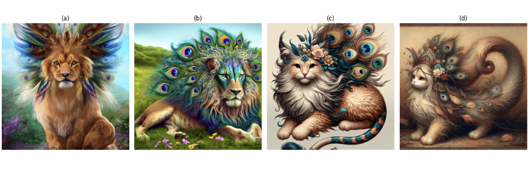

# 데이터셋

- 스테이블 디퓨전 이미지 쌍으로 구성된 DiffusionDB 데이터셋을 사용
- 200만개의 이미지가 포함된 DiffusionDB 2M과 1400개의 이미지가 포함된 DiffusionDB Large가 존재
- 아래 예제에서는 1000개만 짤라서 사용함

<br>

### 데이터셋 로딩

```python
from datasets import load_dataset

dataset = load_dataset('poloclub/diffusiondb', "2m_first_1k", split='train')
example_index= 867
original_image = dataset[example_index]['image']
original_prompt = dataset[example_index]['prompt']

# <PIL.PngImagePlugin.PngImageFile image mode=RGB size=512x512 at 0x134481430>
print(original_image)
```

<br>

# 실습 흐름

- 원본 이미지와 3가지 프롬프트로 생성한 3개의 합성 이미지를 비교함
- 이미지 생성에는 DALL-E 3 모델을 사용
- 첫번째 프롬프트는 원본 이미지를 OpenAI의 멀티 모달 LLM인 GPT-4o에 입력해서 생성한다
- 다음은 원본 이미지에 대응되는 `원본 프롬프트`를 입력한다
- 마지막은 전체 프롬프트 텍스트를 임베딩 모델로 저장한 벡터 디비에 원본 이미지를 이미지 임베딩 모델로 변환한 이미지 임베딩으로 검색해서 찾은 `유사 프롬프트`를 사용해서 이미지를 생성

<br>

# GPT-4o로 이미지 설명 생성하기

```python
import requests
import base64
from io import BytesIO
import os
from datasets import load_dataset

os.environ["OPENAI_API_KEY"] = ""


def make_base64(image):
    buffered = BytesIO()
    image.save(buffered, format="JPEG")
    img_str = base64.b64encode(buffered.getvalue()).decode("utf-8")
    return img_str


def generate_description_from_image_gpt4(prompt, image64):
    headers = {
        "Content-Type": "application/json",
        "Authorization": f"Bearer {os.getenv('OPENAI_API_KEY')}",
    }
    payload = {
        "model": "gpt-4o",
        "messages": [
            {
                "role": "user",
                "content": [
                    {"type": "text", "text": prompt},
                    {
                        "type": "image_url",
                        "image_url": {"url": f"data:image/jpeg;base64,{image64}"},
                    },
                ],
            }
        ],
        "max_tokens": 300,
    }
    response_oai = requests.post(
        "https://api.openai.com/v1/chat/completions", headers=headers, json=payload
    )
    result = response_oai.json()["choices"][0]["message"]["content"]
    return result


dataset = load_dataset("poloclub/diffusiondb", "2m_first_1k", split="train")
example_index = 867
original_image = dataset[example_index]["image"]
original_prompt = dataset[example_index]["prompt"]

image_base64 = make_base64(original_image)
described_result = generate_description_from_image_gpt4("Describe provided image", image_base64)

"""
The image depicts a lion with an elaborate and colorful mane that resembles peacock feathers.
The mane features vibrant hues of blue, green, and purple, with eye-like patterns similar to those found on peacock feathers.
The lion sits against a natural background with patches of grass and flowers, creating a whimsical and fantastical scene.
The overall tone of the image is vibrant and imaginative.
"""
print(described_result)
```

<br>

# 프롬프트 저장하기

### 클라이언트 준비 & 인덱스 생성

```python
import os
from datasets import load_dataset
from openai import OpenAI
from pinecone import Pinecone, ServerlessSpec

pinecon_api_key = ""
openai_api_key = ""

dataset = load_dataset("poloclub/diffusiondb", "2m_first_1k", split="train")
example_index = 867
original_image = dataset[example_index]["image"]
original_prompt = dataset[example_index]["prompt"]

# GPT-4o 이미지 분석결과 캐싱
described_result = """
    The image depicts a lion with an elaborate and colorful mane that resembles peacock feathers.
    The mane features vibrant hues of blue, green, and purple, with eye-like patterns similar to those found on peacock feathers.
    The lion sits against a natural background with patches of grass and flowers, creating a whimsical and fantastical scene.
    The overall tone of the image is vibrant and imaginative.
"""

pc = Pinecone(api_key=pinecon_api_key)
os.environ["OPENAI_API_KEY"] = openai_api_key
client = OpenAI()

index_name = "llm-multimodal"
try:
    pc.create_index(
        name=index_name,
        # 무료 차원인 512차원 사용
        dimension=512,
        # 코사인 유사도를 평가 지표로 사용
        metric="cosine",
        spec=ServerlessSpec("aws", "us-east-1")
    )
    print(pc.list_indexes())
except:
    print("인덱스가 이미 있음")

index = pc.Index(index_name)
```

<br>

### 프롬프트 텍스트 -> 임베딩 벡터 변환 및 파인콘에 저장하기

```python
import os
from datasets import load_dataset
from openai import OpenAI
from pinecone import Pinecone, ServerlessSpec
import torch
from tqdm.auto import trange
from transformers import AutoTokenizer, CLIPTextModelWithProjection

pinecon_api_key = ""
os.environ["OPENAI_API_KEY"] = ""

dataset = load_dataset("poloclub/diffusiondb", "2m_first_1k", split="train")
example_index = 867
original_image = dataset[example_index]["image"]
original_prompt = dataset[example_index]["prompt"]

described_result = """
    The image depicts a lion with an elaborate and colorful mane that resembles peacock feathers.
    The mane features vibrant hues of blue, green, and purple, with eye-like patterns similar to those found on peacock feathers.
    The lion sits against a natural background with patches of grass and flowers, creating a whimsical and fantastical scene.
    The overall tone of the image is vibrant and imaginative.
"""

pc = Pinecone(api_key=pinecon_api_key)

client = OpenAI()

index_name = "llm-multimodal"
try:
    pc.create_index(
        name=index_name,
        dimension=512,
        metric="cosine",
        spec=ServerlessSpec("aws", "us-east-1")
    )
    print(pc.list_indexes())
except:
    print("인덱스가 이미 있음")

index = pc.Index(index_name)

device = "cuda" if torch.cuda.is_available() else "cpu"

text_model = CLIPTextModelWithProjection.from_pretrained("openai/clip-vit-base-patch32")
tokenizer = AutoTokenizer.from_pretrained("openai/clip-vit-base-patch32")

tokens = tokenizer(dataset['prompt'], padding=True, return_tensors="pt", truncation=True)
batch_size = 16
text_embs = []

for start_idx in trange(0, len(dataset), batch_size):
    with torch.no_grad():
        outputs = text_model(input_ids=tokens['input_ids'][start_idx:start_idx + batch_size],
                             attention_mask=tokens['attention_mask'][start_idx:start_idx + batch_size])
        text_emb_tmp = outputs.text_embeds
    text_embs.append(text_emb_tmp)
text_embs = torch.cat(text_embs, dim=0)

"""
tensor([[-0.1001, -0.0165,  0.1752,  ..., -0.1827, -0.1109, -0.7854],
        [ 0.4135,  0.1837, -0.0263,  ..., -0.0776, -0.2004, -0.3663],
        [ 0.2645, -0.0532, -0.4703,  ..., -0.2539, -0.0788, -0.0064],
        ...,
        [ 0.0342, -0.1253, -0.5799,  ..., -0.2563,  0.3712,  0.1881],
        [ 0.0692,  0.3679, -0.3008,  ...,  0.7099, -0.0401, -0.3051],
        [ 0.1094, -0.1349, -0.5255,  ..., -0.1460,  0.4290,  0.1840]])
"""
print(text_embs)

# pinecone에 데이터를 저장함
input_data = []
for id_int, emb, prompt in zip(range(0, len(dataset)), text_embs.tolist(), dataset['prompt']):
    input_data.append(
        {
            "id": str(id_int),
            "values": emb,
            "metadata": {
                "prompt": prompt
            }
        }
    )

# {'upserted_count': 1000}
index.upsert(vectors=input_data)
```

<br>

### 이미지 임베딩을 통한 유사한 이미지들 검색

```python
import os
from datasets import load_dataset
from openai import OpenAI
from pinecone import Pinecone, ServerlessSpec
from transformers import AutoProcessor, CLIPVisionModelWithProjection

pinecon_api_key = ""
os.environ["OPENAI_API_KEY"] = ""

dataset = load_dataset("poloclub/diffusiondb", "2m_first_1k", split="train")
example_index = 867
original_image = dataset[example_index]["image"]

pc = Pinecone(api_key=pinecon_api_key)

client = OpenAI()

index_name = "llm-multimodal"
index = pc.Index(index_name)

# 이미지 임베딩 모델을 통해서 이미지를 임베딩으로 변환
vision_model = CLIPVisionModelWithProjection.from_pretrained("openai/clip-vit-base-patch32")
processor = AutoProcessor.from_pretrained("openai/clip-vit-base-patch32")

inputs = processor(images=original_image, return_tensors="pt")

# 이미지와 유사한 3개의 프롬프트 조회
outputs = vision_model(**inputs)
image_embeds = outputs.image_embeds

search_results = index.query(
    vector=image_embeds[0].tolist(),
    top_k=3,
    include_values=False,
    include_metadata=True
)
searched_idx = int(search_results['matches'][0]['id'])

"""
example_index인 867은 검색결과 3개중에 2번째에 존재함
918번 프롬프트는 예시랑 거의 유사한데 rabbit -> bunny로 바뀌고 baby라는 표현이 사라진 정도다
{
  "matches": [
    {
      "id": "918",
      "metadata": {
        "prompt": "cute fluffy bunny cat lion hybrid mixed creature character concept, with long flowing mane blowing in the wind, long peacock feather tail, wearing headdress of tribal peacock feathers and flowers, detailed painting, renaissance, 4 k "
      },
      "score": 0.37477535,
      "values": []
    },
    {
      "id": "867",
      "metadata": {
        "prompt": "cute fluffy baby cat rabbit lion hybrid mixed creature character concept, with long flowing mane blowing in the wind, long peacock feather tail, wearing headdress of tribal peacock feathers and flowers, detailed painting, renaissance, 4 k "
      },
      "score": 0.372427762,
      "values": []
    },
    {
      "id": "817",
      "metadata": {
        "prompt": "cute fluffy baby cat lion hybrid mixed creature character concept, with long flowing mane blowing in the wind, long peacock feather tail, wearing headdress of tribal peacock feathers and flowers, detailed painting, renaissance, 4 k "
      },
      "score": 0.370809853,
      "values": []
    }
  ],
  "namespace": "",
  "usage": {
    "read_units": 1
  }
}
"""
print(search_results)

# 918
print(searched_idx)
```

<br>

# DALL-E 3으로 이미지 생성하기

### 이미지 생성 및 기존 이미지랑 비교하기

```python
import os
from datasets import load_dataset
from openai import OpenAI
from pinecone import Pinecone
from transformers import AutoProcessor, CLIPVisionModelWithProjection
import requests
from PIL import Image
import matplotlib.pyplot as plt

pinecone_api_key = ""
os.environ["OPENAI_API_KEY"] = ""

dataset = load_dataset("poloclub/diffusiondb", "2m_first_1k", split="train")
example_index = 867
original_image = dataset[example_index]["image"]
original_prompt = dataset[example_index]['prompt']

pc = Pinecone(api_key=pinecone_api_key)

client = OpenAI()

index_name = "llm-multimodal"
index = pc.Index(index_name)

described_result = """
    The image depicts a lion with an elaborate and colorful mane that resembles peacock feathers.
    The mane features vibrant hues of blue, green, and purple, with eye-like patterns similar to those found on peacock feathers.
    The lion sits against a natural background with patches of grass and flowers, creating a whimsical and fantastical scene.
    The overall tone of the image is vibrant and imaginative.
"""

vision_model = CLIPVisionModelWithProjection.from_pretrained("openai/clip-vit-base-patch32")
processor = AutoProcessor.from_pretrained("openai/clip-vit-base-patch32")

inputs = processor(images=original_image, return_tensors="pt")

outputs = vision_model(**inputs)
image_embeds = outputs.image_embeds

search_results = index.query(
    vector=image_embeds[0].tolist(),
    top_k=3,
    include_values=False,
    include_metadata=True
)
searched_idx = int(search_results['matches'][0]['id'])


def generate_image_dalle3(prompt):
    response_oai = client.images.generate(
        model="dall-e-3",
        prompt=str(prompt),
        size="1024x1024",
        quality="standard",
        n=1,
    )
    result = response_oai.data[0].url
    return result


# 생성된 이미지 URL을 로컬에 저장함
def get_generated_image(image_url, sequence):
    generated_image = requests.get(image_url).content
    image_filename = f"gen_img_{sequence}.png"
    with open(image_filename, "wb") as image_file:
        image_file.write(generated_image)
    return Image.open(image_filename)


# GPT-4o가 만든 프롬프트로 이미지 생성
gpt_described_image_url = generate_image_dalle3(described_result)
gpt4o_prompt_image = get_generated_image(gpt_described_image_url, sequence="1")
print(gpt4o_prompt_image)

# 원본 프롬프트로 이미지 생성
original_prompt_image_url = generate_image_dalle3(original_prompt)
original_prompt_image = get_generated_image(original_prompt_image_url, sequence="2")
print(original_prompt_image)

# 이미지 임베딩으로 검색한 유사 프롬프트로 이미지 생성
searched_prompt_image_url = generate_image_dalle3(dataset[searched_idx]['prompt'])
searched_prompt_image = get_generated_image(searched_prompt_image_url, sequence="3")
print(searched_prompt_image)

images = [original_image, gpt4o_prompt_image, original_prompt_image, searched_prompt_image]
titles = ['(a)', '(b)', '(c)', '(d)']

fig, axes = plt.subplots(1, len(images), figsize=(15, 5))

for ax, img, title in zip(axes, images, titles):
    ax.imshow(img)
    ax.axis('off')
    ax.set_title(title)

plt.tight_layout()
plt.show()
```

<br>

### 결과


