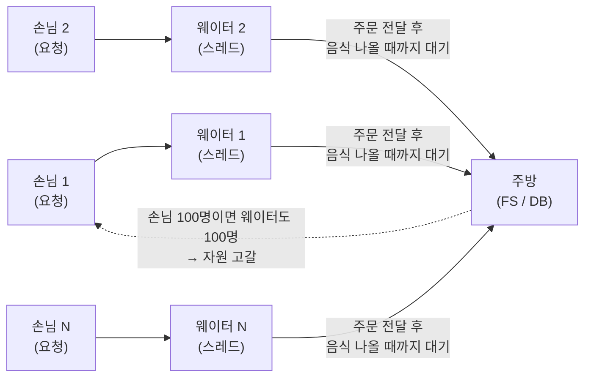
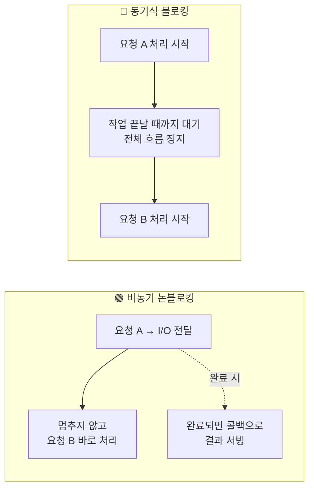
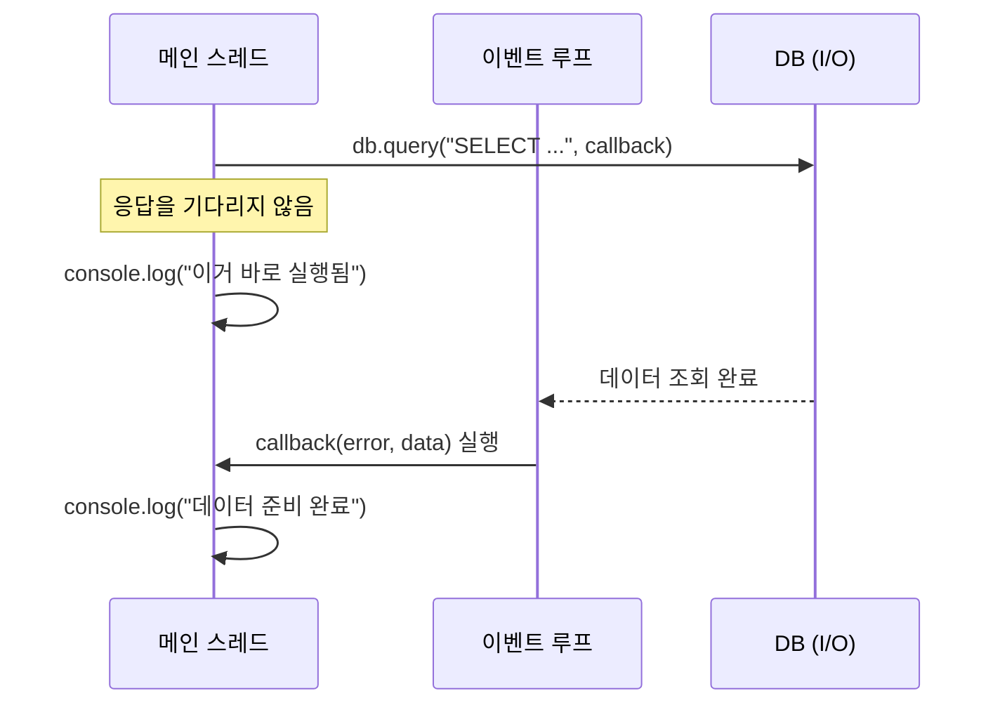

# 동기와 비동기

### 전통적인 웹서버

- Apache 등 레거시 프레임 워크는 동기식 블로킹 구조를 사용함
- 동기 방식이란 Task A, B, C가 있을때 앞 작업이 끝나야 다음 작업이 실행되게 시간/순서를 엄격하게 지킴
- 블로킹이라 위 동기 방식처럼 A, B, C 작업이 진행될 때 앞 작업이 끝날 때까지 전체 흐름이 정지된다는 뜻임

<br>

### 동기식 블로킹 구조를 식당에 비유하기

- 어느 식당의 웨이터는 주방에 요리를 전달, 이후에 다시 요리가 나올때까지 주방 앞에서 대기함
- 이 경우 주방이 처리하는 주문을 계속 기다리므로 손님이 100명이면 웨이터도 100명이 필요
- 웨이터는 스레드, 주방은 FS, DB를 뜻함, 손님은 무언가를 요청하는 클라이언트의 요청을 뜻함
- 동기식 구조의 경우 요청당 1개의 스레드를 사용, 즉 대량 요청이 발생하면 순식간에 자원이 고갈됨



<br>

### Node.js의 비동기 논블로킹 방식

- 동기식과 완전히 다르게 작동하는데 이는 멈추지 않고 바로 다음 일로 넘어가는 방식임
- 웨이터는 1명만 존재(스레드가 1개)하며 들어오는 주문은 즉시 주방으로 전달함
- 이후에 완료된 음식은 웨이터가 직접 서빙하지 않고 컨베이어 벨트로 하나씩 던져줌
- 웨이터는 틈틈히 컨베이어 벨트를 확인해서 각 좌석으로 서빙해줌. 이것이 Node.js의 실제 원리임



<br>

## 동기, 비동기 예제

### 동기

```ts
// 동기 방식으로 쿼리에서 데이터를 조회
// 해당 작업이 끝날 떄까지 아래 console.log는 출력되지 않음
const result = db.querySync("SELECT * FROM USER");
console.log("SYNC");
```

<br>

### 비동기

- Node.js의 경우 아래처럼 데이터 I/O 작업에서는 앞에 무언가 있다고 절대 작업을 멈추지 않음
- 하지만 비디오 인코딩, 암호해독 등 CPU 집약적 작업은 이런 구조에 적합하지 않음
- 이런 과정을 이벤트루프를 통해서 처리하는데 CPU 집약적 작업은 이벤트루프의 블로킹을 유발함

```ts
// query 메서드가 완료되면 실행되는 콜백 함수를 전달받음
// DB에서 데이터를 모두 찾으면 콜백 내부 코드가 실행됨
// 동기 방식과는 다르게 바로 아래쪽 console.log가 즉시 실행됨
const result = db.query("SELECT * FROM USER", (error, data) => {
  consoole.log("데이터 준비 완료", data);
});

console.log("이거 바로 실행됨");
```



<br>
