### Call Stack

- 자바스크립트는 한번에 한개의 작업만 가능한 싱글스레드 언어임
- V8 엔진 내부에는 크게 메모리 힙(변수, 데이터 등 저장), 콜스택 2개의 공간이 존재

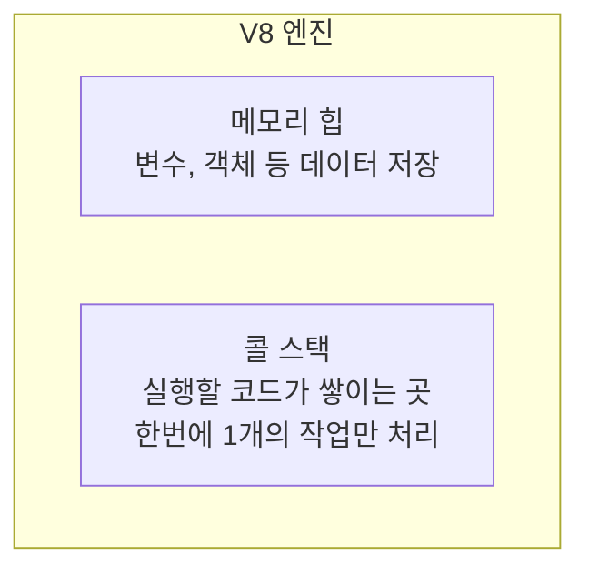

<br>

### libuv

- C언어 기반의 오픈소스 라이브러리로 Node.js에서 핵심 기능을 담당
- 내부에는 백그라운드에서 무거운 작업을 처리해주는 스레드 풀이 존재함
- 메인 스레드는 작업을 총괄하고 실제 작업은 libuv 스레드 풀에서 처리함
- 보기에는 싱글스레드 방식으로 처리하지만 내부에선 멀티스레드 방식으로 동작하게됨
- 즉 직접 스레드를 제어할 필요없이 무거운 작업은 뒤에서 알아서 처리해주는 방식이다

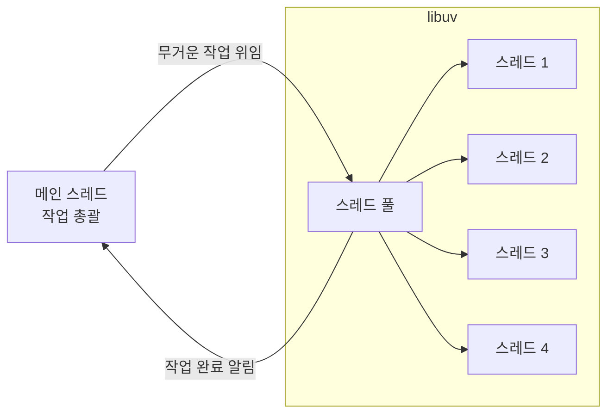

<br>

### Node.js 공식문서에서 싱글스레드라고 못박는 이유

- 일반적으로 작성하는 자바스크립트 코드는 메인 콜 스택 스레드에서만 실행됨
- 개발자는 스레드를 제어하는 방식에 대해서 신경쓰지 않고 메인 콜 스택 스레드에만 지시를 하게됨
- 그래서 공식문서에는 실제 개발자가 작업하는 환경에 맞추어 싱글스레드라고 적어놓음
- 이벤트루프는 독립적인 스레드가 아니며 비동기 작업들의 순서를 조율하는 시스템 로직일 뿐임

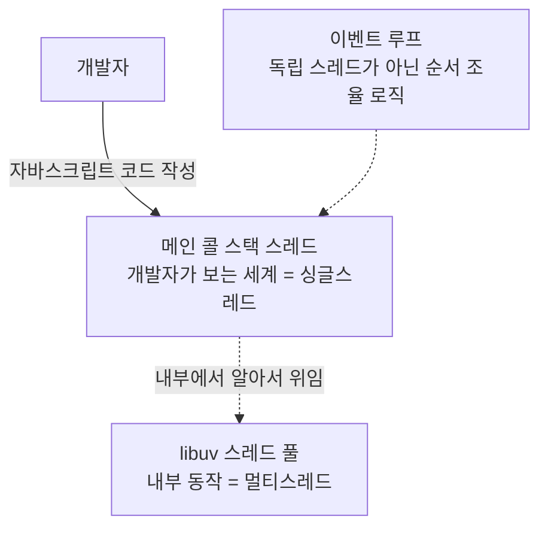

<br>

### 이벤트 큐

- libuv에서 백그라운드 작업이 완료되면 완료되었다고 전달을 해야함
- 메인스레드에게 직접 전달하는게 아닌 백그라운드 작업이 완료되면 이벤트 큐에다가 쌓아둠
- 이벤트 큐의 경우 FIFO 방식으로 작동하며 먼저 작업이 끝난거부터 이벤트 큐에서 빠져나감

```ts
const cb = (error, data) => {
  console.log("파일 읽기 완료");
};

fs.readFile("some.txt", cb); // 이벤트 큐로 이동한 코드
```

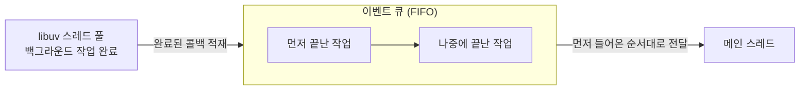

<br>

### 이벤트 루프

- 전체적인 작업을 총괄하는 부품
- 테스크 큐에 존재하던 작업을 메인 스레드로 밀어넣음. 이 과정을 계속해서 반복함

```ts
// 1. 파일을 읽어오라는 지시를 전달하고 다음 라인으로 넘어감
// 4. 테스트 큐에 존재하던 남은 작업을 메인 스레드로 밀어넣음. 이후에 작업이 끝남
fs.readFile('some.txt', (error, data) => [
  console.log('읽기 완료');
])

// 2.해당 코드가 바로 실행됨
// 3. 해당 시점에 메인 콜스택이 텅 비게됨
console.log('작업 끝')

/**
 * -- 출력
 * 작업 끝
 * 읽기 완료
*/
```

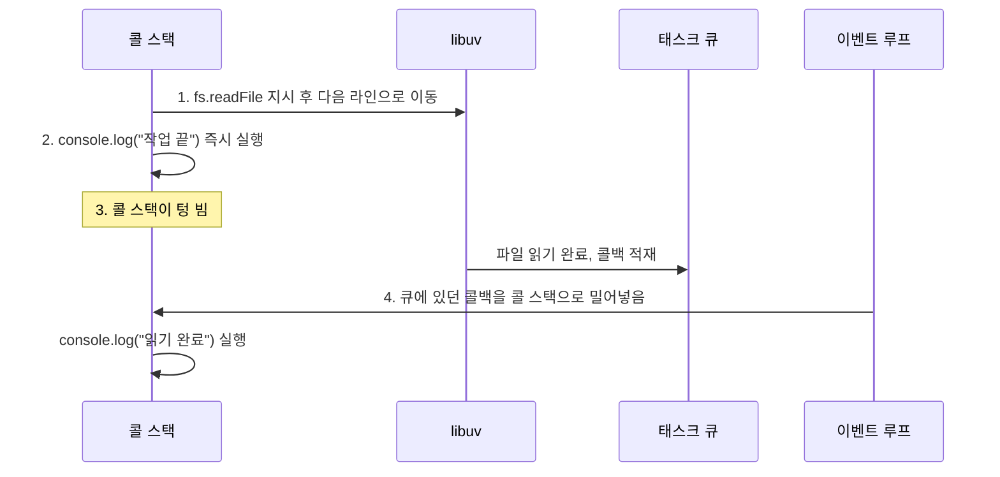

<br>

### 이벤트 루프 6단계 해부

- 만약 모든 작업이 1개의 거대한 큐에 몰려있다면 시간이 오래걸리는 작업이 몰려있을때 병목이 발생함
- Node.js의 경우 파일시스템, 타이머 등 종류별로 큐를 분리해놓음
- 하나의 무거운 작업이 시스템 전체를 독점하는걸 방지하고 정해진 순서와 시간에 따라서 유연한 처리가 가능
- libuv 내부 코드를 확인해보면 `while (true) { ... }`를 통해서 무한하게 이러한 루프가 돌아감

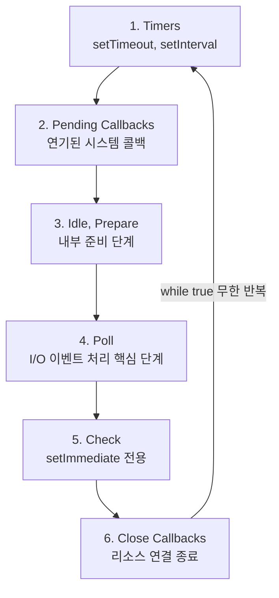

<br>

### 이벤트 루프 1 : 타이머

- 설정된 시간이 타이머가 다 된 콜백을 처리하는 단계
- 대표적으로 `setTimeout`, `setInterval`이 존재함
- 복잡한 계산은 신경쓰지 않고 오직 시간만 확인함. 시간이 다된 작업을 콜스택으로 올림

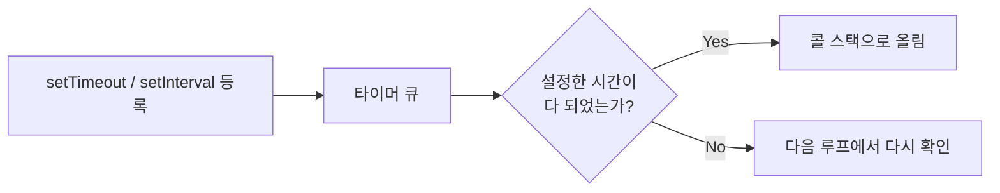

<br>

### 이벤트 루프 2 : 대기 콜백

- OS 레벨에서 발생한 긴급하게 연기된 작업을 처리함
- OS에서 보내는 시스템 에러 보고서들을 처리하는데 TCP 에러 같은 네트워크 소켓 오류가 여기에 속함
- 이러한 에러는 다음으로 미루면 시스템이 위험해질수 있어서 별도의 공간에 몰아넣고 처리함

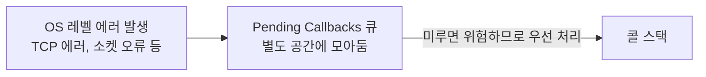

<br>

### 이벤트 루프 3 : Ide, Prepare

- 이벤트 루프가 다음 핵심 작업을 위해서 내부적으로 준비하는 단계로 잠깐 숨을 고르는 공간
- 해당 단계는 Node.js 내부 libuv만 엔진만 사용하므로 개발자가 작성한 코드는 여기서 돌아갈일이 없음

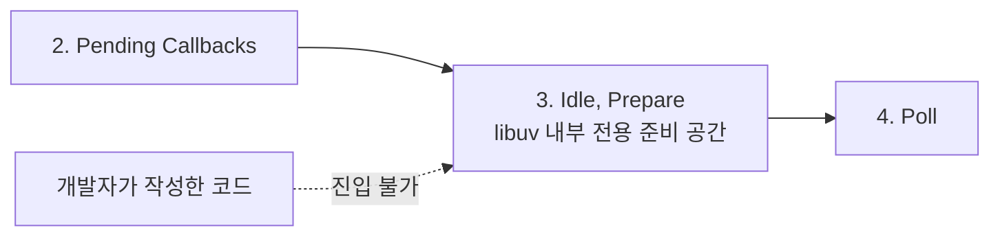

<bhr>

### 이벤트 루프 4: Poll

- 대기 및 처리를 담당하는 단계로 새로운 입출력 이벤트를 가져오고 관련된 콜백을 실행하는 단계
- 가장 핵심적인 역할을 하는 부분임
- `readFile`, `writeFile` 같은 파일시스템이나 네트워크 I/O 등 작업이 모두 여기 모임
- 모든 작업이 완료될 때 까지 여기서 처리하며 당장 처리할게 없다면 여기서 머무름

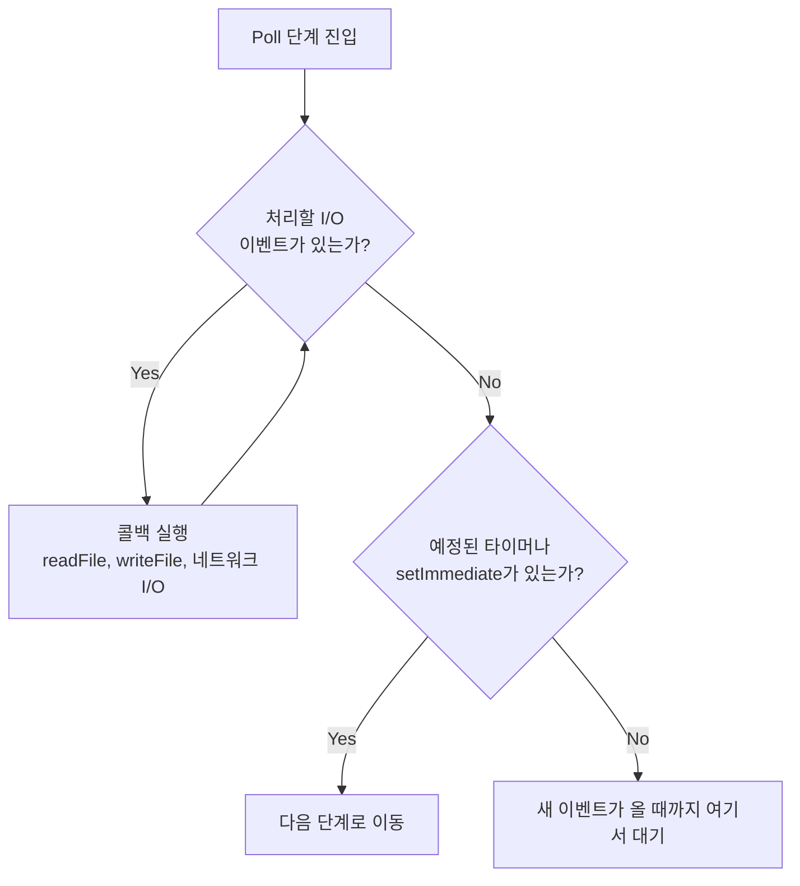

<br>

### 이벤트 루프 5 : Check

- 전담 메서드인 `setImmediate`만 처리하는 단계임
- Poll에서 무거운 I/O 작업을 마치고 이것부터 당장 처리하라고 명시적으로 사용할때만 사용함
- 복잡한 루프 과정에서 코드 실행을 대기하지 않고 가장 빠르게 다음 코드를 실행하고 싶을때 사용함

```ts
setTimmediate(() => {
  console.log("당장 실행되어야함");
});
```

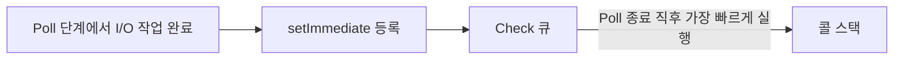

<br>

### 이벤트 루프 6 : Close Callback

- 리소스 연결을 완전히 종료하는 콜백을 처리하는 단계
- 대표적으로 쓰임을 다한 네트워크/디비 연결을 안전하게 끊어주는 역할을 해줌
- 여기를 거쳐야 불필요한 메모리 낭비를 줄일 수 있음


<br>

### Microtask Queue

- 이벤트 루프의 순서를 깨부수고 무조건 긴급으로 처리해야하는 작업이 모이는 공간
- 일반 작업 -> 다음 작업 사이에 필수적으로 포함되어야하는 작업이 여기에 들어가게됨
- 흔히 사용하는 `Promise.then()`, `Promise.catch()`, `process.nextTick()`이 여기에 속함
- 위 작업에서도 우선순위가 존재하는데 `prosess.nextTick()` > `Promise`로 우선순위가 높음
  - `nextTickQueue`는 `process.nextTick()` 전용 큐다
  - `microTaskQueue`는 `Promise` 전용 큐다

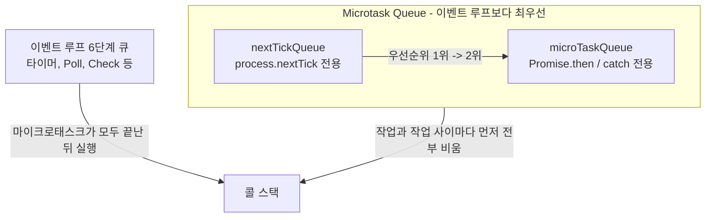

<br>

### Microtask Queue의 부작용 주의

- 무조건 우선순위로 처리되는데 이 때 만약 개발자가 복잡한 Promise Chain을 만든다고 가정한다
- 그런 경우 계속해서 우선순위 작업이 추가되는데 이러면 이벤트 루프가 블로킹됨
- 이런 현상을 기아 현상(Starvation)이라고 부름. 이는 CPU를 배정받지 못하고 굶어죽는 상태를 의미함

```ts
// 2. createInfinityVip를 계속해서 처리하느라 아래 메세지는 출력되지 않음
setTimeout(() => {
  console.log("알람: 1번 도착, 영원히 실행 불가능");
}, 0);

function createInfinityVip() {
  // 1. 재귀호출을 통해서 계속해서 무한하게 Microtask Queue에다가 작업을 넣음
  process.nextTick(() => {
    console.log("VVIP 처리중..");
    createInfinityVip();
  });
}

createInfinityVip();
```

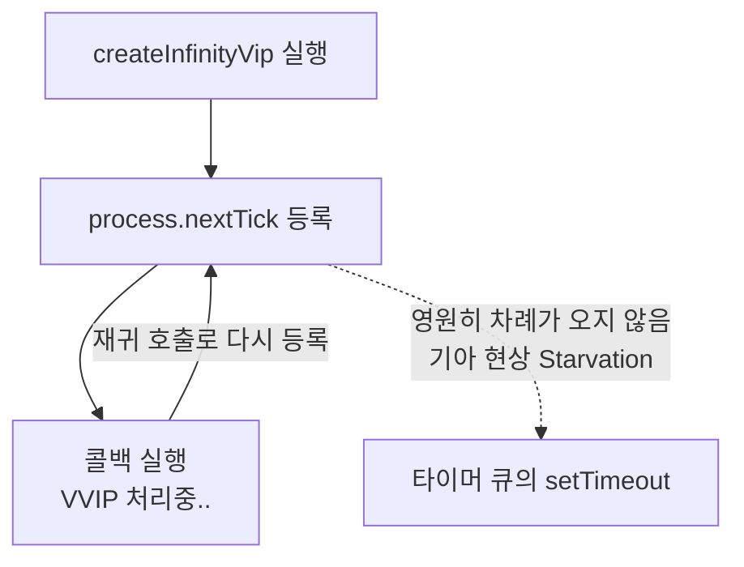

<br>

### 비동기 코드의 실행 우선순위 역전

- 타이머 루프에 무언가 들어와 있더라도 마이크로 테스트 큐에 작업이 있다면 상황은 완전히 달라짐

```ts
setTimeout(() => {
  console.log("일반 보고");
}, 0);

Promise.resolve().then(() => {
  console.log("긴급 보고");
});

// 출력 순서 : 긴급 보고 -> 일반 보고
// 사유 : Promise의 경우 별도의 마이크로 테스크 큐에 들어가므로 타이머 큐보다 더 먼저 실행됨
```

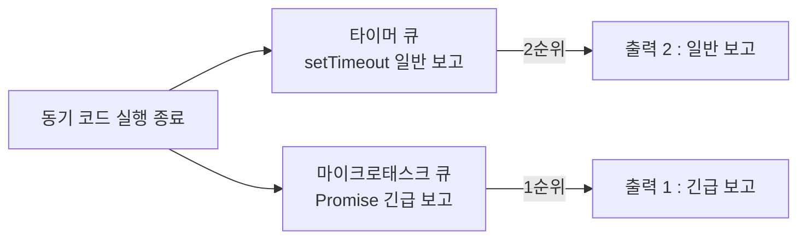

<br>

### 처리 순서 확인하기

- A의 경우 동기 코드이므로 즉시 처리된다
- B, C의 경우 일단 타이머 큐랑 마이크로 테스트 큐에 던져놓음
- 이후에는 D가 바로 실행됨
- 그리고 우선순위상 마이크로 테스크 큐에 들어가므로 C가 출력됨
- 이후에 타이머 큐에 들어간 B가 출력됨
- 즉 출력 순서는 A -> D -> C -> B 순서로 작동함

```ts
console.log("A");
setTimeout(() => console.log("B"), 0);
Promise.resolve().then(() => console.log("C"));
console.log("D");
```

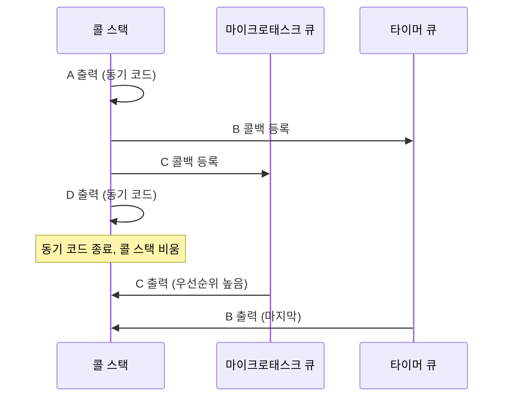

<br>

### 타이머 사이의 프로미스

- 먼저 2개의 작업이 타이머 큐에 들어가게됨
- 이벤트 루프가 첫번째 작업을 콜스택으로 올리면서 우선 1번 메세지가 출력됨
- 이후에 프로미스 작업을 마이크로 테스크 큐에 밀어넣으면서 새로운 작업이 등록됨
- 이후에 다음 타이머 큐에 들어있는 작업을 처리하는게 아닌 우선순위가 더 높은 마이크로 테스크 큐 작업을 처리함

```ts
setTimeout(() => {
  console.log("1. 첫번째 알람");
  Promise.resolve().then(() => console.log("2. 타이머 진행중 VIP 서류 새치기"));
}, 0);

setTimeout(() => console.log("3. 두번째 알람"));
```

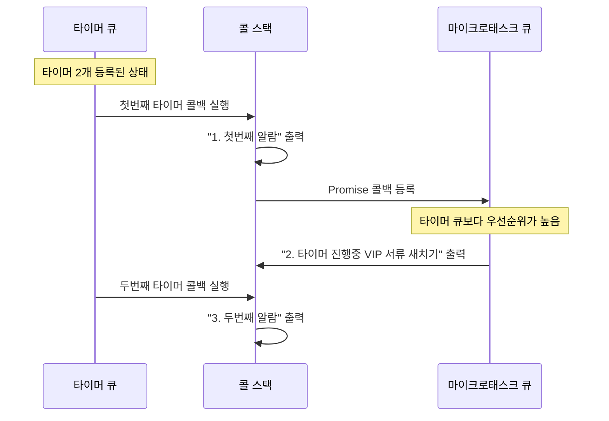

<br>

### 동기 + 타이머 + 프로미스 + nextTick 혼합 예제

- 처음 만난 동기 코드가 즉시 실행되어 1번이 출력됨
- 타이머 큐에 작업 등록, 마이크로 테스크 큐에 작업 등록을 거침
- 두번째 동기 코드가 즉시 실행되어 2번이 출력됨
- 3번째 nextTick 큐에 등록된 3번이 출력됨
- 이후에 프로미스쪽 코드가 실행되며 동기 코드인 4번이 출력됨
- 5번의 경우도 nextTick 큐에 등록되므로 5번이 출력됨
- 이후에 nextTick 큐와 마이크로 테스크 큐에 작업이 없으므로 타이머 큐에 등록된 6번이 출력됨

```ts
console.log("1. 동기 코드 바로실행");
setTimeout(() => console.log("6. 예약된 알람 작업 타이머 실행"), 0);
Promise.resolve().then(() => {
  console.log("4. Promise 실행");
  process.nextTick(() => console.log("5. 긴급 작업 실행"));
});
process.nextTick(() => console.log("3. 긴급 작업 실행"));
console.log("2. 동기 코드 바로 실행");
```

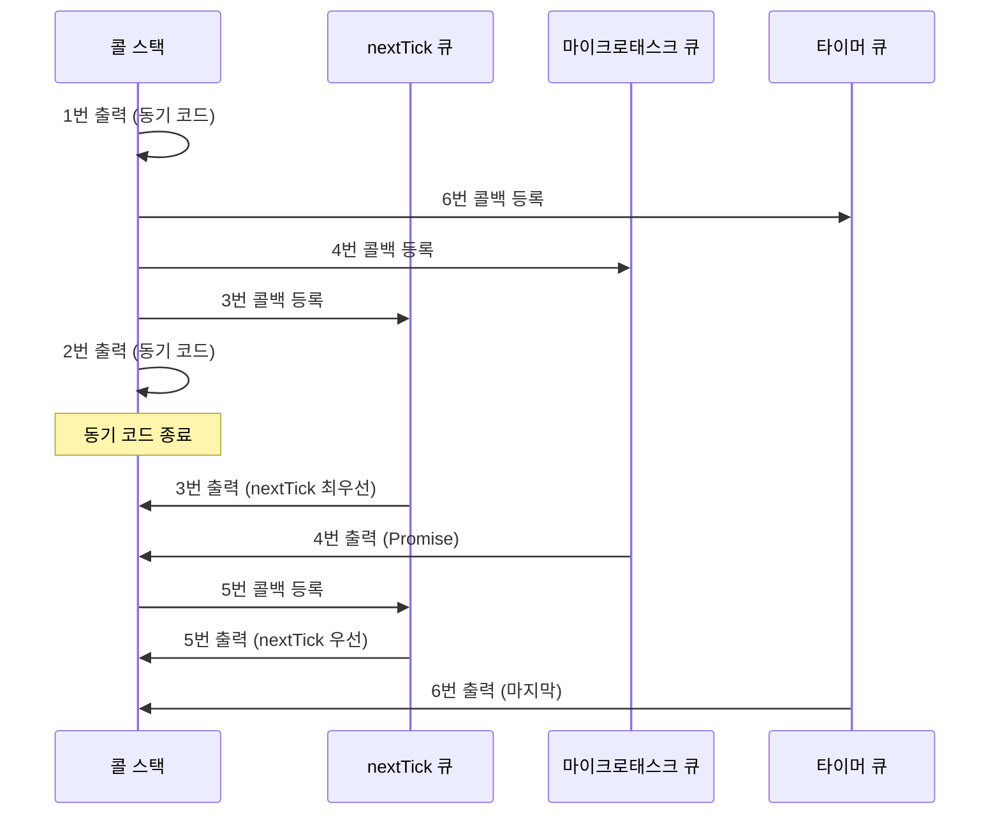
