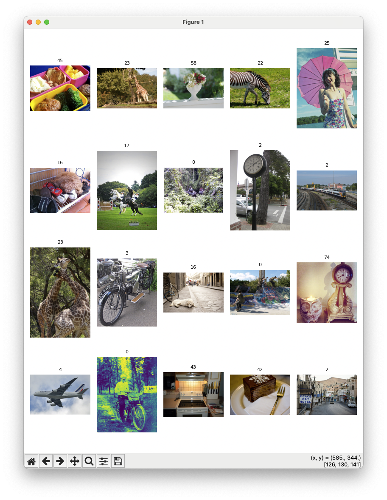

# Chroma
- AI 네이티브 오픈소스 데이터베이스임

<br>

### 벡터 스토어에서 조회하기
```python
from langchain_community.document_loaders import TextLoader
from langchain_openai.embeddings import OpenAIEmbeddings
from langchain.text_splitter import RecursiveCharacterTextSplitter
from langchain_chroma import Chroma


text_splitter = RecursiveCharacterTextSplitter(chunk_size=600, chunk_overlap=0)
loader1 = TextLoader("/Users/imkdw/study/RAG 비법노트/example/finance-keywords.txt")
loader2 = TextLoader("/Users/imkdw/study/RAG 비법노트/example/nlp-keywords.txt")
split_doc1 = loader1.load_and_split(text_splitter)
split_doc2 = loader2.load_and_split(text_splitter)

db = Chroma.from_documents(
    documents=split_doc1, embedding=OpenAIEmbeddings(), collection_name="my_db"
)

DB_PATH = "./chroma_db"

persist_db = Chroma.from_documents(
    # persist_directory를 지정하지 않으면 메모리에 저장됨
    # 만약 로컬 DB를 사용할경우 지정하는걸 권장
    split_doc1,
    OpenAIEmbeddings(),
    persist_directory=DB_PATH,
    collection_name="my_db",
)

persist_db = Chroma(
    persist_directory=DB_PATH,
    embedding_function=OpenAIEmbeddings(),
    collection_name="my_db",
)

print(persist_db.get())
```

<br>

### 유사도 기준으로 검색
- similarity_search의 k 파라미터를 통해서 검색할 데이터 개수 지정이 가능함. 기본값은 4라서 4개가 조회됨
- 
```python
from langchain_community.document_loaders import TextLoader
from langchain_openai.embeddings import OpenAIEmbeddings
from langchain.text_splitter import RecursiveCharacterTextSplitter
from langchain_chroma import Chroma


text_splitter = RecursiveCharacterTextSplitter(chunk_size=600, chunk_overlap=0)
loader1 = TextLoader("/Users/imkdw/study/RAG 비법노트/example/finance-keywords.txt")
loader2 = TextLoader("/Users/imkdw/study/RAG 비법노트/example/nlp-keywords.txt")
split_doc1 = loader1.load_and_split(text_splitter)
split_doc2 = loader2.load_and_split(text_splitter)

db = Chroma.from_documents(
    documents=split_doc1, embedding=OpenAIEmbeddings(), collection_name="my_db"
)

DB_PATH = "./chroma_db"

persist_db = Chroma.from_documents(
    # persist_directory를 지정하지 않으면 메모리에 저장됨
    # 만약 로컬 DB를 사용할경우 지정하는걸 권장
    split_doc1,
    OpenAIEmbeddings(),
    persist_directory=DB_PATH,
    collection_name="my_db",
)

persist_db = Chroma(
    persist_directory=DB_PATH,
    embedding_function=OpenAIEmbeddings(),
    collection_name="my_db",
)

# [
#     Document(
#         id="96e3ea7a-e6b7-4695-bf0c-899629b412f7",
#         metadata={
#             "source": "/Users/imkdw/study/RAG 비법노트/example/finance-keywords.txt"
#         },
#         page_content="정의: 주가수익비율(P/E)은 주가를 주당순이익으로 나눈 값으로, 기업의 가치를 평가하는 데 사용되는 지표입니다.\n예시: 아마존의 P/E 비율이 높은 것은 투자자들이 회사의 미래 성장 가능성을 높게 평가하고 있다는 것을 의미합니다.\n연관키워드: 주식 가치평가, 투자 분석, 성장주\n\nQuarterly Earnings Report\n\n정의: 분기별 실적 보고서는 기업이 3개월마다 발표하는 재무 성과와 사업 현황에 대한 보고서입니다.\n예시: 애플의 분기별 실적 발표는 전체 기술 섹터와 S&P 500 지수에 큰 영향을 미칩니다.\n연관키워드: 기업 실적, 투자자 관계, 재무 분석\n\nIndex Fund\n\n정의: 인덱스 펀드는 S&P 500과 같은 특정 지수의 구성과 성과를 그대로 추종하는 투자 상품입니다.\n예시: 바운가드 S&P 500 ETF는 S&P 500 지수를 추종하는 대표적인 인덱스 펀드입니다.\n연관키워드: 패시브 투자, ETF, 포트폴리오 관리\n\nMarket Weight",
#     ),
#     Document(
#         id="7c982569-c682-4fa4-a049-ffd7e8537ded",
#         metadata={
#             "source": "/Users/imkdw/study/RAG 비법노트/example/finance-keywords.txt"
#         },
#         page_content="S&P 500\n\n정의: S&P 500은 미국 주식 시장에 상장된 500개의 대형 기업의 주가를 종합한 지수입니다. 이는 미국 경제와 주식 시장의 전반적인 상황을 나타내는 주요 지표로 사용됩니다.\n예시: 애플, 마이크로소프트, 아마존과 같은 대형 기술 기업들이 S&P 500에 포함되어 있습니다.\n연관키워드: 주식 시장, 지수, 대형주\n\nMarket Capitalization\n\n정의: 시가총액은 회사의 발행 주식 수와 현재 주가를 곱한 값으로, 회사의 전체 가치를 나타냅니다.\n예시: 애플의 시가총액이 2조 달러를 넘어서면서 S&P 500 지수에서 가장 큰 비중을 차지하게 되었습니다.\n연관키워드: 기업 가치, 주식, 투자\n\nDividend\n\n정의: 배당금은 기업이 주주들에게 이익의 일부를 현금으로 지급하는 것을 말합니다.\n예시: 코카콜라는 50년 이상 연속으로 배당금을 인상해온 S&P 500 기업 중 하나입니다.\n연관키워드: 주주 가치, 수익률, 투자 전략\n\nBlue Chip Stocks",
#     ),
#     Document(
#         id="6d4dfbee-6120-45af-bb0a-cf3678f8b7e4",
#         metadata={
#             "source": "/Users/imkdw/study/RAG 비법노트/example/finance-keywords.txt"
#         },
#         page_content="정의: 시장 가중치는 특정 기업이나 섹터가 전체 지수에서 차지하는 비중을 나타냅니다.\n예시: 기술 섹터는 S&P 500 지수에서 가장 큰 시장 가중치를 차지하고 있습니다.\n연관키워드: 포트폴리오 구성, 섹터 분석, 자산 배분\n\nGrowth Stock\n\n정의: 성장주는 평균 이상의 높은 성장률을 보이는 기업의 주식을 의미합니다.\n예시: 페이스북(메타)과 같은 기술 기업들은 S&P 500에 포함된 대표적인 성장주로 꼽힙니다.\n연관키워드: 고성장 기업, 기술주, 투자 전략\n\nValue Stock\n\n정의: 가치주는 현재 시장 가치가 내재 가치보다 낮다고 평가되는 기업의 주식을 말합니다.\n예시: 워렌 버핏이 투자한 코카콜라는 S&P 500에 포함된 대표적인 가치주 중 하나입니다.\n연관키워드: 가치 투자, 배당주, 안정적 수익\n\nMarket Volatility\n\n정의: 시장 변동성은 주식 시장의 가격 변동 폭을 나타내는 지표입니다.\n예시: VIX 지수(변동성 지수)가 상승하면 S&P 500 지수의 변동성이 높아질 것으로 예상됩니다.\n연관키워드: 리스크 관리, 투자 심리, 헤지 전략\n\nEquity Research",
#     ),
#     Document(
#         id="884c4b0d-419b-41f5-bd93-d9553ad5ffb3",
#         metadata={
#             "source": "/Users/imkdw/study/RAG 비법노트/example/finance-keywords.txt"
#         },
#         page_content="정의: 주식 리서치는 기업의 재무 상태, 사업 모델, 경쟁력 등을 분석하여 투자 의사 결정을 돕는 활동입니다.\n예시: 골드만삭스의 애널리스트들이 S&P 500 기업들에 대한 분기별 실적 전망을 발표했습니다.\n연관키워드: 투자 분석, 기업 가치평가, 시장 전망\n\nCorporate Governance\n\n정의: 기업 지배구조는 기업의 경영과 통제에 관한 시스템과 프로세스를 의미합니다.\n예시: S&P 500 기업들 중 이사회의 다양성을 높이는 기업들이 증가하고 있습니다.\n연관키워드: 주주 권리, ESG, 기업 윤리\n\nMergers and Acquisitions (M&A)\n\n정의: 인수합병은 기업들이 다른 기업을 사거나 합치는 과정을 말합니다.\n예시: 마이크로소프트가 액티비전 블리자드를 인수하면서 S&P 500 내 게임 산업의 판도가 변화했습니다.\n연관키워드: 기업 전략, 시너지 효과, 기업 가치\n\nESG (Environmental, Social, and Governance)",
#     ),
# ]
print(db.similarity_search("TF IDF 에 대하여 알려줘", k=2))
```

<br>

### 데이터 추가
```python
from langchain_community.document_loaders import TextLoader
from langchain_openai.embeddings import OpenAIEmbeddings
from langchain.text_splitter import RecursiveCharacterTextSplitter
from langchain_chroma import Chroma


text_splitter = RecursiveCharacterTextSplitter(chunk_size=600, chunk_overlap=0)
loader1 = TextLoader("/Users/imkdw/study/RAG 비법노트/example/finance-keywords.txt")
loader2 = TextLoader("/Users/imkdw/study/RAG 비법노트/example/nlp-keywords.txt")
split_doc1 = loader1.load_and_split(text_splitter)
split_doc2 = loader2.load_and_split(text_splitter)

db = Chroma.from_documents(
    documents=split_doc1, embedding=OpenAIEmbeddings(), collection_name="my_db"
)

DB_PATH = "./chroma_db"

persist_db = Chroma.from_documents(
    # persist_directory를 지정하지 않으면 메모리에 저장됨
    # 만약 로컬 DB를 사용할경우 지정하는걸 권장
    split_doc1,
    OpenAIEmbeddings(),
    persist_directory=DB_PATH,
    collection_name="my_db",
)

persist_db = Chroma(
    persist_directory=DB_PATH,
    embedding_function=OpenAIEmbeddings(),
    collection_name="my_db",
)

from langchain_core.documents import Document

db.add_documents(
    [
        Document(
            page_content="안녕하세요! 이번엔 도큐먼트를 새로 추가해 볼께요",
            metadata={"source": "mydata.txt"},
            id="1",
        )
    ]
)

# {'ids': ['1'], 'embeddings': None, 'documents': ['안녕하세요! 이번엔 도큐먼트를 새로 추가해 볼께요'], 'uris': None, 'data': None, 'metadatas': [{'source': 'mydata.txt'}], 'included': [<IncludeEnum.documents: 'documents'>, <IncludeEnum.metadatas: 'metadatas'>]}
print(db.get("1"))
```

<br>

### 텍스트 추가하기
```python
from langchain_community.document_loaders import TextLoader
from langchain_openai.embeddings import OpenAIEmbeddings
from langchain.text_splitter import RecursiveCharacterTextSplitter
from langchain_chroma import Chroma


text_splitter = RecursiveCharacterTextSplitter(chunk_size=600, chunk_overlap=0)
loader1 = TextLoader("/Users/imkdw/study/RAG 비법노트/example/finance-keywords.txt")
loader2 = TextLoader("/Users/imkdw/study/RAG 비법노트/example/nlp-keywords.txt")
split_doc1 = loader1.load_and_split(text_splitter)
split_doc2 = loader2.load_and_split(text_splitter)

db = Chroma.from_documents(
    documents=split_doc1, embedding=OpenAIEmbeddings(), collection_name="my_db"
)

DB_PATH = "./chroma_db"

persist_db = Chroma.from_documents(
    # persist_directory를 지정하지 않으면 메모리에 저장됨
    # 만약 로컬 DB를 사용할경우 지정하는걸 권장
    split_doc1,
    OpenAIEmbeddings(),
    persist_directory=DB_PATH,
    collection_name="my_db",
)

persist_db = Chroma(
    persist_directory=DB_PATH,
    embedding_function=OpenAIEmbeddings(),
    collection_name="my_db",
)

# 신규 데이터를 추가합니다. 이때 기존의 id=1 의 데이터는 덮어쓰게 됩니다.
db.add_texts(
    ["이전에 추가한 Document 를 덮어쓰겠습니다.", "덮어쓴 결과가 어떤가요?"],
    metadatas=[{"source": "mydata.txt"}, {"source": "mydata.txt"}],
    ids=["1", "2"],
)

# 문구가 바뀐모습
#  {'ids': ['1'], 'embeddings': None, 'documents': ['이전에 추가한 Document 를 덮어쓰겠습니다.'], 'uris': None, 'data': None, 'metadatas': [{'source': 'mydata.txt'}], 'included': [<IncludeEnum.documents: 'documents'>, <IncludeEnum.metadatas: 'metadatas'>]}
print(db.get(["1"]))

# {'ids': ['2'], 'embeddings': None, 'documents': ['덮어쓴 결과가 어떤가요?'], 'uris': None, 'data': None, 'metadatas': [{'source': 'mydata.txt'}], 'included': [<IncludeEnum.documents: 'documents'>, <IncludeEnum.metadatas: 'metadatas'>]}
print(db.get(["2"]))
```

<br>

### 문서 삭제
```python
from langchain_community.document_loaders import TextLoader
from langchain_openai.embeddings import OpenAIEmbeddings
from langchain.text_splitter import RecursiveCharacterTextSplitter
from langchain_chroma import Chroma


text_splitter = RecursiveCharacterTextSplitter(chunk_size=600, chunk_overlap=0)
loader1 = TextLoader("/Users/imkdw/study/RAG 비법노트/example/finance-keywords.txt")
loader2 = TextLoader("/Users/imkdw/study/RAG 비법노트/example/nlp-keywords.txt")
split_doc1 = loader1.load_and_split(text_splitter)
split_doc2 = loader2.load_and_split(text_splitter)

db = Chroma.from_documents(
    documents=split_doc1, embedding=OpenAIEmbeddings(), collection_name="my_db"
)

DB_PATH = "./chroma_db"

persist_db = Chroma.from_documents(
    # persist_directory를 지정하지 않으면 메모리에 저장됨
    # 만약 로컬 DB를 사용할경우 지정하는걸 권장
    split_doc1,
    OpenAIEmbeddings(),
    persist_directory=DB_PATH,
    collection_name="my_db",
)

persist_db = Chroma(
    persist_directory=DB_PATH,
    embedding_function=OpenAIEmbeddings(),
    collection_name="my_db",
)

db.delete(ids=["1"])

# {'ids': [], 'embeddings': None, 'documents': [], 'uris': None, 'data': None, 'metadatas': [], 'included': [<IncludeEnum.documents: 'documents'>, <IncludeEnum.metadatas: 'metadatas'>]}
print(db.get(["1"]))
```

<br>

### 삭제
```python
from langchain_community.document_loaders import TextLoader
from langchain_openai.embeddings import OpenAIEmbeddings
from langchain.text_splitter import RecursiveCharacterTextSplitter
from langchain_chroma import Chroma


text_splitter = RecursiveCharacterTextSplitter(chunk_size=600, chunk_overlap=0)
loader1 = TextLoader("/Users/imkdw/study/RAG 비법노트/example/finance-keywords.txt")
loader2 = TextLoader("/Users/imkdw/study/RAG 비법노트/example/nlp-keywords.txt")
split_doc1 = loader1.load_and_split(text_splitter)
split_doc2 = loader2.load_and_split(text_splitter)

db = Chroma.from_documents(
    documents=split_doc1, embedding=OpenAIEmbeddings(), collection_name="my_db"
)

DB_PATH = "./chroma_db"

persist_db = Chroma.from_documents(
    # persist_directory를 지정하지 않으면 메모리에 저장됨
    # 만약 로컬 DB를 사용할경우 지정하는걸 권장
    split_doc1,
    OpenAIEmbeddings(),
    persist_directory=DB_PATH,
    collection_name="my_db",
)

persist_db = Chroma(
    persist_directory=DB_PATH,
    embedding_function=OpenAIEmbeddings(),
    collection_name="my_db",
)

# 특정 데이터만 제거
db.delete(ids=["1"])

# 초기화
db.reset_collection()
```

<br>

### 벡터스토어 -> 리트리버 변환
```python
from langchain_community.document_loaders import TextLoader
from langchain_openai.embeddings import OpenAIEmbeddings
from langchain.text_splitter import RecursiveCharacterTextSplitter
from langchain_chroma import Chroma


text_splitter = RecursiveCharacterTextSplitter(chunk_size=600, chunk_overlap=0)
loader1 = TextLoader("/Users/imkdw/study/RAG 비법노트/example/finance-keywords.txt")
loader2 = TextLoader("/Users/imkdw/study/RAG 비법노트/example/nlp-keywords.txt")
split_doc1 = loader1.load_and_split(text_splitter)
split_doc2 = loader2.load_and_split(text_splitter)

# DB 생성
db = Chroma.from_documents(
    documents=split_doc1 + split_doc2,
    embedding=OpenAIEmbeddings(),
    collection_name="nlp",
)

# 벡서 스토어에 내장된 검색 알고리즘을 쓰는 리트리버 생성
retriever = db.as_retriever()

# invoke 요청을하면 리트리버가 벡터 디비에서 유사도를 기준으로 검색해서 문서를 가져옴
# [Document(id='f3abb848-3515-4b3a-b8de-b937d3308588', metadata={'source': '/Users/imkdw/study/RAG 비법노트/example/nlp-keywords.txt'}, page_content='정의: Word2Vec은 단어를 벡터 공간에 매핑하여 단어 간의 의미적 관계를 나타내는 자연어 처리 기술입니다. 이는 단어의 문맥적 유사성을 기반으로 벡터를 생성합니다.\n예시: Word2Vec 모델에서 "왕"과 "여왕"은 서로 가까운 위치에 벡터로 표현됩니다.\n연관키워드: 자연어 처리, 임베딩, 의미론적 유사성\nLLM (Large Language Model)\n\n정의: LLM은 대규모의 텍스트 데이터로 훈련된 큰 규모의 언어 모델을 의미합니다. 이러한 모델은 다양한 자연어 이해 및 생성 작업에 사용됩니다.\n예시: OpenAI의 GPT 시리즈는 대표적인 대규모 언어 모델입니다.\n연관키워드: 자연어 처리, 딥러닝, 텍스트 생성\n\
print(retriever.invoke("Word2Vec 에 대하여 알려줘"))

retriever = db.as_retriever(
    # k: 6개의 결과 출력
    # lambda_mult: MMR 알고리즘 다양성 조절
    # fetch_k : MMR 알고리즘에 전달할 문서의 수
    search_type="mmr",
    search_kwargs={"k": 6, "lambda_mult": 0.25, "fetch_k": 10},
)
```

<br>

### 특정 임계값 지정 및 메타데이터
```python
from langchain_community.document_loaders import TextLoader
from langchain_openai.embeddings import OpenAIEmbeddings
from langchain.text_splitter import RecursiveCharacterTextSplitter
from langchain_chroma import Chroma


text_splitter = RecursiveCharacterTextSplitter(chunk_size=600, chunk_overlap=0)
loader1 = TextLoader("/Users/imkdw/study/RAG 비법노트/example/finance-keywords.txt")
loader2 = TextLoader("/Users/imkdw/study/RAG 비법노트/example/nlp-keywords.txt")
split_doc1 = loader1.load_and_split(text_splitter)
split_doc2 = loader2.load_and_split(text_splitter)

# DB 생성
db = Chroma.from_documents(
    documents=split_doc1 + split_doc2,
    embedding=OpenAIEmbeddings(),
    collection_name="nlp",
)

retriever = db.as_retriever(
    # 임계값을 설정하는 경우 반드시 similarity_score_threshold로 설정해야함
    search_type="similarity_score_threshold",
    # 유사도가 0.8 이상만 조회
    search_kwargs={"score_threshold": 0.8},
)

retriever.invoke("Word2Vec 에 대하여 알려줘")

# 메타데이터 필터 적용
retriever = db.as_retriever(
    search_kwargs={"filter": {"source": "data/finance-keywords.txt"}, "k": 2}
)

retriever.invoke("ESG 에 대하여 알려줘")
```

<br>

# 멀티모달 검색
### COCO 데이터셋 사용하기
```python
import os
from datasets import load_dataset
from matplotlib import pyplot as plt

# COCO 데이터셋 로드
dataset = load_dataset(
    path="detection-datasets/coco", name="default", split="train", streaming=True
)

# 이미지 저장 폴더와 이미지 개수 설정
IMAGE_FOLDER = "tmp"
N_IMAGES = 20

# 그래프 플로팅을 위한 설정
plot_cols = 5
plot_rows = N_IMAGES // plot_cols
fig, axes = plt.subplots(plot_rows, plot_cols, figsize=(plot_rows * 2, plot_cols * 2))
axes = axes.flatten()

dataset_iter = iter(dataset)
os.makedirs(IMAGE_FOLDER, exist_ok=True)
for i in range(N_IMAGES):
    data = next(dataset_iter)
    image = data["image"]
    label = data["objects"]["category"][0]

    axes[i].imshow(image)
    axes[i].set_title(label, fontsize=8)
    axes[i].axis("off")

    image.save(f"{IMAGE_FOLDER}/{i}.jpg")

plt.tight_layout()
plt.show()
```



<br>

