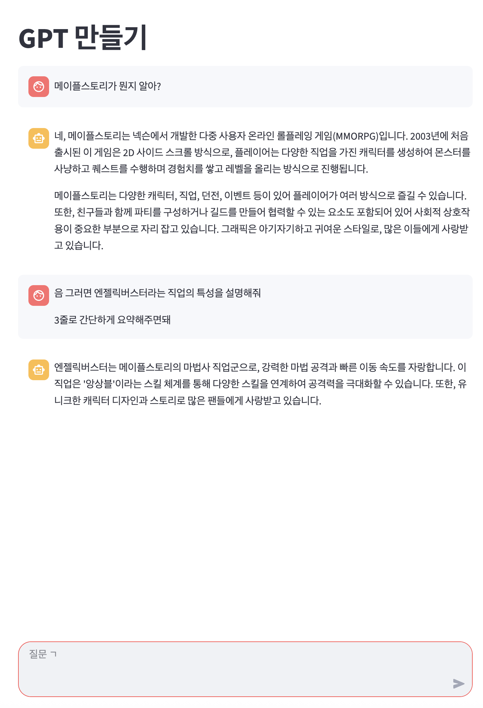

# 웹 앱에 체인 생성하기
- streamlit을 사용해서 만든 기본 틀을 바탕으로 프롬프트, LLM, 출력 파서를 연결

```python
import streamlit as st
from langchain_core.messages import ChatMessage
from langchain_core.output_parsers import StrOutputParser
from langchain_core.prompts import ChatPromptTemplate
from langchain_openai import ChatOpenAI
from dotenv import load_dotenv

load_dotenv()

# 제목 설정
st.title("GPT 만들기")

# 최초 한번만 메세지를 저장할 공간 할당
if "messages" not in st.session_state:
    st.session_state["messages"] = []


# 이력에 새로운 메세지들을 추가하는 함수
def add_message(role: str, message: str) -> None:
    st.session_state["messages"].append(ChatMessage(role=role, content=message))


# 저장된 이전 대화를 출력함
def print_messages() -> None:
    for chat_message in st.session_state["messages"]:
        st.chat_message(chat_message.role).write(chat_message.content)


# 체인을 생성하는 함수
def create_chain():
    prompt = ChatPromptTemplate.from_messages(
        [
            ("system", "당신은 친절한 AI 어시스턴트입니다"),
            ("user", "#Question: \n {question}"),
        ]
    )

    llm = ChatOpenAI(model="gpt-4o-mini")
    output_parser = StrOutputParser()

    return prompt | llm | output_parser


print_messages()

user_input = st.chat_input("질문 ㄱ")

if user_input:
    st.chat_message("user").write(user_input)
    chain = create_chain()
    response = chain.stream({"question": user_input})

    # 챗봇 답변을 스트리밍으로 출력
    ai_answer = ""
    with st.chat_message("assistant"):
        container = st.empty()
        for token in response:
            ai_answer += token
            container.markdown(ai_answer)

    # 이력에 추가
    add_message("user", user_input)
    add_message("assistant", ai_answer)
```

<br>

# 테스트
