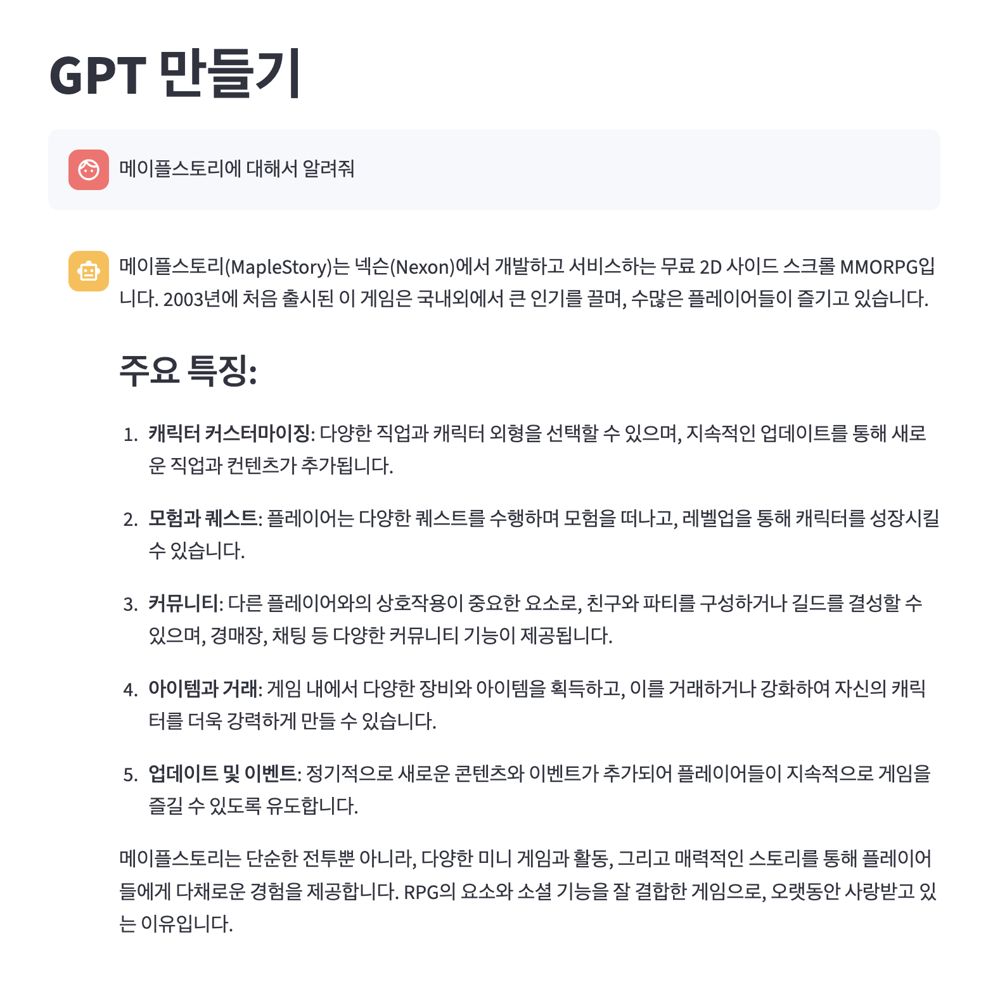
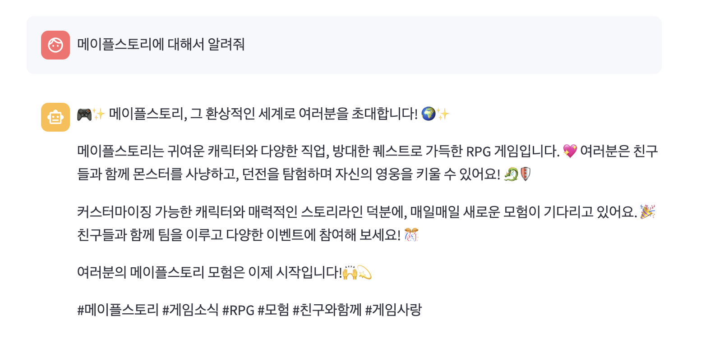
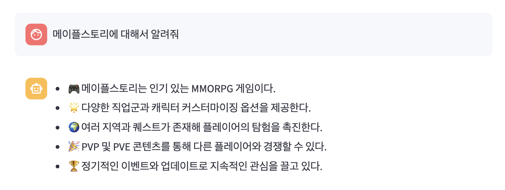

# 프롬프트 타입 선택 기능 추가
- streamlit에서 제공하는 sidebar, selectbox를 통한 부가기능 구현

```python
import streamlit as st
from langchain_core.messages import ChatMessage
from langchain_core.output_parsers import StrOutputParser
from langchain_core.prompts import ChatPromptTemplate, load_prompt
from langchain_openai import ChatOpenAI
from dotenv import load_dotenv
from langchain import hub


load_dotenv()

# 제목 설정
st.title("GPT 만들기")

with st.sidebar:
    clear_btn = st.button("대화날리기")
    # index = 0은 첫번째를 기본값으로 설정한다는 뜻, 즉 `기본`이 들어감
    selected_prompt = st.selectbox(
        "프롬프트 선택 ㄱㄱ", ("기본", "SNS 게시글", "요약"), index=0
    )

# 최초 한번만 메세지를 저장할 공간 할당
if "messages" not in st.session_state:
    st.session_state["messages"] = []


# 이력에 새로운 메세지들을 추가하는 함수
def add_message(role: str, message: str) -> None:
    st.session_state["messages"].append(ChatMessage(role=role, content=message))


# 저장된 이전 대화를 출력함
def print_messages() -> None:
    for chat_message in st.session_state["messages"]:
        st.chat_message(chat_message.role).write(chat_message.content)


# 체인을 생성하는 함수
def create_chain(prompt_type: str):
    prompt = ChatPromptTemplate.from_messages(
        [
            ("system", "당신은 친절한 AI 어시스턴트입니다"),
            ("user", "#Question: \n {question}"),
        ]
    )

    if prompt_type == "SNS 게시글":
        prompt = load_prompt(
            "/Users/imkdw/study/RAG 비법노트/14. Streamlit으로 ChatGPT 웹 앱 제작/sns.yaml",
            encoding="utf-8",
        )
    elif prompt_type == "요약":
        # 에러나서 로컬 파일로 대체
        # prompt = hub.pull("teddynote/chain-of-density-map-korean")
        prompt = load_prompt(
            "/Users/imkdw/study/RAG 비법노트/14. Streamlit으로 ChatGPT 웹 앱 제작/요약.yaml",
            encoding="utf-8",
        )

    llm = ChatOpenAI(model="gpt-4o-mini")
    output_parser = StrOutputParser()

    return prompt | llm | output_parser


print_messages()

user_input = st.chat_input("질문 ㄱ")

if user_input:
    st.chat_message("user").write(user_input)
    chain = create_chain(selected_prompt)
    response = chain.stream({"question": user_input})

    ai_answer = ""
    with st.chat_message("assistant"):
        container = st.empty()
        for token in response:
            ai_answer += token
            container.markdown(ai_answer)

    add_message("user", user_input)
    add_message("assistant", ai_answer)
```

<br>

# 테스트
### 일반모드


<br>

### SNS 모드


<br>

### 요약모드
