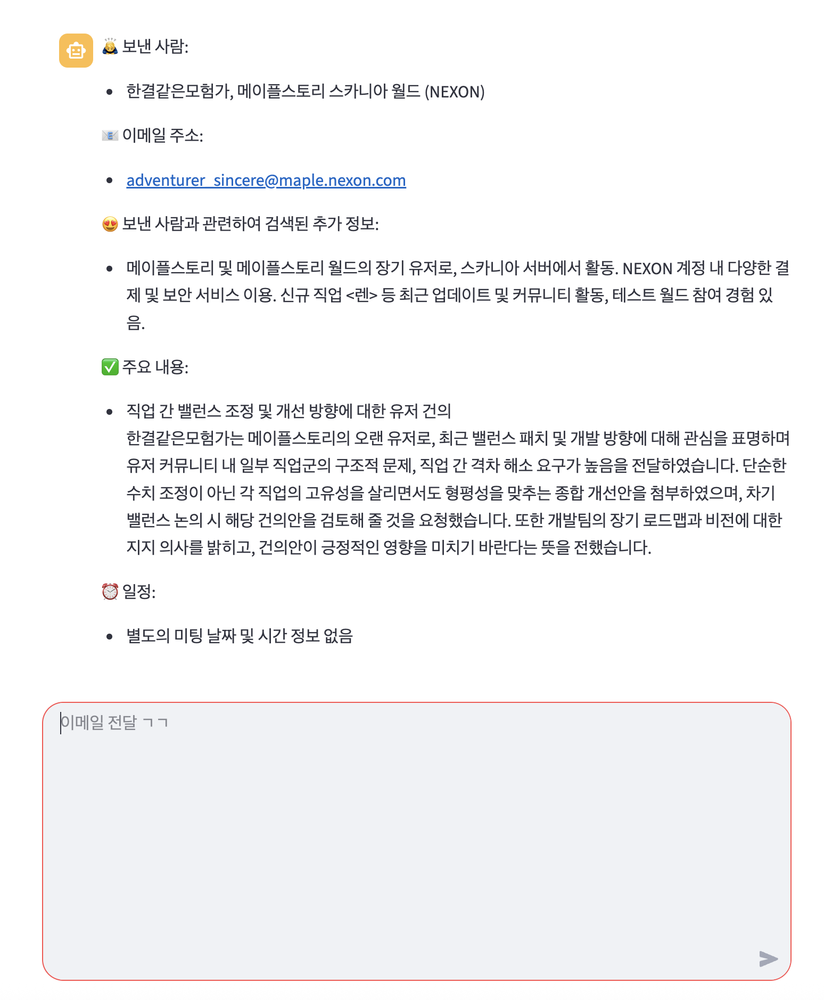

# 이메일의 주요 정보 및 검색 정보 기반 요약 보고서 챗봇
```python
from dotenv import load_dotenv
import streamlit as st
from langchain_core.messages.chat import ChatMessage
from langchain_core.prompts import PromptTemplate
from langchain_core.output_parsers import StrOutputParser
from pydantic import BaseModel, Field
from langchain_core.output_parsers import PydanticOutputParser
from langchain_openai import ChatOpenAI
from langchain_community.utilities import SerpAPIWrapper
from langchain_teddynote.prompts import load_prompt

load_dotenv()

st.title("이메일 요약기")

with st.sidebar:
    clear_btn = st.button("대화 초기화")


class EmailSummary(BaseModel):
    person: str = Field(description="메일을 보낸 사람")
    company: str = Field(description="메일을 보낸 사람의 회사 정보")
    email: str = Field(description="메일을 보낸 사람의 이메일 주소")
    subject: str = Field(description="메일 제목")
    summary: str = Field(description="메일 본문을 요약한 텍스트")
    date: str = Field(description="메일 본문에 언급된 미팅 날짜와 시간")


if "messages" not in st.session_state:
    st.session_state["messages"] = []


def add_message(role: str, message: str) -> None:
    st.session_state["messages"].append(ChatMessage(role=role, content=message))


def print_messages() -> None:
    for chat_message in st.session_state["messages"]:
        st.chat_message(chat_message.role).write(chat_message.content)


def create_email_parsing_chain():
    output_parser = PydanticOutputParser(pydantic_object=EmailSummary)

    prompt = PromptTemplate.from_template(
        """
    You are a helpful assistant. Please answer the following questions in KOREAN.

    #QUESTION:
    다음의 이메일 내용 중에서 주요 내용을 추출해 주세요.

    #EMAIL CONVERSATION:
    {email_conversation}

    #FORMAT:
    {format}
    """
    )

    prompt = prompt.partial(format=output_parser.get_format_instructions())

    return prompt | ChatOpenAI(model="gpt-4.1") | output_parser


def create_report_chain():
    prompt = load_prompt(
        "/Users/imkdw/study/RAG 비법노트/15. 이메일 업무 자동화 챗봇/email.yaml",
        encoding="utf-8",
    )

    return prompt | ChatOpenAI(model="gpt-4.1") | StrOutputParser()


# 초기화 버튼이 눌리면...
if clear_btn:
    st.session_state["messages"] = []

print_messages()

# 사용자의 입력
user_input = st.chat_input("이메일 전달 ㄱㄱ")

if user_input:
    st.chat_message("user").write(user_input)

    # 이메일 파싱 체인 생성과 그에 대한 답변 조회
    email_chain = create_email_parsing_chain()
    answer = email_chain.invoke({"email_conversation": user_input})

    # 구글 검색을 통해서 이메일을 발송한 사람에 대해서 추가적인 검색 진행
    params = {"engine": "google", "gl": "kr", "hl": "ko", "num": "3"}
    search = SerpAPIWrapper(params=params)
    search_query = f"{answer.person} {answer.company} {answer.email}"
    search_result = search.run(search_query)
    search_result = eval(search_result)
    search_result_string = "\n".join(search_result)

    # 이메일 요약 체인 생성
    report_chain = create_report_chain()
    report_chain_input = {
        "sender": answer.person,
        "additional_information": search_result_string,
        "company": answer.company,
        "email": answer.email,
        "subject": answer.subject,
        "summary": answer.summary,
        "date": answer.date,
    }

    response = report_chain.stream(report_chain_input)
    with st.chat_message("assistant"):
        container = st.empty()

        ai_answer = ""
        for token in response:
            ai_answer += token
            container.markdown(ai_answer)

    add_message("user", user_input)
    add_message("assistant", ai_answer)
```

<br>

# 테스트
