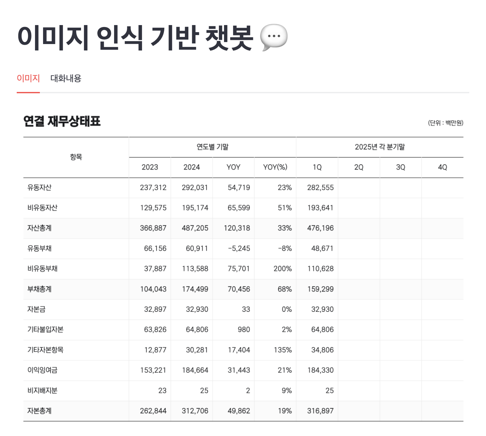

# 멀티모달 모델을 활용한 이미지 인식 기반 챗봇
```python
from langchain_teddynote import logging

logging.langsmith("[Project] 이미지 인식")

# =======================================================

import streamlit as st
from langchain_core.messages.chat import ChatMessage
from langchain_openai import ChatOpenAI
from langchain_teddynote.models import MultiModal
from dotenv import load_dotenv
import os

load_dotenv()

# 캐시 디렉토리 생성
if not os.path.exists(".cache"):
    os.mkdir(".cache")

# 파일 업로드 전용 폴더
if not os.path.exists(".cache/files"):
    os.mkdir(".cache/files")

if not os.path.exists(".cache/embeddings"):
    os.mkdir(".cache/embeddings")

st.title("이미지 인식 기반 챗봇 💬")

if "messages" not in st.session_state:
    st.session_state["messages"] = []

main_tab1, main_tab2 = st.tabs(["이미지", "대화내용"])


with st.sidebar:
    clear_btn = st.button("대화 초기화")
    uploaded_file = st.file_uploader("이미지 업로드", type=["jpg", "jpeg", "png"])
    selected_model = st.selectbox("LLM 선택", ["gpt-4.1-mini", "gpt-4.1-nano"], index=0)

    system_prompt = st.text_area(
        "시스템 프롬프트",
        "당신은 표(재무제표) 를 해석하는 금융 AI 어시스턴트 입니다.\n당신의 임무는 주어진 테이블 형식의 재무제표를 바탕으로 흥미로운 사실을 정리하여 친절하게 답변하는 것입니다.",
        height=200,
    )


# 이전 대화를 출력
def print_messages():
    for chat_message in st.session_state["messages"]:
        main_tab2.chat_message(chat_message.role).write(chat_message.content)


# 새로운 메시지를 추가
def add_message(role, message):
    st.session_state["messages"].append(ChatMessage(role=role, content=message))


@st.cache_resource(show_spinner="업로드한 이미지를 처리 중입니다...")
def process_imagefile(file):
    file_content = file.read()
    file_path = f"./.cache/files/{file.name}"

    with open(file_path, "wb") as f:
        f.write(file_content)

    return file_path


def generate_answer(
    image_filepath, system_prompt, user_prompt, model_name="gpt-4.1-mini"
):
    llm = ChatOpenAI(
        temperature=0,
        model_name=model_name,
    )

    multimodal = MultiModal(llm, system_prompt=system_prompt, user_prompt=user_prompt)

    return multimodal.stream(image_filepath)


if clear_btn:
    st.session_state["messages"] = []

print_messages()

user_input = st.chat_input("궁금한 내용을 물어보세요!")

warning_msg = main_tab2.empty()

if uploaded_file:
    image_filepath = process_imagefile(uploaded_file)
    main_tab1.image(image_filepath)

if user_input:
    if uploaded_file:
        image_filepath = process_imagefile(uploaded_file)
        response = generate_answer(
            image_filepath, system_prompt, user_input, selected_model
        )

        main_tab2.chat_message("user").write(user_input)

        with main_tab2.chat_message("assistant"):
            container = st.empty()

            ai_answer = ""
            for token in response:
                ai_answer += token.content
                container.markdown(ai_answer)

        add_message("user", user_input)
        add_message("assistant", ai_answer)
    else:
        warning_msg.error("이미지를 업로드 해주세요.")
```

<br>

# 테스트

