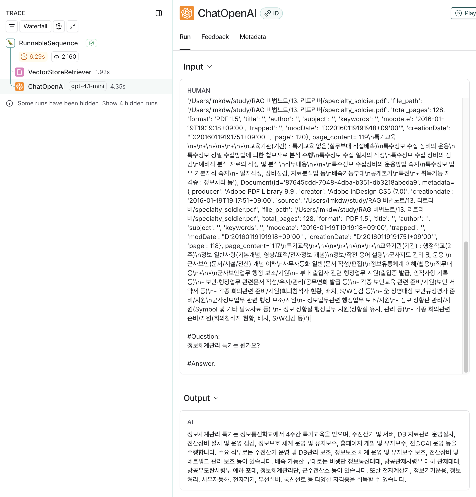

# PDF 문서기반 질의응답 RAG
```python
from langchain_teddynote import logging
from dotenv import load_dotenv

load_dotenv()

logging.langsmith("RAG CHATBOT")

# =======================================================
PDF_PATH = "/Users/imkdw/study/RAG 비법노트/13. 리트리버/specialty_soldier.pdf"

from langchain_text_splitters import RecursiveCharacterTextSplitter
from langchain_community.document_loaders import PyMuPDFLoader
from langchain_community.vectorstores import FAISS
from langchain_core.output_parsers import StrOutputParser
from langchain_core.runnables import RunnablePassthrough
from langchain_core.prompts import PromptTemplate
from langchain_openai import ChatOpenAI, OpenAIEmbeddings

loader = PyMuPDFLoader(PDF_PATH)
docs = loader.load()

# 텍스트는 500자, 중복된 텍스트는 최대 50자
text_splitter = RecursiveCharacterTextSplitter(chunk_size=500, chunk_overlap=50)
split_documents = text_splitter.split_documents(docs)

embeddings = OpenAIEmbeddings()

vector_store = FAISS.from_documents(documents=split_documents, embedding=embeddings)

retriever = vector_store.as_retriever()

prompt = PromptTemplate.from_template(
    """You are an assistant for question-answering tasks. 
Use the following pieces of retrieved context to answer the question. 
If you don't know the answer, just say that you don't know. 
Answer in Korean.

#Context: 
{context}

#Question:
{question}

#Answer:"""
)


llm = ChatOpenAI(model_name="gpt-4.1-mini", temperature=0)

chain = (
    {"context": retriever, "question": RunnablePassthrough()}
    | prompt
    | llm
    | StrOutputParser()
)

question = "정보체계관리 특기는 뭔가요?"
response = chain.invoke(question)

# 정보체계관리 특기는 정보통신학교에서 4주간 교육을 받으며, 주전산기 및 서버, DB 자료관리 운영절차, 전산장비 설치 및 운영 점검, 정보보호 체계 운영 및 유지보수, 홈페이지 개발 및 유지보수, 전술 C4I 운영 등을 수행합니다. 주요 직무로는 주전산기 운영 및 DB관리 보조, 정보보호 체계 운영 및 유지보수 보조, 전산장비 및 네트워크 관리 보조 등이 있습니다. 배속 가능한 부대로는 비행단 정보통신대대, 방공관제사령부 예하 관제대대, 방공유도탄사령부 예하 포대, 정보체계관리단, 군수전산소 등이 있으며, 취득 가능한 자격증으로는 전자계산기, 정보기기운용, 정보처리, 사무자동화, 전자기기, 무선설비, 통신선로 등이 있습니다.
print(response)
```

<br>

# Langsmith 모니터링
