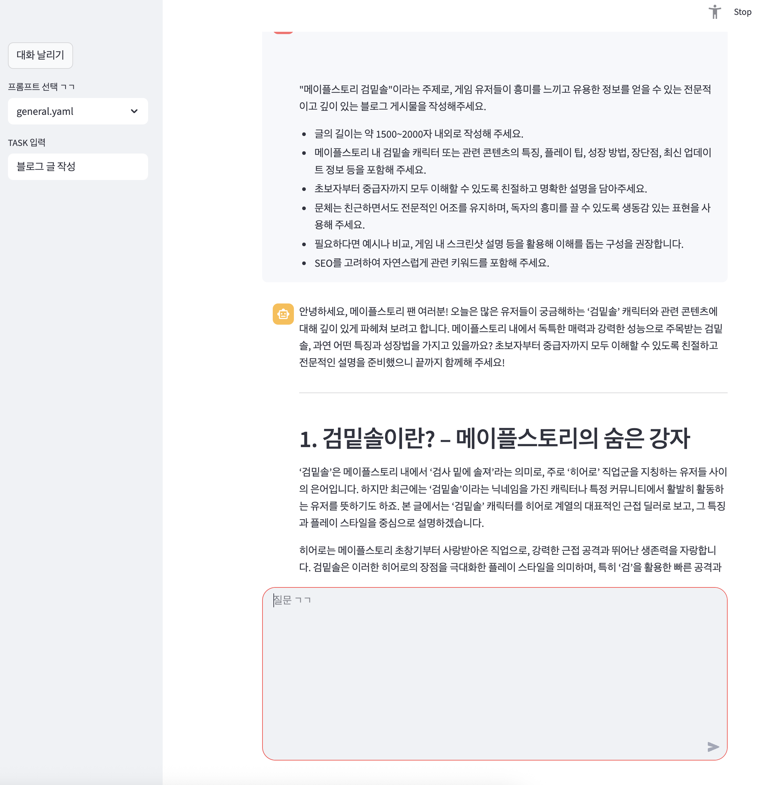

# 프롬프트를 개선해 주는 프롬프트 메이커
```python
from glob import glob
from pathlib import Path
from langchain_core.messages import ChatMessage
from langchain_core.prompts import load_prompt
from langchain_openai import ChatOpenAI
from langchain_core.output_parsers import StrOutputParser
from langchain_teddynote import logging
from dotenv import load_dotenv

load_dotenv()

logging.langsmith("PROMPT MAKER")

# =======================================================
import streamlit as st

if "messages" not in st.session_state:
    st.session_state["messages"] = []


def print_messages():
    for chat_message in st.session_state["messages"]:
        st.chat_message(chat_message.role).write(chat_message.content)


# 새로운 메시지를 추가
def add_message(role: str, message: str) -> None:
    st.session_state["messages"].append(ChatMessage(role=role, content=message))


st.title("PROMPT MAKER")

with st.sidebar:
    clear_btn = st.button("대화 날리기")

    prompt_files = sorted(glob("/Users/imkdw/study/RAG 비법노트/17. RAG 챗봇/*.yaml"))
    if not prompt_files:
        st.warning("프롬프트(.yaml) 파일이 없습니다.")
        selected_prompt = None
    else:
        selected_prompt = st.selectbox(
            "프롬프트 선택 ㄱㄱ",
            prompt_files,
            index=0,
            format_func=lambda p: Path(p).name,
        )

    task_input = st.text_input("TASK 입력", "")


def create_chain(prompt_filepath: str):
    prompt = load_prompt(prompt_filepath, encoding="utf-8")

    if task_input:
        prompt = prompt.partial(task=task_input)

    llm = ChatOpenAI(model="gpt-4.1-mini", temperature=0)

    return prompt | llm | StrOutputParser()


print_messages()

user_input = st.chat_input("질문 ㄱㄱ")

if user_input:
    st.chat_message("user").write(user_input)
    chain = create_chain(selected_prompt)
    response = chain.stream({"question": user_input})

    ai_answer = ""
    with st.chat_message("assistant"):
        container = st.empty()
        for token in response:
            ai_answer += token
            container.markdown(ai_answer)

    add_message("user", user_input)
    add_message("assistant", ai_answer)
```

<br>

# 프롬프트 생성


<br>

# 작성된 프롬프트 사용

