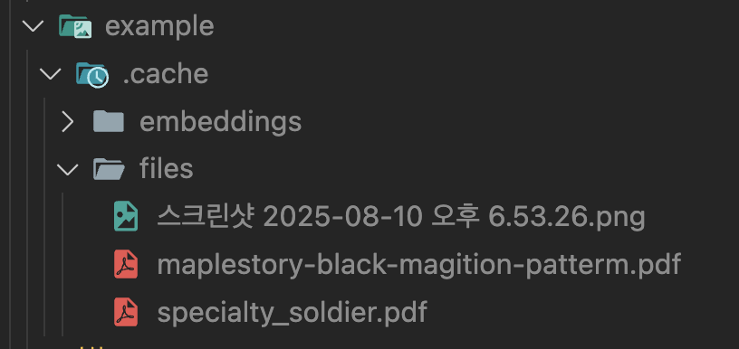

# 페이지 분할 후 파일 업로드 기능 추가
```python
from glob import glob
import os
from pathlib import Path
from langchain_core.messages import ChatMessage
from langchain_core.prompts import load_prompt
from langchain_openai import ChatOpenAI
from langchain_core.output_parsers import StrOutputParser
from langchain_teddynote import logging
from dotenv import load_dotenv

load_dotenv()

logging.langsmith("PDF 기반 QA")

# =======================================================
import streamlit as st

st.title("PDF 기반 QA")

if not os.path.exists(".cache"):
    os.mkdir(".cache")

if not os.path.exists(".cache/files"):
    os.mkdir(".cache/files")

if not os.path.exists(".cache/embeddings"):
    os.mkdir(".cache/embeddings")

if "messages" not in st.session_state:
    st.session_state["messages"] = []


def print_messages():
    for chat_message in st.session_state["messages"]:
        st.chat_message(chat_message.role).write(chat_message.content)


def add_message(role: str, message: str) -> None:
    st.session_state["messages"].append(ChatMessage(role=role, content=message))


with st.sidebar:
    clear_btn = st.button("대화 날리기")
    uploaded_file = st.file_uploader("파일 업로드", type=["pdf"])
    selected_prompt = load_prompt(
        "/Users/imkdw/study/RAG 비법노트/17. RAG 챗봇/pdf-rag.yaml"
    )


@st.cache_resource(show_spinner="파일을 처리 중입니다...")
def embed_file(file):
    file_content = file.read()
    file_path = f"./.cache/files/{file.name}"
    with open(file_path, "wb") as f:
        f.write(file_content)


if uploaded_file:
    embed_file(uploaded_file)


def create_chain(prompt_filepath: str):
    prompt = load_prompt(prompt_filepath, encoding="utf-8")

    output_parser = StrOutputParser()

    llm = ChatOpenAI(model="gpt-4.1-mini", temperature=0)

    return prompt | llm | output_parser


print_messages()

user_input = st.chat_input("질문 ㄱㄱ")

if user_input:
    st.chat_message("user").write(user_input)
    chain = create_chain(selected_prompt)

    response = chain.stream({"question": user_input})
    with st.chat_message("assistant"):
        container = st.empty()

        ai_answer = ""
        for token in response:
            ai_answer += token
            container.markdown(ai_answer)

    add_message("user", user_input)
    add_message("assistant", ai_answer)
```

<br>

# 파일 캐싱
