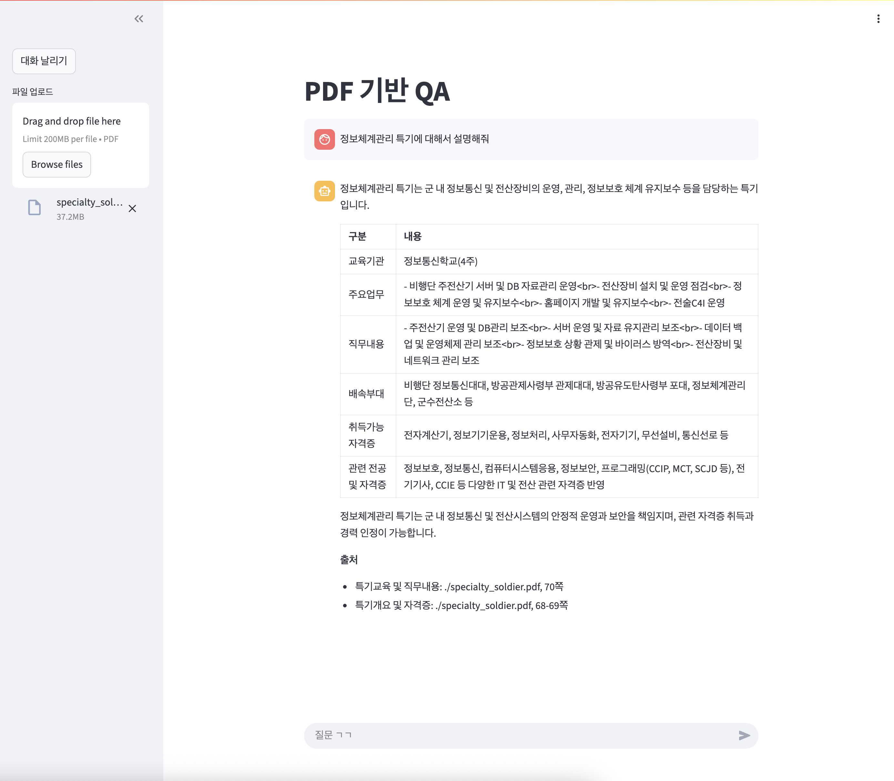

# PDF 기반 QA 챗봇 만들기
```python
from glob import glob
import os
from pathlib import Path
from langchain_core.messages import ChatMessage
from langchain_core.prompts import load_prompt
from langchain_core.runnables import RunnablePassthrough
from operator import itemgetter
from langchain_openai import ChatOpenAI, OpenAIEmbeddings
from langchain_community.document_loaders import PDFPlumberLoader
from langchain_core.output_parsers import StrOutputParser
from langchain_teddynote import logging
from dotenv import load_dotenv
from langchain_community.vectorstores import FAISS

load_dotenv()

logging.langsmith("PDF 기반 QA")

# =======================================================
from langchain_text_splitters import RecursiveCharacterTextSplitter
import streamlit as st

st.title("PDF 기반 QA")

if not os.path.exists(".cache"):
    os.mkdir(".cache")

if not os.path.exists(".cache/files"):
    os.mkdir(".cache/files")

if not os.path.exists(".cache/embeddings"):
    os.mkdir(".cache/embeddings")

if "messages" not in st.session_state:
    st.session_state["messages"] = []

if "chain" not in st.session_state:
    st.session_state["chain"] = None


def print_messages():
    for chat_message in st.session_state["messages"]:
        st.chat_message(chat_message.role).write(chat_message.content)


def add_message(role: str, message: str) -> None:
    st.session_state["messages"].append(ChatMessage(role=role, content=message))


with st.sidebar:
    clear_btn = st.button("대화 날리기")
    uploaded_file = st.file_uploader("파일 업로드", type=["pdf"])
    selected_prompt = load_prompt(
        "/Users/imkdw/study/RAG 비법노트/17. RAG 챗봇/pdf-rag.yaml"
    )


@st.cache_resource(show_spinner="파일을 처리 중입니다...")
def embed_file(file):
    file_content = file.read()
    file_path = f"./.cache/files/{file.name}"
    with open(file_path, "wb") as f:
        f.write(file_content)

    loader = PDFPlumberLoader(file_path)
    docs = loader.load()

    text_splitter = RecursiveCharacterTextSplitter(chunk_size=1000, chunk_overlap=50)
    split_documents = text_splitter.split_documents(docs)

    embeddings = OpenAIEmbeddings()

    vectorstore = FAISS.from_documents(documents=split_documents, embedding=embeddings)

    retriever = vectorstore.as_retriever()

    return retriever


def create_chain(retriever, model_name):
    prompt = load_prompt(
        "/Users/imkdw/study/RAG 비법노트/17. RAG 챗봇/pdf-rag.yaml", encoding="utf-8"
    )

    output_parser = StrOutputParser()

    llm = ChatOpenAI(model=model_name, temperature=0)

    return (
        {
            "context": itemgetter("question") | retriever,
            "question": itemgetter("question"),
        }
        | prompt
        | llm
        | output_parser
    )


if uploaded_file:
    retriever = embed_file(uploaded_file)
    chain = create_chain(retriever, "gpt-4.1-mini")
    st.session_state["chain"] = chain


print_messages()

user_input = st.chat_input("질문 ㄱㄱ")
warning_msg = st.empty()

if user_input:
    chain = st.session_state["chain"]

    if chain is not None:
        st.chat_message("user").write(user_input)
        response = chain.stream({"question": user_input})
        with st.chat_message("assistant"):
            container = st.empty()

            ai_answer = ""
            for token in response:
                ai_answer += token
                container.markdown(ai_answer)

        add_message("user", user_input)
        add_message("assistant", ai_answer)
    else:
        warning_msg.error("파일을 업로드 해주세요.")
```

<br>

# 테스트
