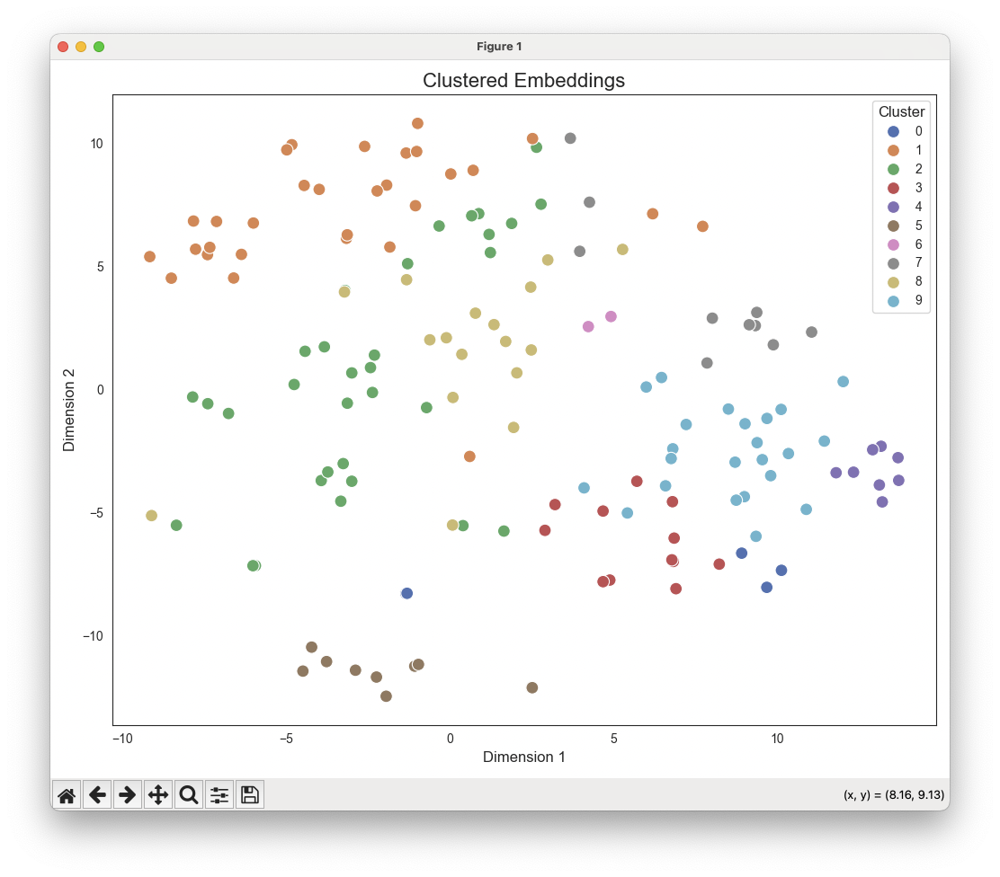

# Clustering Map Refine 요약
- Map-Refine 방식에 클러스터링(군집화) 단게를 붙여 보자는 것임
- 문서를 몇 개의 클러스터로 나누고 중심점에서 가장 가까운 문서를 클러스터의 대표 문서로 인지한 후 Map-Refine 방식으로 요약하는것임

<br>

# 클러스터링 결과 시각화
```python
from dotenv import load_dotenv
from langchain_core.output_parsers import StrOutputParser
from langchain_teddynote import logging

load_dotenv()

logging.langsmith("test")

# ==============================================

from langchain_community.document_loaders import PyPDFLoader
from langchain_upstage import UpstageEmbeddings
from langchain_text_splitters import RecursiveCharacterTextSplitter
from sklearn.cluster import KMeans
from sklearn.manifold import TSNE
import matplotlib.pyplot as plt
import seaborn as sns
import numpy as np


loader = PyPDFLoader(
    "/Users/imkdw/study/RAG 비법노트/13. 리트리버/specialty_soldier.pdf"
)
docs = loader.load()

# PDF 문서를 하나의 텍스트로 만들기
texts = "\n\n".join([doc.page_content for doc in docs])

# 50555
print(len(texts))

# 하나로된 텍스트를 여러개의 문서로 나누기
text_splitter = RecursiveCharacterTextSplitter(chunk_size=500, chunk_overlap=100)
split_docs = text_splitter.split_text(texts)

# 150
print(len(split_docs))

# 임베딩 진행
embeddings = UpstageEmbeddings(model="solar-embedding-1-large-passage")
vectors = embeddings.embed_documents(split_docs)

# 클러스터링 진행, 이는 문서의 수보다 작거나 같아야함
num_clusters = 10
kmeans = KMeans(n_clusters=num_clusters, random_state=123).fit(vectors)

# t-SNE 수행 및 2차원으로 축소
tsne = TSNE(n_components=2, random_state=42)
reduced_data_tsne = tsne.fit_transform(np.array(vectors))

# seaborn 스타일 설정
sns.set_style("white")

# 축소된 데이터 플롯
plt.figure(figsize=(10, 8))
sns.scatterplot(
    x=reduced_data_tsne[:, 0],
    y=reduced_data_tsne[:, 1],
    hue=kmeans.labels_,
    palette="deep",
    s=100,
)
plt.xlabel("Dimension 1", fontsize=12)
plt.ylabel("Dimension 2", fontsize=12)
plt.title("Clustered Embeddings", fontsize=16)
plt.legend(title="Cluster", title_fontsize=12)

# 배경색 설정
plt.gcf().patch.set_facecolor("white")

plt.tight_layout()
plt.show()
```



<br>

# 클러스터 중심점 찾아서 요약하기
```python
from dotenv import load_dotenv
from langchain_core.output_parsers import StrOutputParser
from langchain_teddynote import logging

load_dotenv()

logging.langsmith("test")

# ==============================================
from langchain import hub
from langchain_openai import ChatOpenAI
from langchain_teddynote.callbacks import StreamingCallback
from langchain_community.document_loaders import PyPDFLoader
from langchain_upstage import UpstageEmbeddings
from langchain_text_splitters import RecursiveCharacterTextSplitter
from sklearn.cluster import KMeans
from sklearn.manifold import TSNE
import matplotlib.pyplot as plt
import seaborn as sns
import numpy as np
from langchain_core.documents import Document
from langchain_core.runnables import chain


@chain
def map_refine_chain(docs):

    # map chain 생성
    map_summary = hub.pull("teddynote/map-summary-prompt")

    map_chain = (
        map_summary
        | ChatOpenAI(
            model_name="gpt-4o-mini",
            temperature=0,
        )
        | StrOutputParser()
    )

    input_doc = [{"documents": doc.page_content, "language": "Korean"} for doc in docs]

    # 첫 번째 프롬프트, ChatOpenAI, 문자열 출력 파서를 연결하여 체인을 생성합니다.
    doc_summaries = map_chain.batch(input_doc)

    refine_prompt = hub.pull("teddynote/refine-prompt")

    refine_llm = ChatOpenAI(
        model_name="gpt-4o-mini",
        temperature=0,
        callbacks=[StreamingCallback()],
        streaming=True,
    )

    refine_chain = refine_prompt | refine_llm | StrOutputParser()

    previous_summary = doc_summaries[0]

    for current_summary in doc_summaries[1:]:

        previous_summary = refine_chain.invoke(
            {
                "previous_summary": previous_summary,
                "current_summary": current_summary,
                "language": "Korean",
            }
        )
        print("\n\n-----------------\n\n")

    return previous_summary


loader = PyPDFLoader(
    "/Users/imkdw/study/RAG 비법노트/13. 리트리버/specialty_soldier.pdf"
)
docs = loader.load()

# PDF 문서를 하나의 텍스트로 만들기
texts = "\n\n".join([doc.page_content for doc in docs])

# 50555
print(len(texts))

# 하나로된 텍스트를 여러개의 문서로 나누기
text_splitter = RecursiveCharacterTextSplitter(chunk_size=500, chunk_overlap=100)
split_docs = text_splitter.split_text(texts)

# 150
print(len(split_docs))

# 임베딩 진행
embeddings = UpstageEmbeddings(model="solar-embedding-1-large-passage")
vectors = embeddings.embed_documents(split_docs)

# 클러스터링 진행, 이는 문서의 수보다 작거나 같아야함
num_clusters = 10
kmeans = KMeans(n_clusters=num_clusters, random_state=123).fit(vectors)

# t-SNE 수행 및 2차원으로 축소
tsne = TSNE(n_components=2, random_state=42)
reduced_data_tsne = tsne.fit_transform(np.array(vectors))

# seaborn 스타일 설정
sns.set_style("white")

# 축소된 데이터 플롯
plt.figure(figsize=(10, 8))
sns.scatterplot(
    x=reduced_data_tsne[:, 0],
    y=reduced_data_tsne[:, 1],
    hue=kmeans.labels_,
    palette="deep",
    s=100,
)
plt.xlabel("Dimension 1", fontsize=12)
plt.ylabel("Dimension 2", fontsize=12)
plt.title("Clustered Embeddings", fontsize=16)
plt.legend(title="Cluster", title_fontsize=12)

# 배경색 설정
plt.gcf().patch.set_facecolor("white")

plt.tight_layout()
plt.show()


closest_indices = []

for i in range(num_clusters):
    distances = np.linalg.norm(vectors - kmeans.cluster_centers_[i], axis=1)
    closest_index = np.argmin(distances)
    closest_indices.append(closest_index)

selected_indices = sorted(closest_indices)
selected_indices

selected_docs = [Document(page_content=split_docs[doc]) for doc in selected_indices]

refined_summary = map_refine_chain.invoke(selected_docs)
print(refined_summary)
```