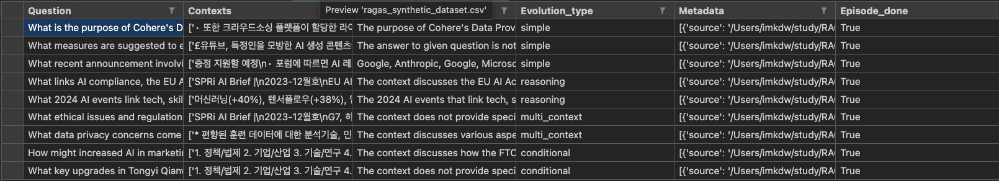

# 필요한 패키지 설지
```
pip install langchain==0.2.16 ragas==0.1.19
```

<br>

# 예제
```python
from langchain_community.document_loaders import PDFPlumberLoader
from ragas.testset.generator import TestsetGenerator
from ragas.testset.evolutions import simple, reasoning, multi_context, conditional
from ragas.llms import LangchainLLMWrapper
from ragas.embeddings import LangchainEmbeddingsWrapper
from ragas.testset.extractor import KeyphraseExtractor
from ragas.testset.docstore import InMemoryDocumentStore
from langchain_openai import ChatOpenAI, OpenAIEmbeddings
from langchain.text_splitter import RecursiveCharacterTextSplitter

loader = PDFPlumberLoader(
    "/Users/imkdw/study/RAG 비법노트/22. RAG 평가와 개선/SPRI_AI_Brief_2023년12월호_F.pdf"
)

docs = loader.load()[3:-1]

for doc in docs:
    doc.metadata["filename"] = doc.metadata["source"]


# 데이터셋 생성기
generator_llm = ChatOpenAI(model="gpt-4o-mini")

# 데이터셋 비평기
critic_llm = ChatOpenAI(model="gpt-4o-mini")

# 임베딩 모델
embeddings = OpenAIEmbeddings(model="text-embedding-3-small")

# 텍스트 분할기 설정
splitter = RecursiveCharacterTextSplitter(chunk_size=1000, chunk_overlap=100)

# LangChain의 ChatOpenAI 모델을 LangchainLLMWrapper로 감싸 Ragas와 호환되게 변경
langchain_llm = LangchainLLMWrapper(ChatOpenAI(model="gpt-4o-mini"))

# 주요 구문 추출기를 초기화
keyphrase_extractor = KeyphraseExtractor(llm=langchain_llm)

# ragas_embeddings 생성
ragas_embeddings = LangchainEmbeddingsWrapper(embeddings)

# InMemoryDocumentStore 초기화, 문서를 메모리에 저장하고 관리하게됨
docstore = InMemoryDocumentStore(
    splitter=splitter,
    embeddings=ragas_embeddings,
    extractor=keyphrase_extractor,
)

generator = TestsetGenerator.from_langchain(
    generator_llm,
    critic_llm,
    ragas_embeddings,
    docstore=docstore,
)

# 질문 유형별 분포 결정
# simple: 간단한 질문
# reasoning: 추론이 필요한 질문
# multi_context: 여러 맥락을 고려해야 하는 질문
# conditional: 조건부 질문
distributions = {simple: 0.4, reasoning: 0.2, multi_context: 0.2, conditional: 0.2}

# 테스트셋 생성
# docs: 문서 데이터
# test_size: 생성할 질문의 수
# distributions: 질문 유형별 분포
# with_debugging_logs: 디버깅 로그 출력 여부
# raise_exceptions: 예외 발생 여부
testset = generator.generate_with_langchain_docs(
    documents=docs,
    test_size=10,
    distributions=distributions,
    with_debugging_logs=True,
    raise_exceptions=False,
)

# 생성된 테스트셋을 pandas DataFrame으로 변환
test_df = testset.to_pandas()

# DataFrame의 상위 5개 행 출력
test_df.head()

# DataFrame을 CSV 파일로 저장
test_df.to_csv("ragas_synthetic_dataset.csv", index=False)
```

<br>

# 생성된 테스트셋
