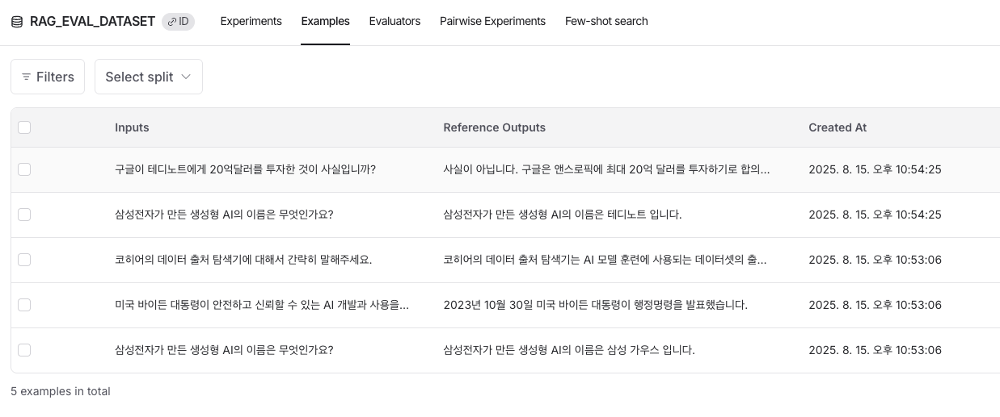

# 평가용 테스트 데이터셋 구축하기
- RAGAS 처럼 합성 테스트 데이터셋을 생성하거나 직접 입력해서 추가가 가능
- 만약 서비스에 이용자가 있다면 이용자가 입력한 질의 응답을 데이터셋에 추가도 가능함
- 데이터셋 구축을 위해서는 크게 3가지 과정이 필요함
  - question-retrieval 평가 : 검색한 결과가 질문과 관련성이 있는지 평가
  - question-answer 평가 : LLM이 생성한 답변이 질문과 얼마나 관련성이 있는지 평가
  - retrieval-answer 평가 : LLM이 생성한 답변이 검색된 결과 안에서 답변했는지 평가. 특히 환각현상 확인에 필요함
- 일반적으로 retrieval, question, answer 3가지가 필요하지만 수기로 데이터셋을 입력시 retrieval에 대한 ground_truth 구축이 힘듦
  - ground_truth : 평가나 학습을 위해서 사람이 정해 놓은 기준 정답
- retrieval에 대한 ground_truth가 있다면 모두 데이터셋으로 저장해서 활용하고 없다면 question과 answer만으로 데이터셋 구축을 진행함

<br>

# 데이터셋 직접 구축하기
```python
import pandas as pd
import pandas as pd
from datasets import load_dataset, Dataset

# 질문과 답변 목록
inputs = [
    "삼성전자가 만든 생성형 AI의 이름은 무엇인가요?",
    "미국 바이든 대통령이 안전하고 신뢰할 수 있는 AI 개발과 사용을 보장하기 위한 행정명령을 발표한 날은 언제인가요?",
    "코히어의 데이터 출처 탐색기에 대해서 간략히 말해주세요.",
]

# 질문에 대한 답변 목록
outputs = [
    "삼성전자가 만든 생성형 AI의 이름은 삼성 가우스 입니다.",
    "2023년 10월 30일 미국 바이든 대통령이 행정명령을 발표했습니다.",
    "코히어의 데이터 출처 탐색기는 AI 모델 훈련에 사용되는 데이터셋의 출처와 라이선스 상태를 추적하고 투명성을 확보하기 위한 플랫폼입니다. 12개 기관과 협력하여 2,000여 개 데이터셋의 출처 정보를 제공하며, 개발자들이 데이터의 구성과 계보를 쉽게 파악할 수 있게 돕습니다.",
]

# 질문과 답변 쌍 생성
qa_pairs = [{"question": q, "answer": a} for q, a in zip(inputs, outputs)]

# 데이터프레임으로 변환
df = pd.DataFrame(qa_pairs)

# 0                        삼성전자가 만든 생성형 AI의 이름은 무엇인가요?                   삼성전자가 만든 생성형 AI의 이름은 삼성 가우스 입니다.
# 1  미국 바이든 대통령이 안전하고 신뢰할 수 있는 AI 개발과 사용을 보장하기 위한 행...            2023년 10월 30일 미국 바이든 대통령이 행정명령을 발표했습니다.
# 2                    코히어의 데이터 출처 탐색기에 대해서 간략히 말해주세요.  코히어의 데이터 출처 탐색기는 AI 모델 훈련에 사용되는 데이터셋의 출처와 라이선스...
print(df.head())
```

<br>

# Langsmith에 데이터셋 저장하기
```python
from langsmith import Client

client = Client()
dataset_name = "RAG_EVAL_DATASET"


def create_dataset(client, dataset_name, description=None):
    for dataset in client.list_datasets():
        if dataset.name == dataset_name:
            return dataset

    dataset = client.create_dataset(
        dataset_name=dataset_name,
        description=description,
    )
    return dataset


dataset = create_dataset(client, dataset_name)

# 새로운 질문 목록
new_questions = [
    "삼성전자가 만든 생성형 AI의 이름은 무엇인가요?",
    "구글이 테디노트에게 20억달러를 투자한 것이 사실입니까?",
]

# 새로운 답변 목록
new_answers = [
    "삼성전자가 만든 생성형 AI의 이름은 테디노트 입니다.",
    "사실이 아닙니다. 구글은 앤스로픽에 최대 20억 달러를 투자하기로 합의했으며, 이 중 5억 달러를 우선 투자하고 향후 15억 달러를 추가로 투자하기로 했습니다.",
]

# UI에서 업데이트된 버전 확인
client.create_examples(
    inputs=[{"question": q} for q in new_questions],
    outputs=[{"answer": a} for a in new_answers],
    dataset_id=dataset.id,
)
```


