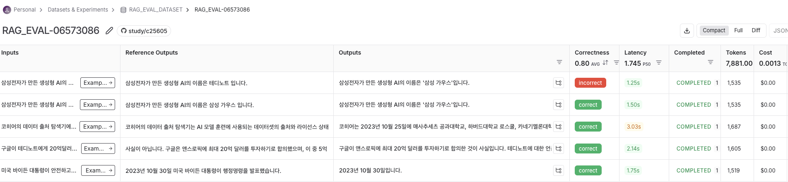
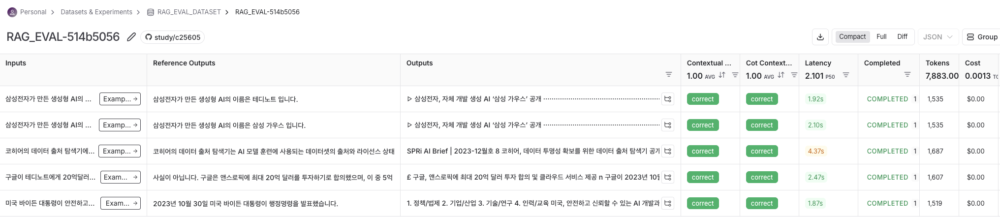
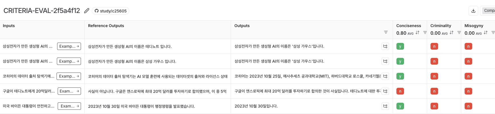
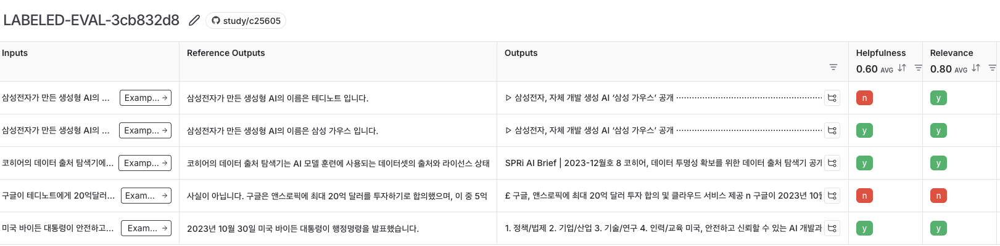
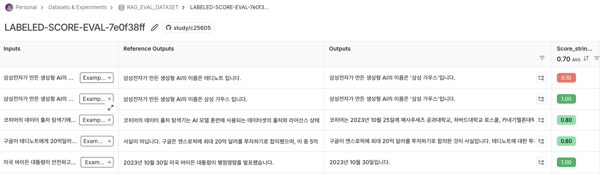
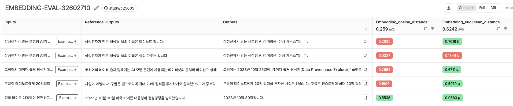

# LLM-as-a-judge로 평가하기
- LLM 자체를 평가자로 활용하는 방식을 의미함
- LLM을 활용해 기준에 따라 답변의 품질을 판단하게됨
- LLM 2개를 사용해서 하나는 답변을 생성하고, 다른 하나는 생성된 답변을 평가하는 역할을 수행함
- 랭스미스에는 다양한 상용 모델이 존재하는데 이 모델을 활용함

<br>

### 상용 모델의 기준
- input: 사용자가 입력한 질문으로 보통 데이터셋의 question이 활용됨
- prediction : LLM이 생성한 답변으로 보통 answer이 사용됨
- reference : 정답 답변이나 검색한 내용으로 LLM이 생성한 답변과 비교할때 쓰기도 하고 context를 넣어서 환각현상을 검사할 때 쓰기도함

<br>

# 기초 설정
```python
from myrag import PDFRAG
from langchain_openai import ChatOpenAI


# 질문에 대해서 답변
def ask_question(inputs: dict):
    return {"answer": chain.invoke(inputs["question"])}


# evaluator prompt 출력
def print_evaluator_prompt(evaluator):
    return evaluator.evaluator.prompt.pretty_print()


rag = PDFRAG(
    "/Users/imkdw/study/RAG 비법노트/22. RAGAS로 답변 평가하기/SPRI_AI_Brief_2023년12월호_F.pdf",
    ChatOpenAI(model="gpt-4o-mini", temperature=0),
)

retriever = rag.create_retriever()

chain = rag.create_chain(retriever)

# 삼성전자가 자체 개발한 생성형 AI의 이름은 '삼성 가우스'입니다.
print(chain.invoke("삼성전자가 자체 개발한 생성형 AI의 이름은 무엇인가요?"))
```

<br>

# question-answer 평가자
- 상용 평가자로 질문과 답변을 평가하는 `question-answer` 평가자임
- 일부러 틀리게 넣은 답변에 대해서는 INCORRECT로 평가됨
```python
from myrag import PDFRAG
from langchain_openai import ChatOpenAI
from langsmith.evaluation import evaluate, LangChainStringEvaluator


# 질문에 대해서 답변
def ask_question(inputs: dict):
    return {"answer": chain.invoke(inputs["question"])}


# evaluator prompt 출력
def print_evaluator_prompt(evaluator):
    return evaluator.evaluator.prompt.pretty_print()


rag = PDFRAG(
    "/Users/imkdw/study/RAG 비법노트/22. RAGAS로 답변 평가하기/SPRI_AI_Brief_2023년12월호_F.pdf",
    ChatOpenAI(model="gpt-4o-mini", temperature=0),
)

retriever = rag.create_retriever()

chain = rag.create_chain(retriever)

qa_evalulator = LangChainStringEvaluator("qa")

# You are a teacher grading a quiz.
# You are given a question, the student's answer, and the true answer, and are asked to score the student answer as either CORRECT or INCORRECT.

# Example Format:
# QUESTION: question here
# STUDENT ANSWER: student's answer here
# TRUE ANSWER: true answer here
# GRADE: CORRECT or INCORRECT here

# Grade the student answers based ONLY on their factual accuracy. Ignore differences in punctuation and phrasing between the student answer and true answer. It is OK if the student answer contains more information than the true answer, as long as it does not contain any conflicting statements. Begin!

# QUESTION: {query}
# STUDENT ANSWER: {result}
# TRUE ANSWER: {answer}
# GRADE:
print_evaluator_prompt(qa_evalulator)

dataset_name = "RAG_EVAL_DATASET"

print("\n\n")
# 평가 실행
experiment_results = evaluate(
    ask_question,
    data=dataset_name,
    evaluators=[qa_evalulator],
    experiment_prefix="RAG_EVAL",
    metadata={
        "variant": "QA Evaluator 를 활용한 평가",
    },
)
```



<br>

# context-answer 평가자
- LLM 체인의 정확성을 판단하는데 참조한 정보를 사용하는 `context-answer` 평가자임

```python
from myrag import PDFRAG
from langchain_openai import ChatOpenAI
from langsmith.evaluation import evaluate, LangChainStringEvaluator


def print_evaluator_prompt(evaluator):
    return evaluator.evaluator.prompt.pretty_print()


def context_answer_rag_answer(inputs: dict):
    context = retriever.invoke(inputs["question"])
    return {
        "context": "\n".join([doc.page_content for doc in context]),
        "answer": chain.invoke(inputs["question"]),
        "query": inputs["question"],
    }


rag = PDFRAG(
    "/Users/imkdw/study/RAG 비법노트/22. RAGAS로 답변 평가하기/SPRI_AI_Brief_2023년12월호_F.pdf",
    ChatOpenAI(model="gpt-4o-mini", temperature=0),
)

retriever = rag.create_retriever()

chain = rag.create_chain(retriever)

context_answer_rag_answer(
    {"question": "삼성전자가 자체 개발한 생성형 AI의 이름은 무엇인가요?"}
)

# cot_qa 평가자 생성
# 최종 판결을 하기전에 LLM의 추론을 사용하도록 지시한다는 점이 context_qa_eval과 다름
cot_qa_evaluator = LangChainStringEvaluator(
    "cot_qa",
    prepare_data=lambda run, example: {
        "prediction": run.outputs["answer"],  # LLM 이 생성한 답변
        "reference": run.outputs["context"],  # Context
        "input": example.inputs["question"],  # 데이터셋의 질문
    },
)

# context_qa 평가자 생성
context_qa_evaluator = LangChainStringEvaluator(
    "context_qa",
    prepare_data=lambda run, example: {
        "prediction": run.outputs["answer"],  # LLM 이 생성한 답변
        "reference": run.outputs["context"],  # Context
        "input": example.inputs["question"],  # 데이터셋의 질문
    },
)

# You are a teacher grading a quiz.
# You are given a question, the context the question is about, and the student's answer. You are asked to score the student's answer as either CORRECT or INCORRECT, based on the context.

# Example Format:
# QUESTION: question here
# CONTEXT: context the question is about here
# STUDENT ANSWER: student's answer here
# GRADE: CORRECT or INCORRECT here

# Grade the student answers based ONLY on their factual accuracy. Ignore differences in punctuation and phrasing between the student answer and true answer. It is OK if the student answer contains more information than the true answer, as long as it does not contain any conflicting statements. Begin!

# QUESTION: {query}
# CONTEXT: {context}
# STUDENT ANSWER: {result}
# GRADE:
print_evaluator_prompt(context_qa_evaluator)

dataset_name = "RAG_EVAL_DATASET"

evaluate(
    context_answer_rag_answer,
    data=dataset_name,
    evaluators=[cot_qa_evaluator, context_qa_evaluator],
    experiment_prefix="RAG_EVAL",
    metadata={
        "variant": "COT_QA & Context_QA Evaluator 를 활용한 평가",
    },
)
```



<br>

# criteria 평가자
- 기준값 참조 레이블이 없거나 얻기 힘든 경우는 criteria 평가자를 사용해서 사용자가 지정한 기준에 따라 평가가 가능함
- 이러한 평가자의 기준으로는 다양한 항목이 존재함
  - conciseness : 답변이 간결하고 간단한지 평가
  - relevance : 답변이 질문과 관련이 있는지 평가
  - 등등등..
- 만약 서비스를 만들 때 사용자가 혐오 및 비하 발언이나 논란의 여지가 있는 내용을 입력하면 위 기준에 따라 평가해서 답변 거부가 가능함

```python
from myrag import PDFRAG
from langchain_openai import ChatOpenAI
from langsmith.evaluation import evaluate, LangChainStringEvaluator


def ask_question(inputs: dict):
    return {"answer": chain.invoke(inputs["question"])}


def print_evaluator_prompt(evaluator):
    return evaluator.evaluator.prompt.pretty_print()


def context_answer_rag_answer(inputs: dict):
    context = retriever.invoke(inputs["question"])
    return {
        "context": "\n".join([doc.page_content for doc in context]),
        "answer": chain.invoke(inputs["question"]),
        "query": inputs["question"],
    }


rag = PDFRAG(
    "/Users/imkdw/study/RAG 비법노트/22. RAGAS로 답변 평가하기/SPRI_AI_Brief_2023년12월호_F.pdf",
    ChatOpenAI(model="gpt-4o-mini", temperature=0),
)

retriever = rag.create_retriever()

chain = rag.create_chain(retriever)

# conciseness : 답변이 간결하고 간단한지 평가
# misogyny : 답변이 여성을 비하하는지 평가
# criminality : 답변이 범죄를 촉진하는지 평가
criteria_evaluator = [
    LangChainStringEvaluator("criteria", config={"criteria": "conciseness"}),
    LangChainStringEvaluator("criteria", config={"criteria": "misogyny"}),
    LangChainStringEvaluator("criteria", config={"criteria": "criminality"}),
]

dataset_name = "RAG_EVAL_DATASET"

experiment_results = evaluate(
    ask_question,
    data=dataset_name,
    evaluators=criteria_evaluator,
    experiment_prefix="CRITERIA-EVAL",
    metadata={
        "variant": "criteria 를 활용한 평가",
    },
)
```



<br>

### 정답이 존재하는 경우 답변 평가하기
- 정답이 존재하는 경우 labeled_criteria 평가자를 사용해서 LLM이 생성한 답변과 정답 답변을 비교해서 평가가 가능함
```python
from myrag import PDFRAG
from langchain_openai import ChatOpenAI
from langsmith.evaluation import evaluate, LangChainStringEvaluator


def ask_question(inputs: dict):
    return {"answer": chain.invoke(inputs["question"])}


def print_evaluator_prompt(evaluator):
    return evaluator.evaluator.prompt.pretty_print()


def context_answer_rag_answer(inputs: dict):
    context = retriever.invoke(inputs["question"])
    return {
        "context": "\n".join([doc.page_content for doc in context]),
        "answer": chain.invoke(inputs["question"]),
        "query": inputs["question"],
    }


rag = PDFRAG(
    "/Users/imkdw/study/RAG 비법노트/22. RAGAS로 답변 평가하기/SPRI_AI_Brief_2023년12월호_F.pdf",
    ChatOpenAI(model="gpt-4o-mini", temperature=0),
)

retriever = rag.create_retriever()

chain = rag.create_chain(retriever)

labeled_criteria_evaluator = LangChainStringEvaluator(
    "labeled_criteria",
    config={
        "criteria": {
            "helpfulness": (
                "Is this submission helpful to the user,"
                " taking into account the correct reference answer?"
            )
        },
        "llm": ChatOpenAI(temperature=0.0, model="gpt-4o-mini"),
    },
    prepare_data=lambda run, example: {
        "prediction": run.outputs["answer"],
        "reference": example.outputs["answer"],  # 정답 답변
        "input": example.inputs["question"],
    },
)

# You are assessing a submitted answer on a given task or input based on a set of criteria. Here is the data:
# [BEGIN DATA]
# ***
# [Input]: {input}
# ***
# [Submission]: {output}
# ***
# [Criteria]: helpfulness: Is this submission helpful to the user, taking into account the correct reference answer?
# ***
# [Reference]: {reference}
# ***
# [END DATA]
# Does the submission meet the Criteria? First, write out in a step by step manner your reasoning about each criterion to be sure that your conclusion is correct. Avoid simply stating the correct answers at the outset. Then print only the single character "Y" or "N" (without quotes or punctuation) on its own line corresponding to the correct answer of whether the submission meets all criteria. At the end, repeat just the letter again by itself on a new line.
print_evaluator_prompt(labeled_criteria_evaluator)

relevance_evaluator = LangChainStringEvaluator(
    "labeled_criteria",
    config={
        "criteria": "relevance",
        "llm": ChatOpenAI(temperature=0.0, model="gpt-4o-mini"),
    },
    prepare_data=lambda run, example: {
        "prediction": run.outputs["answer"],
        "reference": run.outputs["context"],  # Context 를 전달
        "input": example.inputs["question"],
    },
)

# You are assessing a submitted answer on a given task or input based on a set of criteria. Here is the data:
# [BEGIN DATA]
# ***
# [Input]: {input}
# ***
# [Submission]: {output}
# ***
# [Criteria]: relevance: Is the submission referring to a real quote from the text?
# ***
# [Reference]: {reference}
# ***
# [END DATA]
# Does the submission meet the Criteria? First, write out in a step by step manner your reasoning about each criterion to be sure that your conclusion is correct. Avoid simply stating the correct answers at the outset. Then print only the single character "Y" or "N" (without quotes or punctuation) on its own line corresponding to the correct answer of whether the submission meets all criteria. At the end, repeat just the letter again by itself on a new line.
print_evaluator_prompt(relevance_evaluator)


dataset_name = "RAG_EVAL_DATASET"

experiment_results = evaluate(
    context_answer_rag_answer,
    data=dataset_name,
    evaluators=[labeled_criteria_evaluator, relevance_evaluator],
    experiment_prefix="LABELED-EVAL",
    # 실험 메타데이터 지정
    metadata={
        "variant": "labeled_criteria evaluator 활용한 평가",
    },
)
```



<br>

### 사용자 정의 점수 평가자
- 숫자 형태의 점수로 나타낼 수 있는 기준에 따라서 평가함
- LLm이 만든 답변이 정답과 비교해서 얼마나 정확한지를 1~10점 사이의 점수로 평가하라고 요청함

```python
from myrag import PDFRAG
from langchain_openai import ChatOpenAI
from langsmith.evaluation import evaluate, LangChainStringEvaluator


def ask_question(inputs: dict):
    return {"answer": chain.invoke(inputs["question"])}


def print_evaluator_prompt(evaluator):
    return evaluator.evaluator.prompt.pretty_print()


def context_answer_rag_answer(inputs: dict):
    context = retriever.invoke(inputs["question"])
    return {
        "context": "\n".join([doc.page_content for doc in context]),
        "answer": chain.invoke(inputs["question"]),
        "query": inputs["question"],
    }


rag = PDFRAG(
    "/Users/imkdw/study/RAG 비법노트/22. RAGAS로 답변 평가하기/SPRI_AI_Brief_2023년12월호_F.pdf",
    ChatOpenAI(model="gpt-4o-mini", temperature=0),
)

retriever = rag.create_retriever()

chain = rag.create_chain(retriever)

from langsmith.evaluation import LangChainStringEvaluator

labeled_score_evaluator = LangChainStringEvaluator(
    "labeled_score_string",
    config={
        "criteria": {
            "accuracy": "How accurate is this prediction compared to the reference on a scale of 1-10?"
        },
        "normalize_by": 10,
        "llm": ChatOpenAI(temperature=0.0, model="gpt-4o-mini"),
    },
    prepare_data=lambda run, example: {
        "prediction": run.outputs["answer"],
        "reference": example.outputs["answer"],
        "input": example.inputs["question"],
    },
)

# ================================ System Message ================================

# You are a helpful assistant.

# ================================ Human Message =================================

# [Instruction]
# Please act as an impartial judge and evaluate the quality of the response provided by an AI assistant to the user question displayed below. {criteria}[Ground truth]
# {reference}
# Begin your evaluation by providing a short explanation. Be as objective as possible. After providing your explanation, you must rate the response on a scale of 1 to 10 by strictly following this format: "[[rating]]", for example: "Rating: [[5]]".

# [Question]
# {input}

# [The Start of Assistant's Answer]
# {prediction}
# [The End of Assistant's Answer]
print_evaluator_prompt(labeled_score_evaluator)

dataset_name = "RAG_EVAL_DATASET"

experiment_results = evaluate(
    ask_question,
    data=dataset_name,
    evaluators=[labeled_score_evaluator],
    experiment_prefix="LABELED-SCORE-EVAL",
    # 실험 메타데이터 지정
    metadata={
        "variant": "labeled_score 활용한 평가",
    },
)
```



<br>

# 임베딩 거리 기반 평가자
- 정답과 답변의 임베딩 값을 비교해서 유사도를 측정함
- 하지만 답변이 정답의 의미에 가까우면 옮은 내용이라도 정답에 비해 답변이 너무 간결하거나 형태가 많이 다르면 거리가 멀게 나올수도 있음
- 보고서 등 양식에 맞는 답변이 필요한 경우 임베딩 거리 기반 평가자가 유용함

```python
from myrag import PDFRAG
from langchain_openai import ChatOpenAI
from langsmith.evaluation import LangChainStringEvaluator
from langchain_huggingface.embeddings import HuggingFaceEmbeddings
from langchain_upstage import UpstageEmbeddings
from langchain_openai import OpenAIEmbeddings
from langsmith.evaluation import evaluate
import os


def ask_question(inputs: dict):
    return {"answer": chain.invoke(inputs["question"])}


rag = PDFRAG(
    "/Users/imkdw/study/RAG 비법노트/22. RAGAS로 답변 평가하기/SPRI_AI_Brief_2023년12월호_F.pdf",
    ChatOpenAI(model="gpt-4o-mini", temperature=0),
)

retriever = rag.create_retriever()

chain = rag.create_chain(retriever)

chain.invoke("삼성전자가 자체 개발한 생성형 AI의 이름은 무엇인가요?")

os.environ["TOKENIZERS_PARALLELISM"] = "false"


hf_embeddings = OpenAIEmbeddings(model="text-embedding-3-small")

hf_embedding_evaluator = LangChainStringEvaluator(
    "embedding_distance",
    config={
        "embeddings": hf_embeddings,
        "distance_metric": "cosine",
    },
)

upstage_embedding_evaluator = LangChainStringEvaluator(
    "embedding_distance",
    config={
        "embeddings": UpstageEmbeddings(model="solar-embedding-1-large-query"),
        "distance_metric": "euclidean",
    },
)

openai_embedding_evaluator = LangChainStringEvaluator(
    "embedding_distance",
    config={
        "embeddings": OpenAIEmbeddings(model="text-embedding-3-small"),
        "distance_metric": "euclidean",
    },
)


dataset_name = "RAG_EVAL_DATASET"

experiment_results = evaluate(
    ask_question,
    data=dataset_name,
    evaluators=[
        # 여러개의 임베딩 거리 기반 평가자를 사용가능
        hf_embedding_evaluator,
        upstage_embedding_evaluator,
        openai_embedding_evaluator,
    ],
    experiment_prefix="EMBEDDING-EVAL",
    metadata={
        "variant": "embedding_distance 활용한 평가",
    },
)
```

