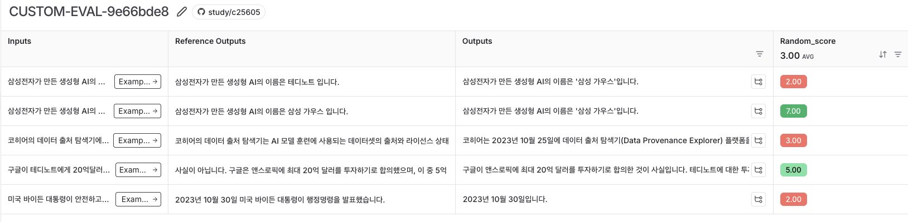

# 사용자 정의 평가자 만들기
- 사용자의 입맛에 맞게 프롬프트 방식으로 만든 평가자

```python
from myrag import PDFRAG
from langchain_openai import ChatOpenAI
from langsmith.schemas import Run, Example
import random
from langsmith.evaluation import evaluate


def ask_question(inputs: dict):
    return {"answer": chain.invoke(inputs["question"])}


def random_score_evaluator(run: Run, example: Example) -> dict:
    score = random.randint(1, 10)
    return {"key": "random_score", "score": score}


rag = PDFRAG(
    "/Users/imkdw/study/RAG 비법노트/22. RAGAS로 답변 평가하기/SPRI_AI_Brief_2023년12월호_F.pdf",
    ChatOpenAI(model="gpt-4o-mini", temperature=0),
)

retriever = rag.create_retriever()

chain = rag.create_chain(retriever)

chain.invoke("삼성전자가 자체 개발한 생성형 AI의 이름은 무엇인가요?")

dataset_name = "RAG_EVAL_DATASET"

experiment_results = evaluate(
    ask_question,
    data=dataset_name,
    # 1 ~ 10 사이의 랜덤한 값을 스코어링
    evaluators=[random_score_evaluator],
    experiment_prefix="CUSTOM-EVAL",
    metadata={
        "variant": "랜덤 점수 평가자",
    },
)
```



<br>

### LLM-as-a-judge 만들기
```python
from myrag import PDFRAG
from langchain_openai import ChatOpenAI
from langsmith.evaluation import evaluate
from langchain import hub
from langchain_core.output_parsers import StrOutputParser
from langchain_openai import ChatOpenAI
from langsmith.schemas import Run, Example


def context_answer_rag_answer(inputs: dict):
    context = retriever.invoke(inputs["question"])
    return {
        "context": "\n".join([doc.page_content for doc in context]),
        "answer": chain.invoke(inputs["question"]),
        "question": inputs["question"],
    }


def ask_question(inputs: dict):
    return {"answer": chain.invoke(inputs["question"])}


def custom_evaluator(run: Run, example: Example) -> dict:
    llm_answer = run.outputs.get("answer", "")
    context = run.outputs.get("context", "")
    question = example.outputs.get("question", "")

    score = custom_llm_evaluator.invoke(
        {"question": question, "answer": llm_answer, "context": context}
    )

    return {"key": "custom_score", "score": float(score)}


rag = PDFRAG(
    "/Users/imkdw/study/RAG 비법노트/22. RAGAS로 답변 평가하기/SPRI_AI_Brief_2023년12월호_F.pdf",
    ChatOpenAI(model="gpt-4o-mini", temperature=0),
)

retriever = rag.create_retriever()

chain = rag.create_chain(retriever)

"""
As an LLM evaluator (judge), please assess the LLM's response to the given question. Evaluate the response's accuracy, comprehensiveness, and context precision based on the provided context. After your evaluation, return only the numerical scores in the following format:
Accuracy: [score]
Comprehensiveness: [score]
Context Precision: [score]
Final: [normalized score]
Grading rubric:

Accuracy (0-10 points):
Evaluate how well the answer aligns with the information provided in the given context.

0 points: The answer is completely inaccurate or contradicts the provided context
4 points: The answer partially aligns with the context but contains significant inaccuracies
7 points: The answer mostly aligns with the context but has minor inaccuracies or omissions
10 points: The answer fully aligns with the provided context and is completely accurate


Comprehensiveness (0-10 points):

0 points: The answer is completely inadequate or irrelevant
3 points: The answer is accurate but too brief to fully address the question
7 points: The answer covers main aspects but lacks detail or misses minor points
10 points: The answer comprehensively covers all aspects of the question


Context Precision (0-10 points):
Evaluate how precisely the answer uses the information from the provided context.

0 points: The answer doesn't use any information from the context or uses it entirely incorrectly
4 points: The answer uses some information from the context but with significant misinterpretations
7 points: The answer uses most of the relevant context information correctly but with minor misinterpretations
10 points: The answer precisely and correctly uses all relevant information from the context


Final Normalized Score:
Calculate by summing the scores for accuracy, comprehensiveness, and context precision, then dividing by 30 to get a score between 0 and 1.
Formula: (Accuracy + Comprehensiveness + Context Precision) / 30

#Given question:
{question}

#LLM's response:
{answer}

#Provided context:
{context}

Please evaluate the LLM's response according to the criteria above. 

In your output, include only the numerical scores for FINAL NORMALIZED SCORE without any additional explanation or reasoning.
ex) 0.81

#Final Normalized Score(Just the number):
"""
llm_evaluator_prompt = hub.pull("teddynote/context-answer-evaluator")

custom_llm_evaluator = (
    llm_evaluator_prompt
    | ChatOpenAI(temperature=0, model="gpt-4o-mini")
    | StrOutputParser()
)

output = context_answer_rag_answer(
    {"question": "삼성전자가 자체 개발한 생성형 AI의 이름은 무엇인가요?"}
)

custom_llm_evaluator.invoke(output)

dataset_name = "RAG_EVAL_DATASET"

experiment_results = evaluate(
    context_answer_rag_answer,
    data=dataset_name,
    evaluators=[custom_evaluator],
    experiment_prefix="CUSTOM-LLM-EVAL",
    metadata={
        "variant": "Custom LLM Evaluator 활용한 평가",
    },
)
```

