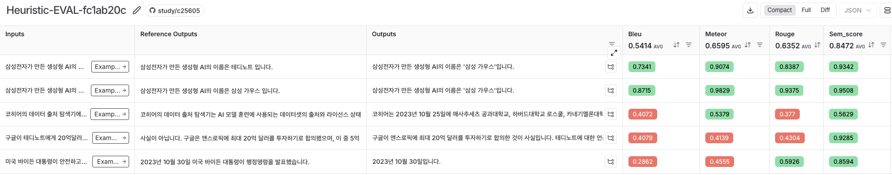

# 휴리스틱 방식으로 평가하기
- LLM-as-a-judge를 쓰면 평가할때마다 토큰 비용이 발생함
- 서비스를 운영할때는 LLM 평가를 통해서 서비스를 개선하는건 좋지만 매번 토큰을 쓰면서 평가하기에는 부담이 될 수 있음
- 휴리스틱 평가는 불충분한 시간이나 정보로 인해서 완벽하게 합리적인 판단을 할 수 없을때 규칙에 따라 점수를 매겨 빠르고 간편하게 사용할 수 있는 추론 방법임
- 지표로는 Rouge, BLEU, METEOR, SemScore 등이 존재함

<br>

# 한글 형태소 분석기
- 한국어 문장에 대해 규칙 기반의 휴리스틱 평가를 할려면 한글 형태소 분석기가 매우 중요함
- 한글 형태소 분석기는 한국어 문장을 가장 작은 의미 단위인 형태소로 분리하고 각 형태소의 품사를 판별하는 도구임
- 문장 대 문장으로 그대로 비교해서 모두 일치하는지 보는게 아닌 문장을 특정한 단위로 쪼개서 비교함
- 영어는 분석이 쉽지만 한글의 경우 단어에 조사나 어미가 붙어서 단어 단위를 깔끔하게 구분해서 문장 일치 여부 바교가 어려움
- 그래서 한국어 문장은 형태소 단위로 분리해서 각 단어를 어간, 어미, 조사 등으로 세분화해서 비교함

```python
from langchain_teddynote.community.kiwi_tokenizer import KiwiTokenizer

kiwi_tokenizer = KiwiTokenizer()

sent1 = "안녕하세요. 반갑습니다. 내 이름은 동우입니다."
sent2 = "안녕하세용 반갑습니다~^^ 내 이름은 동우입니다!!"

# ['안녕하세요.', '반갑습니다.', '내', '이름은', '동우입니다.']
# ['안녕하세용', '반갑습니다~^^', '내', '이름은', '동우입니다!!']
print(sent1.split())
print(sent2.split())

# ['안녕', '하', '세요', '.', '반갑', '습니다', '.', '나', '의', '이름', '은', '동우', '이', 'ᆸ니다', '.']
# ['안녕', '하', '세요', 'ᆼ', '반갑', '습니다', '~', '^^', '나', '의', '이름', '은', '동우', '이', 'ᆸ니다', '!!']
print(kiwi_tokenizer.tokenize(sent1))
print(kiwi_tokenizer.tokenize(sent2))
```

<br>

# ROUGE 점수
- 자동 요약 및 기계 번역의 품질을 평가하는 데 사용되는 평가 지표
- n-gram 중첩을 기반으로 생성된 텍스트가 참조 텍스트의 중요한 키워드를 얼마나 포함하는지 측정함
```python
from langchain_teddynote.community.kiwi_tokenizer import KiwiTokenizer
from rouge_score import rouge_scorer


kiwi_tokenizer = KiwiTokenizer()


sent1 = "안녕하세요. 반갑습니다. 내 이름은 동우입니다."
sent2 = "안녕하세용 반갑습니다~^^ 내 이름은 동우입니다!!"
sent3 = "내 이름은 동우입니다. 안녕하세요. 반갑습니다."

scorer = rouge_scorer.RougeScorer(
    ["rouge1", "rouge2", "rougeL"], use_stemmer=False, tokenizer=KiwiTokenizer()
)

# [1] 안녕하세요. 반갑습니다. 내 이름은 동우입니다.
# [2] 안녕하세용 반갑습니다~^^ 내 이름은 동우입니다!!
# [rouge1] 0.77419
# [rouge2] 0.62069
# [rougeL] 0.77419
print(
    f"[1] {sent1}\n[2] {sent2}\n[rouge1] {scorer.score(sent1, sent2)['rouge1'].fmeasure:.5f}\n[rouge2] {scorer.score(sent1, sent2)['rouge2'].fmeasure:.5f}\n[rougeL] {scorer.score(sent1, sent2)['rougeL'].fmeasure:.5f}"
)


# [1] 안녕하세요. 반갑습니다. 내 이름은 동우입니다.
# [2] 내 이름은 동우입니다. 안녕하세요. 반갑습니다.
# [rouge1] 1.00000
# [rouge2] 0.92857
# [rougeL] 0.53333 -> 문장의 순서가 바껴서 패널티를 많이 받아 rougeL 점수가 많이 낮음
print(
    f"[1] {sent1}\n[2] {sent3}\n[rouge1] {scorer.score(sent1, sent3)['rouge1'].fmeasure:.5f}\n[rouge2] {scorer.score(sent1, sent3)['rouge2'].fmeasure:.5f}\n[rougeL] {scorer.score(sent1, sent3)['rougeL'].fmeasure:.5f}"
)
```

<br>

### n-gram 중첩
- 텍스트를 일정 길이의 연속된 단위로 나누는 기법으로 형태소 분석과 결합해서 문장의 의미를 더 세밀하고 분석할 수 있음
- 문맥적 관게를 파악하거나 텍스트의 구조적 패턴을 분석하는 데 유용함

<br>

# BLEU(Bilingual Evaluation Understudy) 점수
- 주로 기계 번역 평가에 사용됨
- 생성된 텍스트가 참조 텍스트와 얼마나 유사한지를 측정하며 n-gram 정밀도를 기반으로 계산됨
- 간결성 패널티라는게 추가됬는데 이는 생성된 텍스트가 참조 텍스트보다 짧은 경우 패널티를 부과함
- 시스템이 짧은 문장만 생성해서 높은 정밀도를 얻는것을 방지함
- 최종 BLEU 점수는 `각 n-gram 정밀도 기하평균 * 간결성 패널티`로 산정됨
- 의미를 고려하지 않고 단순 문자열 일치만 확인하므로 단어의 중요도를 구분하지 않는 한계가 존재함

```python
from langchain_teddynote.community.kiwi_tokenizer import KiwiTokenizer
from nltk.translate.bleu_score import sentence_bleu

kiwi_tokenizer = KiwiTokenizer()

sent1 = "안녕하세요. 반갑습니다. 내 이름은 동우입니다."
sent2 = "안녕하세용 반갑습니다~^^ 내 이름은 동우입니다!!"
sent3 = "내 이름은 동우입니다. 안녕하세요. 반갑습니다."

# 안녕 하 세요 . 반갑 습니다 . 나 의 이름 은 동우 이 ᆸ니다 .
# 안녕 하 세요 ᆼ 반갑 습니다 ~ ^^ 나 의 이름 은 동우 이 ᆸ니다 !!
# 나 의 이름 은 동우 이 ᆸ니다 . 안녕 하 세요 . 반갑 습니다 .
print(kiwi_tokenizer.tokenize(sent1, type="sentence"))
print(kiwi_tokenizer.tokenize(sent2, type="sentence"))
print(kiwi_tokenizer.tokenize(sent3, type="sentence"))

bleu_score = sentence_bleu(
    [kiwi_tokenizer.tokenize(sent1, type="sentence")],
    kiwi_tokenizer.tokenize(sent2, type="sentence"),
)
# [1] 안녕하세요. 반갑습니다. 내 이름은 동우입니다.
# [2] 안녕하세용 반갑습니다~^^ 내 이름은 동우입니다!!
# [score] 0.74879
print(f"[1] {sent1}\n[2] {sent2}\n[score] {bleu_score:.5f}")

bleu_score = sentence_bleu(
    [kiwi_tokenizer.tokenize(sent1, type="sentence")],
    kiwi_tokenizer.tokenize(sent3, type="sentence"),
)
# [1] 안녕하세요. 반갑습니다. 내 이름은 동우입니다.
# [2] 내 이름은 동우입니다. 안녕하세요. 반갑습니다.
# [score] 0.95739
print(f"[1] {sent1}\n[2] {sent3}\n[score] {bleu_score:.5f}")
```

<br>

### n-gram 정밀도
- 생성된 텍스트의 n-gram 중 참조 텍스트에 등장하는 n-gram의 비율을 나타냄
- 텍스트 생성의 정확도를 평가함

<br>

# METEOR 점수
- 기계 번역의 품질을 평가하기 위해 개발된 평가지표로 단어 매칭, 정밀도와 재현율, 순서 패널티, 가중치 부여를 통해 번역의 유사성을 분석
- 단어 일치 여부 확인시 똑같은 단어는 정확한 매칭으로 처리함
- 어간 매칭은 같은 뿌리를 가진 단어를 연결하는데 예시로 run, running 처럼 모양은 다르지만 같은 뜻을 가진 경우임
- 동의어 매칭은 quick, fast 처럼 서로 다른 단어지만 뜻이 같은 경우임
- 의역 매칭은 비슷한 뜻을 가진 문장이나 구절도 매칭하는데 이 방법은 문장 전체의 흐름을 고려할 때 특히 유용함

<br>

# METEOR 계산 과정
- 생성된 문장에서 참조 문장과 매칭될 수 있는 모든 단어를 찾음
- 이후에 매칭된 단어의 개수를 기준으로 정밀도와 재현율을 계산함
  - 정밀도 : 생성된 문장에서 매칭된 단어가 차지하는 비율
  - 재현율 : 참조 문장에서 매칭된 단어가 차지하는 비율
- 또한 단어들의 순서까지 고려해서 일치하는 단어들이 연속되지 않은 경우 순서 패널티를 부과함
- 동의어나 어간이 변형된 단어도 인식이 가능해서 같은 의미를 가진 다른 표현도 제대로 평가가 가능함
- 여러 참조 문장이 없더라도 단일 참조 문장만 있어도 잘 작동함

```python
from nltk.corpus import wordnet as wn
from nltk.translate import meteor_score
import nltk
from langchain_teddynote.community.kiwi_tokenizer import KiwiTokenizer

nltk.download("wordnet")
wn.ensure_loaded()

kiwi_tokenizer = KiwiTokenizer()

sent1 = "안녕하세요. 반갑습니다. 내 이름은 동우입니다."
sent2 = "안녕하세용 반갑습니다~^^ 내 이름은 동우입니다!!"
sent3 = "내 이름은 동우입니다. 안녕하세요. 반갑습니다."

meteor = meteor_score.meteor_score(
    [kiwi_tokenizer.tokenize(sent1, type="list")],
    kiwi_tokenizer.tokenize(sent2, type="list"),
)

# [1] 안녕하세요. 반갑습니다. 내 이름은 동우입니다.
# [2] 안녕하세용 반갑습니다~^^ 내 이름은 동우입니다!!
# [score] 0.78849
# ===================
print(f"[1] {sent1}\n[2] {sent2}\n[score] {meteor:.5f}")

# [1] 안녕하세요. 반갑습니다. 내 이름은 동우입니다.
# [2] 내 이름은 동우입니다. 안녕하세요. 반갑습니다.
# [score] 0.96800 -> 문장의 순서가 변경되었지만 패널티를 덜 받아서 높게나옴
meteor = meteor_score.meteor_score(
    [kiwi_tokenizer.tokenize(sent1, type="list")],
    kiwi_tokenizer.tokenize(sent3, type="list"),
)
print(f"[1] {sent1}\n[2] {sent3}\n[score] {meteor:.5f}")
```

<br>

# SemScore
- 생성된 단순히 단어 매칭을 넘어 텍스트와 참조 텍스트 간의 의미적 유사성을 많이봄
- 사전 훈련된 어넝 모델을 사용해서 문장 임베딩을 생성함
- 전체 응답뿐 아니라 응답의 문장 단위처럼 각 부분에 대해서도 평가할 수 있는데 이는 인간의 판단에 가까운 지표로 볼 수 있음
- 과정 : 텍스트 임베딩 생성 -> 유사도 계산 -> 최대 유사도 선택 -> 최종 점수를 0 ~ 1 사이 값으로 정규화

<br>

### 코사인 유사도 계산하기
```python
from sentence_transformers import SentenceTransformer, util
import warnings

warnings.filterwarnings("ignore", category=FutureWarning)

sent1 = "안녕하세요. 반갑습니다. 내 이름은 동우입니다."
sent2 = "안녕하세용 반갑습니다~^^ 내 이름은 동우입니다!!"
sent3 = "내 이름은 동우입니다. 안녕하세요. 반갑습니다."

model = SentenceTransformer("all-mpnet-base-v2")

sent1_encoded = model.encode(sent1, convert_to_tensor=True)
sent2_encoded = model.encode(sent2, convert_to_tensor=True)
sent3_encoded = model.encode(sent3, convert_to_tensor=True)

# [1] 안녕하세요. 반갑습니다. 내 이름은 동우입니다.
# [2] 안녕하세용 반갑습니다~^^ 내 이름은 동우입니다!!
# [score] 0.85856
cosine_similarity = util.pytorch_cos_sim(sent1_encoded, sent2_encoded).item()
print(f"[1] {sent1}\n[2] {sent2}\n[score] {cosine_similarity:.5f}")

# [1] 안녕하세요. 반갑습니다. 내 이름은 동우입니다.
# [2] 내 이름은 동우입니다. 안녕하세요. 반갑습니다.
# [score] 0.99268
cosine_similarity = util.pytorch_cos_sim(sent1_encoded, sent3_encoded).item()
print(f"[1] {sent1}\n[2] {sent3}\n[score] {cosine_similarity:.5f}")
```

<br>

# 다양한 평가 수단으로 한번에 평가하기
```python
from sentence_transformers import SentenceTransformer, util
import warnings
from langsmith.schemas import Run, Example
from rouge_score import rouge_scorer
from nltk.translate.bleu_score import sentence_bleu
from nltk.translate import meteor_score
from sentence_transformers import SentenceTransformer, util
from langchain_teddynote.community.kiwi_tokenizer import KiwiTokenizer
from langsmith.evaluation import evaluate
from myrag import PDFRAG


kiwi_tokenizer = KiwiTokenizer()


def ask_question(inputs: dict):
    return {"answer": chain.invoke(inputs["question"])}


def rouge_evaluator(metric: str = "rouge1") -> dict:
    def _rouge_evaluator(run: Run, example: Example) -> dict:
        # 출력값과 정답 가져오기
        student_answer = run.outputs.get("answer", "")
        reference_answer = example.outputs.get("answer", "")

        # ROUGE 점수 계산
        scorer = rouge_scorer.RougeScorer(
            ["rouge1", "rouge2", "rougeL"], use_stemmer=True, tokenizer=KiwiTokenizer()
        )
        scores = scorer.score(reference_answer, student_answer)

        # ROUGE 점수 반환
        rouge = scores[metric].fmeasure

        return {"key": "ROUGE", "score": rouge}

    return _rouge_evaluator


def bleu_evaluator(run: Run, example: Example) -> dict:
    # 출력값과 정답 가져오기
    student_answer = run.outputs.get("answer", "")
    reference_answer = example.outputs.get("answer", "")

    # 토큰화
    reference_tokens = kiwi_tokenizer.tokenize(reference_answer, type="sentence")
    student_tokens = kiwi_tokenizer.tokenize(student_answer, type="sentence")

    # BLEU 점수 계산
    bleu_score = sentence_bleu([reference_tokens], student_tokens)

    return {"key": "BLEU", "score": bleu_score}


def meteor_evaluator(run: Run, example: Example) -> dict:
    student_answer = run.outputs.get("answer", "")
    reference_answer = example.outputs.get("answer", "")

    reference_tokens = kiwi_tokenizer.tokenize(reference_answer, type="list")
    student_tokens = kiwi_tokenizer.tokenize(student_answer, type="list")

    meteor = meteor_score.meteor_score([reference_tokens], student_tokens)

    return {"key": "METEOR", "score": meteor}


def semscore_evaluator(run: Run, example: Example) -> dict:
    student_answer = run.outputs.get("answer", "")
    reference_answer = example.outputs.get("answer", "")

    model = SentenceTransformer("all-mpnet-base-v2")

    student_embedding = model.encode(student_answer, convert_to_tensor=True)
    reference_embedding = model.encode(reference_answer, convert_to_tensor=True)

    cosine_similarity = util.pytorch_cos_sim(
        student_embedding, reference_embedding
    ).item()

    return {"key": "sem_score", "score": cosine_similarity}


rag = PDFRAG(
    "/Users/imkdw/study/RAG 비법노트/22. RAGAS로 답변 평가하기/SPRI_AI_Brief_2023년12월호_F.pdf",
    ChatOpenAI(model="gpt-4o-mini", temperature=0),
)

retriever = rag.create_retriever()

chain = rag.create_chain(retriever)

warnings.filterwarnings("ignore", category=FutureWarning)

sent1 = "안녕하세요. 반갑습니다. 내 이름은 동우입니다."
sent2 = "안녕하세용 반갑습니다~^^ 내 이름은 동우입니다!!"
sent3 = "내 이름은 동우입니다. 안녕하세요. 반갑습니다."


# 평가자 정의
# rogue, bleu, meteor, semscore로 모두 평가 진행
heuristic_evalulators = [
    rouge_evaluator(metric="rougeL"),
    bleu_evaluator,
    meteor_evaluator,
    semscore_evaluator,
]

# 데이터셋 이름 설정
dataset_name = "RAG_EVAL_DATASET"

# 실험 실행
experiment_results = evaluate(
    ask_question,
    data=dataset_name,
    evaluators=heuristic_evalulators,
    experiment_prefix="Heuristic-EVAL",
    # 실험 메타데이터 지정
    metadata={
        "variant": "Heuristic-EVAL (Rouge, BLEU, METEOR, SemScore) 을 사용하여 평가",
    },
)
```



