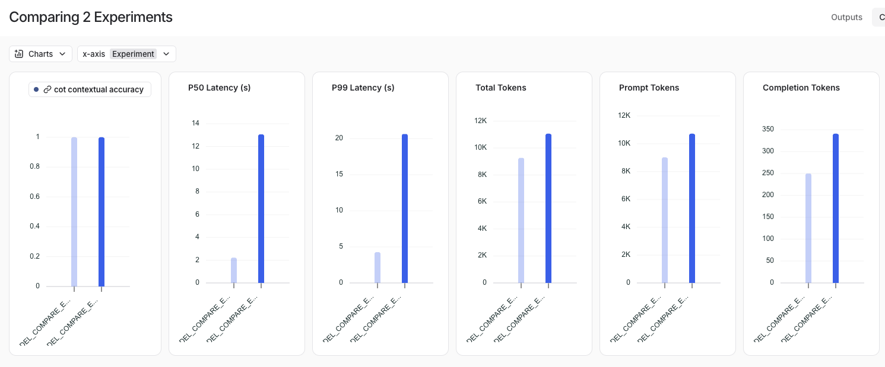

# 실험별 비교 분석하기
- Langsmith의 Compare 기능을 활용해서 실험 결과를 쉽게 비교가 가능함

```python
from myrag import PDFRAG
from langchain_openai import ChatOpenAI
from langchain_ollama import ChatOllama
from langsmith.evaluation import evaluate, LangChainStringEvaluator


def ask_question_with_llm(llm):
    rag = PDFRAG(
        "/Users/imkdw/study/RAG 비법노트/22. RAGAS로 답변 평가하기/SPRI_AI_Brief_2023년12월호_F.pdf",
        llm,
    )

    retriever = rag.create_retriever()

    rag_chain = rag.create_chain(retriever)

    def _ask_question(inputs: dict):
        context = retriever.invoke(inputs["question"])
        context = "\n".join([doc.page_content for doc in context])
        return {
            "question": inputs["question"],
            "context": context,
            "answer": rag_chain.invoke(inputs["question"]),
        }

    return _ask_question


# GPT를 사용한 체인
gpt_chain = ask_question_with_llm(ChatOpenAI(model="gpt-4o-mini", temperature=0))

# Ollama(exaone3.5:7.8b)를 사용한 체인
ollama_chain = ask_question_with_llm(ChatOllama(model="exaone3.5:7.8b"))


# qa 평가자 생성
cot_qa_evalulator = LangChainStringEvaluator(
    "cot_qa",
    config={"llm": ChatOpenAI(model="gpt-4o-mini", temperature=0)},
    prepare_data=lambda run, example: {
        "prediction": run.outputs["answer"],
        "reference": run.outputs["context"],
        "input": example.inputs["question"],
    },
)

dataset_name = "RAG_EVAL_DATASET"

experiment_results1 = evaluate(
    gpt_chain,
    data=dataset_name,
    evaluators=[cot_qa_evalulator],
    experiment_prefix="MODEL_COMPARE_EVAL",
    metadata={
        "variant": "GPT-4o-mini 평가 (cot_qa)",
    },
)

experiment_results2 = evaluate(
    ollama_chain,
    data=dataset_name,
    evaluators=[cot_qa_evalulator],
    experiment_prefix="MODEL_COMPARE_EVAL",
    metadata={
        "variant": "Ollama(exaone3.5:7.8b) 평가 (cot_qa)",
    },
)
```

