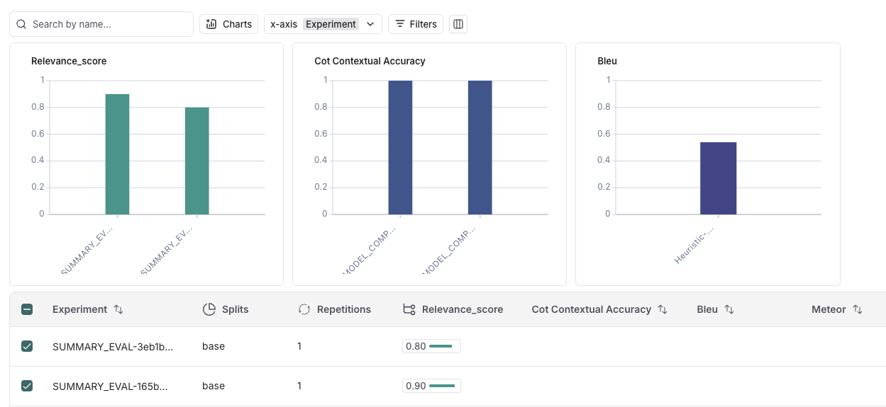

# 요약 평가자로 전체 수준 평가하기
- 말 그대로 실험의 평가 결과를 요약해줌
- 요약 평가자를 사용하면 개별 문제의 평가 결과를 취합해서 자신만의 평가 방식을 새로 정의할 수 있음

```python
from myrag import PDFRAG
from langchain_openai import ChatOpenAI
from langchain_ollama import ChatOllama
from langchain_teddynote.evaluator import OpenAIRelevanceGrader
from typing import List
from langsmith.schemas import Example, Run
from langsmith.evaluation import evaluate


def ask_question_with_llm(llm):
    rag = PDFRAG(
        "/Users/imkdw/study/RAG 비법노트/22. RAGAS로 답변 평가하기/SPRI_AI_Brief_2023년12월호_F.pdf",
        llm,
    )

    retriever = rag.create_retriever()

    rag_chain = rag.create_chain(retriever)

    def _ask_question(inputs: dict):
        context = retriever.invoke(inputs["question"])
        context = "\n".join([doc.page_content for doc in context])
        return {
            "question": inputs["question"],
            "context": context,
            "answer": rag_chain.invoke(inputs["question"]),
        }

    return _ask_question


def relevance_score_summary_evaluator(runs: List[Run], examples: List[Example]) -> dict:
    rq_scores = 0  # 질문 관련성 점수
    ra_scores = 0  # 답변 관련성 점수

    for run, example in zip(runs, examples):
        question = example.inputs["question"]
        context = run.outputs["context"]
        prediction = run.outputs["answer"]

        # 질문 관련성 평가
        rq_score = rq_grader.invoke(
            {
                "input": question,
                "context": context,
            }
        )
        # 답변 관련성 평가
        ra_score = ra_grader.invoke(
            {
                "input": prediction,
                "context": context,
            }
        )

        # 관련성 점수 누적
        if rq_score.score == "yes":
            rq_scores += 1
        if ra_score.score == "yes":
            ra_scores += 1

    # 최종 관련성 점수 계산 (질문 관련성과 답변 관련성의 평균)
    final_score = ((rq_scores / len(runs)) + (ra_scores / len(runs))) / 2

    return {"key": "relevance_score", "score": final_score}


gpt_chain = ask_question_with_llm(ChatOpenAI(model="gpt-4o-mini", temperature=0))
ollama_chain = ask_question_with_llm(ChatOllama(model="exaone3.5:7.8b"))


# target="retrieval-question" -> 검색된 문서와 질문의 관련성 여부 평가
rq_grader = OpenAIRelevanceGrader(
    llm=ChatOpenAI(model="gpt-4o-mini", temperature=0), target="retrieval-question"
).create()

# target="retrieval-answer" -> 검색된 문서와 답변의 관련성 여부 평가
ra_grader = OpenAIRelevanceGrader(
    llm=ChatOpenAI(model="gpt-4o-mini", temperature=0), target="retrieval-answer"
).create()

# score='no' -> 관련성이 없어서 no로 나옴
print(
    rq_grader.invoke(
        {
            "input": "삼성전자가 자체 개발한 생성형 AI 의 이름은?",
            "context": "삼성전자 AI 는 빅스비에요",
        }
    )
)

# score='no' -> 문서 내용과 답변이 일치하지 않아서 no로 나옴
print(
    ra_grader.invoke(
        {
            "input": "삼성전자가 자체 개발한 생성형 AI 는 가우스 입니다.",
            "context": "삼성전자 AI 는 빅스비에요",
        }
    )
)

dataset_name = "RAG_EVAL_DATASET"

experiment_result1 = evaluate(
    gpt_chain,
    data=dataset_name,
    summary_evaluators=[relevance_score_summary_evaluator],
    experiment_prefix="SUMMARY_EVAL",
    metadata={
        "variant": "GPT-4o-mini 사용: summary_evaluator 를 활용한 relevance 평가",
    },
)

experiment_result2 = evaluate(
    ollama_chain,
    data=dataset_name,
    summary_evaluators=[relevance_score_summary_evaluator],
    experiment_prefix="SUMMARY_EVAL",
    metadata={
        "variant": "Ollama(exaone3.5:7.8b) 사용: summary_evaluator 를 활용한 relevance 평가",
    },
)
```

