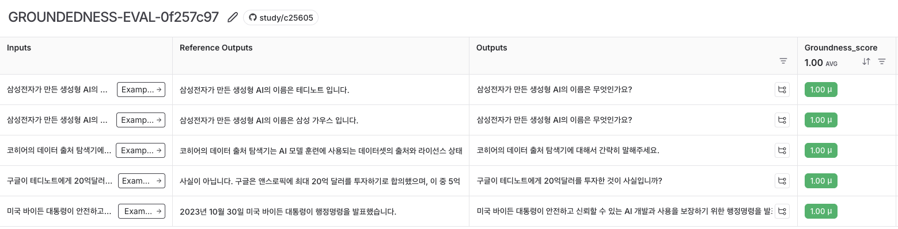

# Groundedness 평가자로 할루시네이션 확인하기
- 답변이 주어진 문맥에 기반하여 정확한지 평가하고 RAG의 답변에 대한 환각현상 여부를 평가하는 데 활용이 가능함
- UPSTAGE 처럼 API 방식도 가능하고 직접 로컬에서 LLM을 통한 구현도 가능함

<br>

# UPSTAGE Groundedness Checker
```python
upstage_groundedness_check = UpstageGroundednessCheck()

request_input = {
    "context": "테디의 성별은 남자이며, 테디노트 유튜브 채널을 운영하고 있습니다.",
    "answer": "테디는 남자다.",
}
# grounded
response = upstage_groundedness_check.invoke(request_input)

request_input = {
    "context": "테디의 성별은 남자이며, 테디노트 유튜브 채널을 운영하고 있습니다.",
    "answer": "테디는 여자다.",
}
# notGrounded
response = upstage_groundedness_check.invoke(request_input)
```

<br>

# Upstage, GPT 2가지로 Groundedness 평가하기
```python
from myrag import PDFRAG
from langchain_upstage import UpstageGroundednessCheck
from langchain_openai import ChatOpenAI
from langchain_teddynote.evaluator import GroundednessChecker
from langsmith.schemas import Run, Example
from langsmith.evaluation import evaluate

upstage_groundedness_check = UpstageGroundednessCheck()


# Upstage Groundness Checker
def upstage_groundness_check_evaluator(run: Run, example: Example) -> dict:
    answer = run.outputs.get("answer", "")
    context = run.outputs.get("context", "")

    groundedness_score = upstage_groundedness_check.invoke(
        {"answer": answer, "context": context}
    )
    groundedness_score = groundedness_score == "grounded"

    return {"key": "groundness_score", "score": int(groundedness_score)}


groundedness_check = GroundednessChecker(
    ChatOpenAI(model="gpt-4o-mini", temperature=0)
).create()


# OpenAI 모델을 활용한 커스텀 평가자
def teddynote_groundness_check_evaluator(run: Run, example: Example) -> dict:
    answer = run.outputs.get("answer", "")
    context = run.outputs.get("context", "")

    groundedness_score = groundedness_check.invoke(
        {"answer": answer, "context": context}
    )
    groundedness_score = groundedness_score.score == "yes"

    return {"key": "groundness_score", "score": int(groundedness_score)}


def ask_question_with_llm(llm):
    rag = PDFRAG(
        "/Users/imkdw/study/RAG 비법노트/22. RAGAS로 답변 평가하기/SPRI_AI_Brief_2023년12월호_F.pdf",
        llm,
    )

    retriever = rag.create_retriever()

    rag_chain = rag.create_chain(retriever)

    def _ask_question(inputs: dict):
        context = retriever.invoke(inputs["question"])
        context = "\n".join([doc.page_content for doc in context])
        return {
            "question": inputs["question"],
            "context": context,
            "answer": rag_chain.invoke(inputs["question"]),
        }

    return _ask_question


gpt_chain = ask_question_with_llm(ChatOpenAI(model="gpt-4o-mini", temperature=0))

dataset_name = "RAG_EVAL_DATASET"

experiment_results = evaluate(
    gpt_chain,
    data=dataset_name,
    evaluators=[
        upstage_groundness_check_evaluator,
        teddynote_groundness_check_evaluator,
    ],
    experiment_prefix="GROUNDEDNESS-EVAL",
    metadata={
        "variant": "Upstage & teddynote Groundness Checker 를 활용한 Hallucination 평가",
    },
)
```

