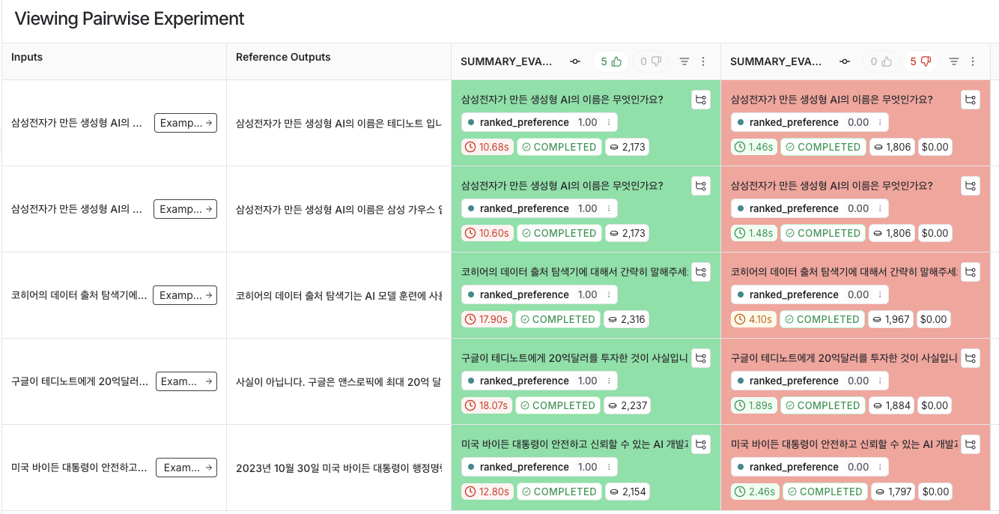

# Pairwise 평가로 실험 비교 분석하기
- Pairwise 평가는 2개 이상의 LLM 생성물을 서로 비교함
- 그동안의 평가방식은 1개를 진행하고 이후에 1개를 더 진행해서 그들끼리 비교하는 방식이였음
- 이는 답변 하나에 대해서 각각의 LLM 생성물을 대조한다는 것이 가장 큰 장점임

```python
from langchain_openai import ChatOpenAI
from langchain_core.prompts import PromptTemplate
from langchain_core.output_parsers import StrOutputParser
from langsmith.evaluation import evaluate_comparative


def evaluate_pairwise(runs: list, example) -> dict:
    """
    A simple evaluator for pairwise answers to score based on  engagement
    """

    # 점수 저장
    scores = {}
    for i, run in enumerate(runs):
        scores[run.id] = i

    # 각 예제에 대한 실행 쌍
    answer_a = runs[0].outputs["answer"]
    answer_b = runs[1].outputs["answer"]
    question = example.inputs["question"]

    # 함수 호출이 있는 LLM, 최고 성능 모델 사용
    llm = ChatOpenAI(model="gpt-4o-mini", temperature=0)

    # 구조화된 프롬프트
    grade_prompt = PromptTemplate.from_template(
        """
        You are an LLM judge. Compare the following two answers to a question and determine which one is better.
        Better answer is the one that is more detailed and informative.
        If the answer is not related to the question, it is not a good answer.
        
        # Question:
        {question}
        
        #Answer A: 
        {answer_a}
        
        #Answer B: 
        {answer_b}
        
        Output should be either `A` or `B`. Pick the answer that is better.
        
        #Preference:
        """
    )
    answer_grader = grade_prompt | llm | StrOutputParser()

    # 점수 획득
    score = answer_grader.invoke(
        {
            "question": question,
            "answer_a": answer_a,
            "answer_b": answer_b,
        }
    )

    # 점수에 따른 실행 할당 매핑
    if score == "A":  # Assistant A 선호
        scores[runs[0].id] = 1
        scores[runs[1].id] = 0
    elif score == "B":  # Assistant B 선호
        scores[runs[0].id] = 0
        scores[runs[1].id] = 1
    else:
        scores[runs[0].id] = 0
        scores[runs[1].id] = 0

    return {"key": "ranked_preference", "scores": scores}


evaluate_comparative(
    ["SUMMARY_EVAL-3eb1bcff", "SUMMARY_EVAL-165b42b1"],
    evaluators=[evaluate_pairwise],
)
```

