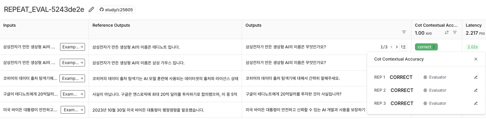
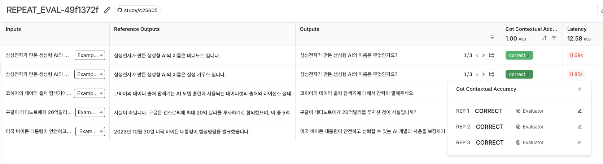

# 반복 평가하기
- LLM으로 평가를 진행하다 보면 평가 결과가 일정하게 나오기가 어려움
- 평가 결과의 편차를 줄이기 위해서 실험을 여러 번 반복하고 평균값을 구함으로써 좀 더 일관성 있는 평가를 할 수 있음
- 단 여러번 반복 평가를 진행하므로 토큰이 더 많이 소모될 수 있음

<br>

# GPT로 평가하기
```python
from myrag import PDFRAG
from langchain_openai import ChatOpenAI
from langsmith.evaluation import evaluate, LangChainStringEvaluator


def ask_question_with_llm(llm):
    rag = PDFRAG(
        "/Users/imkdw/study/RAG 비법노트/22. RAGAS로 답변 평가하기/SPRI_AI_Brief_2023년12월호_F.pdf",
        llm,
    )

    retriever = rag.create_retriever()

    rag_chain = rag.create_chain(retriever)

    def _ask_question(inputs: dict):
        context = retriever.invoke(inputs["question"])
        context = "\n".join([doc.page_content for doc in context])
        return {
            "question": inputs["question"],
            "context": context,
            "answer": rag_chain.invoke(inputs["question"]),
        }

    return _ask_question


gpt_chain = ask_question_with_llm(ChatOpenAI(model="gpt-4o-mini", temperature=1.0))

cot_qa_evalulator = LangChainStringEvaluator(
    "cot_qa",
    config={"llm": ChatOpenAI(model="gpt-4o-mini", temperature=0)},
    prepare_data=lambda run, example: {
        "prediction": run.outputs["answer"],
        "reference": run.outputs["context"],
        "input": example.inputs["question"],
    },
)

dataset_name = "RAG_EVAL_DATASET"

evaluate(
    gpt_chain,
    data=dataset_name,
    evaluators=[cot_qa_evalulator],
    experiment_prefix="REPEAT_EVAL",
    metadata={
        "variant": "Repeat 평가를 수행합니다. GPT-4o-mini 모델 (cot_qa)",
    },
    # 3번 반복
    num_repetitions=3,
)
```



<br>

# Ollama로 평가하기
```python
from myrag import PDFRAG
from langchain_ollama import ChatOllama
from langsmith.evaluation import evaluate, LangChainStringEvaluator


def ask_question_with_llm(llm):
    rag = PDFRAG(
        "/Users/imkdw/study/RAG 비법노트/22. RAGAS로 답변 평가하기/SPRI_AI_Brief_2023년12월호_F.pdf",
        llm,
    )

    retriever = rag.create_retriever()

    rag_chain = rag.create_chain(retriever)

    def _ask_question(inputs: dict):
        context = retriever.invoke(inputs["question"])
        context = "\n".join([doc.page_content for doc in context])
        return {
            "question": inputs["question"],
            "context": context,
            "answer": rag_chain.invoke(inputs["question"]),
        }

    return _ask_question


ollama_chain = ask_question_with_llm(
    ChatOllama(model="exaone3.5:7.8b", temperature=1.0)
)

cot_qa_evalulator = LangChainStringEvaluator(
    "cot_qa",
    config={"llm": ChatOpenAI(model="gpt-4o-mini", temperature=0)},
    prepare_data=lambda run, example: {
        "prediction": run.outputs["answer"],
        "reference": run.outputs["context"],
        "input": example.inputs["question"],
    },
)

dataset_name = "RAG_EVAL_DATASET"

evaluate(
    ollama_chain,
    data=dataset_name,
    evaluators=[cot_qa_evalulator],
    experiment_prefix="REPEAT_EVAL",
    metadata={
        "variant": "Repeat 평가를 수행합니다. Ollama(exaone3.5:7.8b) 모델 (cot_qa)",
    },
    num_repetitions=3,
)
```

