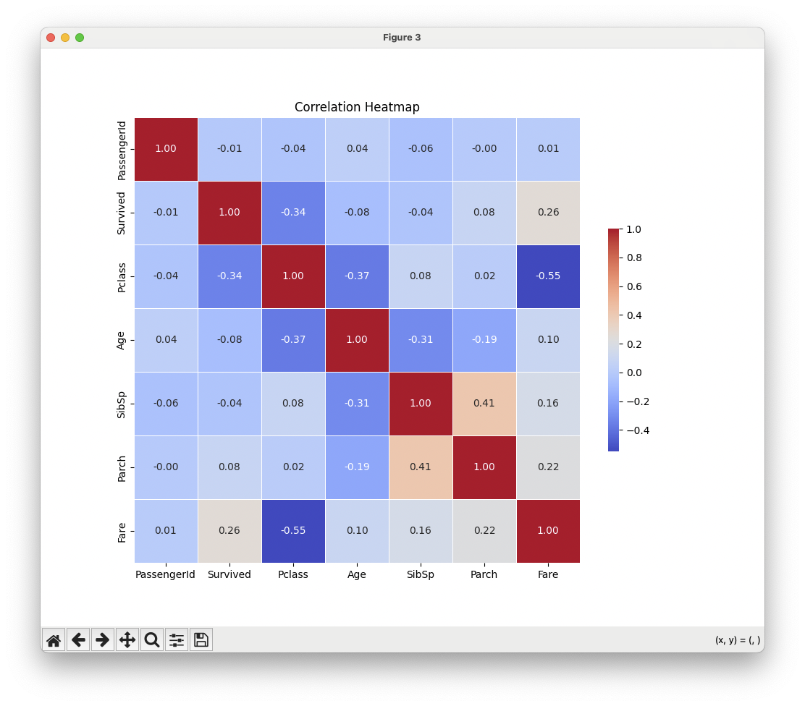
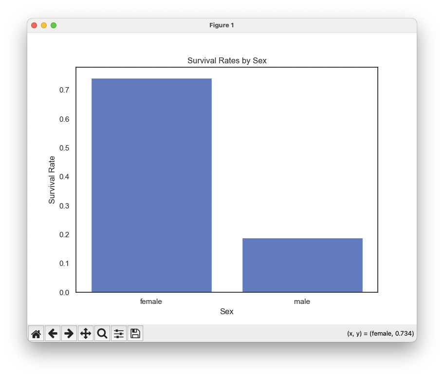
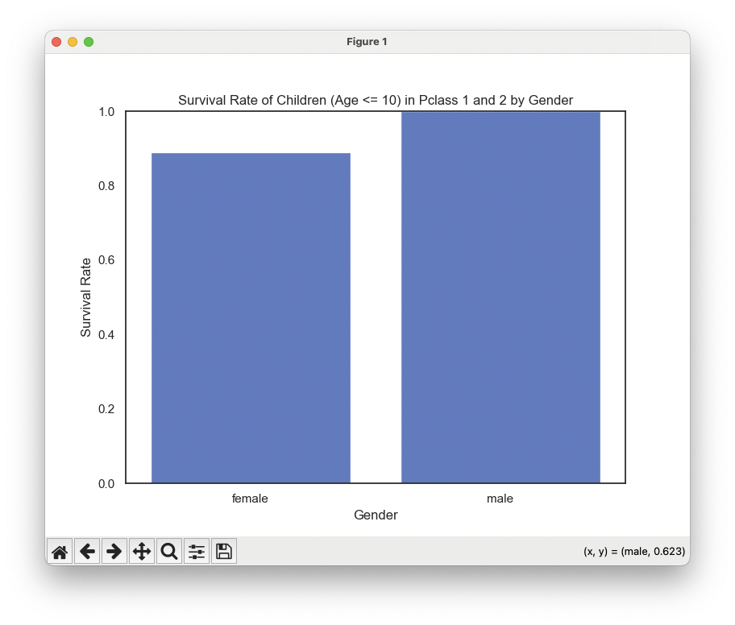

# CSV, 엑셀 데이터 분석 에이전트
- 단순히 데이터를 조회하고 요약하는 것은 물론, 사용자의 요청에 따라 다양한 형태의 데이터 분석을 자동으로 수행이 가능함
- 대용량 데이터도 효율적으로 다룰 수 있기 때문에 복잡한 데이터 처리 작업에서도 매우 유용하게 활용됨

<br>

# 파이썬 코드 바로 실행하기
```python
import pandas as pd

df = pd.read_csv("/Users/imkdw/study/RAG 비법노트/26. 에이전트 활용/titanic.csv")
df.head()

from langchain_experimental.tools import PythonAstREPLTool

python_tool = PythonAstREPLTool()
python_tool.locals["df"] = df


def tool_callback(tool) -> None:
    print(f"<<<<<<< Code >>>>>>")
    if tool_name := tool.get("tool"):
        if tool_name == "python_repl_ast":
            tool_input = tool.get("tool_input")
            for k, v in tool_input.items():
                if k == "query":
                    print(v)
                    result = python_tool.invoke({"query": v})
                    print(result)
    print(f"<<<<<<< Code >>>>>>")


def observation_callback(observation) -> None:
    print(f"<<<<<<< Message >>>>>>")
    if "observation" in observation:
        print(observation["observation"])
    print(f"<<<<<<< Message >>>>>>")


def result_callback(result: str) -> None:
    print(f"<<<<<<< 최종 답변 >>>>>>")
    print(result)
    print(f"<<<<<<< 최종 답변 >>>>>>")


def ask(query):
    response = agent.stream({"input": query})

    for step in response:
        stream_parser.process_agent_steps(step)


agent = create_pandas_dataframe_agent(
    ChatOpenAI(model="gpt-4o", temperature=0),
    df,
    verbose=False,
    agent_type="tool-calling",
    allow_dangerous_code=True,
    prefix="You are a professional data analyst and expert in Pandas. "
    "You must use Pandas DataFrame(`df`) to answer user's request. "
    "\n\n[IMPORTANT] DO NOT create or overwrite the `df` variable in your code. \n\n"
    "If you are willing to generate visualization code, please use `plt.show()` at the end of your code. "
    "I prefer seaborn code for visualization, but you can use matplotlib as well."
    "\n\n<Visualization Preference>\n"
    "- `muted` cmap, white background, and no grid for your visualization."
    "\nRecomment to set palette parameter for seaborn plot.",
)

parser_callback = AgentCallbacks(tool_callback, observation_callback, result_callback)
stream_parser = AgentStreamParser(parser_callback)

response = agent.stream({"input": "corr() 을 구해서 히트맵 시각화"})

for step in response:
    stream_parser.process_agent_steps(step)
```



<br>

# 추가 질문하기
```python
import pandas as pd

df = pd.read_csv("/Users/imkdw/study/RAG 비법노트/26. 에이전트 활용/titanic.csv")
df.head()

from langchain_experimental.tools import PythonAstREPLTool

python_tool = PythonAstREPLTool()
python_tool.locals["df"] = df


def tool_callback(tool) -> None:
    print(f"<<<<<<< Code >>>>>>")
    if tool_name := tool.get("tool"):
        if tool_name == "python_repl_ast":
            tool_input = tool.get("tool_input")
            for k, v in tool_input.items():
                if k == "query":
                    print(v)
                    result = python_tool.invoke({"query": v})
                    print(result)
    print(f"<<<<<<< Code >>>>>>")


def observation_callback(observation) -> None:
    print(f"<<<<<<< Message >>>>>>")
    if "observation" in observation:
        print(observation["observation"])
    print(f"<<<<<<< Message >>>>>>")


def result_callback(result: str) -> None:
    print(f"<<<<<<< 최종 답변 >>>>>>")
    print(result)
    print(f"<<<<<<< 최종 답변 >>>>>>")


def ask(query):
    response = agent.stream({"input": query})

    for step in response:
        stream_parser.process_agent_steps(step)


agent = create_pandas_dataframe_agent(
    ChatOpenAI(model="gpt-4o", temperature=0),
    df,
    verbose=False,
    agent_type="tool-calling",
    allow_dangerous_code=True,
    prefix="You are a professional data analyst and expert in Pandas. "
    "You must use Pandas DataFrame(`df`) to answer user's request. "
    "\n\n[IMPORTANT] DO NOT create or overwrite the `df` variable in your code. \n\n"
    "If you are willing to generate visualization code, please use `plt.show()` at the end of your code. "
    "I prefer seaborn code for visualization, but you can use matplotlib as well."
    "\n\n<Visualization Preference>\n"
    "- `muted` cmap, white background, and no grid for your visualization."
    "\nRecomment to set palette parameter for seaborn plot.",
)

parser_callback = AgentCallbacks(tool_callback, observation_callback, result_callback)
stream_parser = AgentStreamParser(parser_callback)

# <<<<<<< Code >>>>>>
# len(df)
# 891
# <<<<<<< Code >>>>>>
# <<<<<<< Message >>>>>>
# 891
# <<<<<<< Message >>>>>>
# <<<<<<< 최종 답변 >>>>>>
# 데이터프레임에는 총 891개의 행이 있습니다.
# <<<<<<< 최종 답변 >>>>>>
ask("몇 개의 행이 있어?")

# <<<<<<< Code >>>>>>
# # Calculate the survival rate difference between males and females
# male_survival_rate = df[df['Sex'] == 'male']['Survived'].mean()
# female_survival_rate = df[df['Sex'] == 'female']['Survived'].mean()
# survival_rate_difference = female_survival_rate - male_survival_rate
# survival_rate_difference
# 0.5531300709799203
# <<<<<<< Code >>>>>>
# <<<<<<< Message >>>>>>
# 0.5531300709799203
# <<<<<<< Message >>>>>>
# <<<<<<< 최종 답변 >>>>>>
# 남자와 여자의 생존율 차이는 약 0.553입니다. 이는 여자의 생존율이 남자보다 약 55.3% 더 높다는 것을 의미합니다.
# <<<<<<< 최종 답변 >>>>>>
ask("남자와 여자의 생존율의 차이는 몇이야?")

# <<<<<<< Code >>>>>>
# # Calculate survival rates for male and female passengers
# survival_rates = df.groupby('Sex')['Survived'].mean()
# survival_rates
# Sex
# female    0.742038
# male      0.188908
# Name: Survived, dtype: float64
# <<<<<<< Code >>>>>>
# <<<<<<< Message >>>>>>
# Sex
# female    0.742038
# male      0.188908
# Name: Survived, dtype: float64
# <<<<<<< Message >>>>>>
# <<<<<<< Code >>>>>>
# import seaborn as sns
# import matplotlib.pyplot as plt

# # Set the style and palette
# sns.set(style="white", palette="muted")

# # Create a barplot for survival rates by sex
# plt.figure(figsize=(8, 6))
# sns.barplot(x=survival_rates.index, y=survival_rates.values)
# plt.title('Survival Rates by Sex')
# plt.ylabel('Survival Rate')
# plt.xlabel('Sex')
# plt.show()
ask("남자 승객과 여자 승객의 생존율을 구한뒤 barplot 차트로 시각화 해줘")

# <<<<<<< Code >>>>>>
# <<<<<<< Message >>>>>>

# <<<<<<< Message >>>>>>
# <<<<<<< 최종 답변 >>>>>>
# 남자 승객과 여자 승객의 생존율을 바플롯으로 시각화했습니다. 여자는 약 74.2%의 생존율을 보였고, 남자는 약 18.9%의 생존율을 보였습니다.
# <<<<<<< 최종 답변 >>>>>>
# <<<<<<< Code >>>>>>
# # Filter the DataFrame for passengers in Pclass 1 and 2 who are 10 years old or younger
# filtered_df = df[(df['Pclass'].isin([1, 2])) & (df['Age'] <= 10)]

# # Calculate survival rate by gender
# survival_rate_by_gender = filtered_df.groupby('Sex')['Survived'].mean()
# survival_rate_by_gender
# Sex
# female    0.888889
# male      1.000000
# Name: Survived, dtype: float64
# <<<<<<< Code >>>>>>
# <<<<<<< Message >>>>>>
# Sex
# female    0.888889
# male      1.000000
# Name: Survived, dtype: float64
# <<<<<<< Message >>>>>>
# <<<<<<< Code >>>>>>
# import seaborn as sns
# import matplotlib.pyplot as plt

# # Set the style and palette
# sns.set(style="white", palette="muted")

# # Create a bar plot for survival rate by gender
# plt.figure(figsize=(8, 6))
# sns.barplot(x=survival_rate_by_gender.index, y=survival_rate_by_gender.values)
# plt.title('Survival Rate of Children (Age <= 10) in Pclass 1 and 2 by Gender')
# plt.xlabel('Gender')
# plt.ylabel('Survival Rate')
# plt.ylim(0, 1)
# plt.show()
ask("1,2 등급에 탑승한 10세 이하 어린 아이의 성별별 생존율을 구하고 시각화 하세요")
```


