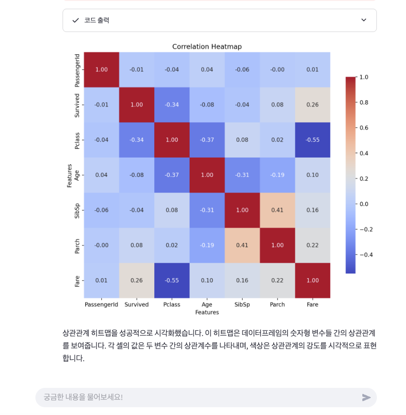

# CSV 파일 기반 데이터 분석 에이전트

```python
from typing import List, Union
from langchain_experimental.agents.agent_toolkits import create_pandas_dataframe_agent
from langchain_experimental.tools import PythonAstREPLTool
from langchain_openai import ChatOpenAI
from langchain_teddynote import logging
from langchain_teddynote.messages import AgentStreamParser, AgentCallbacks
from dotenv import load_dotenv
import streamlit as st
import pandas as pd
import matplotlib.pyplot as plt

# API 키 및 프로젝트 설정
load_dotenv()
logging.langsmith("CSV Agent 챗봇")

# Streamlit 앱 설정
st.title("CSV 데이터 분석 챗봇 💬")

# 세션 상태 초기화
if "messages" not in st.session_state:
    st.session_state["messages"] = []  # 대화 내용을 저장할 리스트 초기화


# 상수 정의
class MessageRole:
    """
    메시지 역할을 정의하는 클래스입니다.
    """

    USER = "user"  # 사용자 메시지 역할
    ASSISTANT = "assistant"  # 어시스턴트 메시지 역할


class MessageType:
    """
    메시지 유형을 정의하는 클래스입니다.
    """

    TEXT = "text"  # 텍스트 메시지
    FIGURE = "figure"  # 그림 메시지
    CODE = "code"  # 코드 메시지
    DATAFRAME = "dataframe"  # 데이터프레임 메시지


# 메시지 관련 함수
def print_messages():
    """
    저장된 메시지를 화면에 출력하는 함수입니다.
    """
    for role, content_list in st.session_state["messages"]:
        with st.chat_message(role):
            for content in content_list:
                if isinstance(content, list):
                    message_type, message_content = content
                    if message_type == MessageType.TEXT:
                        st.markdown(message_content)  # 텍스트 메시지 출력
                    elif message_type == MessageType.FIGURE:
                        st.pyplot(message_content)  # 그림 메시지 출력
                    elif message_type == MessageType.CODE:
                        with st.status("코드 출력", expanded=False):
                            st.code(
                                message_content, language="python"
                            )  # 코드 메시지 출력
                    elif message_type == MessageType.DATAFRAME:
                        st.dataframe(message_content)  # 데이터프레임 메시지 출력
                else:
                    raise ValueError(f"알 수 없는 콘텐츠 유형: {content}")


def add_message(role: MessageRole, content: List[Union[MessageType, str]]):
    """
    새로운 메시지를 저장하는 함수입니다.

    Args:
        role (MessageRole): 메시지 역할 (사용자 또는 어시스턴트)
        content (List[Union[MessageType, str]]): 메시지 내용
    """
    messages = st.session_state["messages"]
    if messages and messages[-1][0] == role:
        messages[-1][1].extend([content])  # 같은 역할의 연속된 메시지는 하나로 합칩니다
    else:
        messages.append([role, [content]])  # 새로운 역할의 메시지는 새로 추가합니다


# 사이드바 설정
with st.sidebar:
    clear_btn = st.button("대화 초기화")  # 대화 내용을 초기화하는 버튼
    uploaded_file = st.file_uploader(
        "CSV 파일을 업로드 해주세요.", type=["csv"], accept_multiple_files=True
    )  # CSV 파일 업로드 기능
    selected_model = st.selectbox(
        "OpenAI 모델을 선택해주세요.", ["gpt-4o-mini", "gpt-3.5-turbo"], index=0
    )  # OpenAI 모델 선택 옵션
    apply_btn = st.button("데이터 분석 시작")  # 데이터 분석을 시작하는 버튼


# 콜백 함수
def tool_callback(tool) -> None:
    """
    도구 실행 결과를 처리하는 콜백 함수입니다.

    Args:
        tool (dict): 실행된 도구 정보
    """
    if tool_name := tool.get("tool"):
        if tool_name == "python_repl_ast":
            tool_input = tool.get("tool_input", {})
            query = tool_input.get("query")
            if query:
                df_in_result = None
                with st.status("데이터 분석 중...", expanded=True) as status:
                    st.markdown(f"```python\n{query}\n```")
                    add_message(MessageRole.ASSISTANT, [MessageType.CODE, query])
                    if "df" in st.session_state:
                        result = st.session_state["python_tool"].invoke(
                            {"query": query}
                        )
                        if isinstance(result, pd.DataFrame):
                            df_in_result = result
                    status.update(label="코드 출력", state="complete", expanded=False)

                if df_in_result is not None:
                    st.dataframe(df_in_result)
                    add_message(
                        MessageRole.ASSISTANT, [MessageType.DATAFRAME, df_in_result]
                    )

                if "plt.show" in query:
                    fig = plt.gcf()
                    st.pyplot(fig)
                    add_message(MessageRole.ASSISTANT, [MessageType.FIGURE, fig])

                return result
            else:
                st.error(
                    "데이터프레임이 정의되지 않았습니다. CSV 파일을 먼저 업로드해주세요."
                )
                return


def observation_callback(observation) -> None:
    """
    관찰 결과를 처리하는 콜백 함수입니다.

    Args:
        observation (dict): 관찰 결과
    """
    if "observation" in observation:
        obs = observation["observation"]
        if isinstance(obs, str) and "Error" in obs:
            st.error(obs)
            st.session_state["messages"][-1][
                1
            ].clear()  # 에러 발생 시 마지막 메시지 삭제


def result_callback(result: str) -> None:
    """
    최종 결과를 처리하는 콜백 함수입니다.

    Args:
        result (str): 최종 결과
    """
    pass  # 현재는 아무 동작도 하지 않습니다


# 에이전트 생성 함수
def create_agent(dataframe, selected_model="gpt-4o-mini"):
    """
    데이터프레임 에이전트를 생성하는 함수입니다.

    Args:
        dataframe (pd.DataFrame): 분석할 데이터프레임
        selected_model (str, optional): 사용할 OpenAI 모델. 기본값은 "gpt-4.1-mini"

    Returns:
        Agent: 생성된 데이터프레임 에이전트
    """
    return create_pandas_dataframe_agent(
        ChatOpenAI(model=selected_model, temperature=0),
        dataframe,
        verbose=False,
        agent_type="tool-calling",
        allow_dangerous_code=True,
        prefix="You are a professional data analyst and expert in Pandas. "
        "You must use Pandas DataFrame(`df`) to answer user's request. "
        "\n\n[IMPORTANT] DO NOT create or overwrite the `df` variable in your code. \n\n"
        "If you are willing to generate visualization code, please use `plt.show()` at the end of your code. "
        "I prefer seaborn code for visualization, but you can use matplotlib as well."
        "\n\n<Visualization Preference>\n"
        "- [IMPORTANT] Use `English` for your visualization title and labels."
        "- `muted` cmap, white background, and no grid for your visualization."
        "\nRecommend to set cmap, palette parameter for seaborn plot if it is applicable. "
        "The language of final answer should be written in Korean. "
        "\n\n###\n\n<Column Guidelines>\n"
        "If user asks with columns that are not listed in `df.columns`, you may refer to the most similar columns listed below.\n",
    )


# 질문 처리 함수
def ask(query):
    """
    사용자의 질문을 처리하고 응답을 생성하는 함수입니다.

    Args:
        query (str): 사용자의 질문
    """
    if "agent" in st.session_state:
        st.chat_message("user").write(query)
        add_message(MessageRole.USER, [MessageType.TEXT, query])

        agent = st.session_state["agent"]
        response = agent.stream({"input": query})

        ai_answer = ""
        parser_callback = AgentCallbacks(
            tool_callback, observation_callback, result_callback
        )
        stream_parser = AgentStreamParser(parser_callback)

        with st.chat_message("assistant"):
            for step in response:
                stream_parser.process_agent_steps(step)
                if "output" in step:
                    ai_answer += step["output"]
            st.write(ai_answer)

        add_message(MessageRole.ASSISTANT, [MessageType.TEXT, ai_answer])


# 메인 로직
if clear_btn:
    st.session_state["messages"] = []  # 대화 내용 초기화

if apply_btn and uploaded_file:
    try:
        # 여러 파일이 업로드된 경우 첫 번째 파일만 사용
        if isinstance(uploaded_file, list):
            if len(uploaded_file) > 0:
                file_to_load = uploaded_file[0]
                if len(uploaded_file) > 1:
                    st.warning(
                        f"{len(uploaded_file)}개의 파일이 업로드되었습니다. 첫 번째 파일 '{file_to_load.name}'만 사용합니다."
                    )
            else:
                st.error("업로드된 파일이 없습니다.")
                st.stop()
        else:
            file_to_load = uploaded_file

        loaded_data = pd.read_csv(file_to_load)  # CSV 파일 로드
        st.session_state["df"] = loaded_data  # 데이터프레임 저장
        st.session_state["python_tool"] = PythonAstREPLTool()  # Python 실행 도구 생성
        st.session_state["python_tool"].locals[
            "df"
        ] = loaded_data  # 데이터프레임을 Python 실행 환경에 추가
        st.session_state["agent"] = create_agent(
            loaded_data, selected_model
        )  # 에이전트 생성

        # 데이터 프리뷰 표시
        st.success(f"'{file_to_load.name}' 파일이 성공적으로 로드되었습니다!")
        st.info(f"데이터 형태: {loaded_data.shape[0]}행 {loaded_data.shape[1]}열")

        # 데이터 미리보기
        with st.expander("데이터 미리보기", expanded=False):
            st.dataframe(loaded_data.head())

        st.success("설정이 완료되었습니다. 대화를 시작해 주세요!")

    except Exception as e:
        st.error(f"파일 로드 중 오류가 발생했습니다: {str(e)}")
elif apply_btn:
    st.warning("파일을 업로드 해주세요.")

print_messages()  # 저장된 메시지 출력

user_input = st.chat_input("궁금한 내용을 물어보세요!")  # 사용자 입력 받기
if user_input:
    ask(user_input)  # 사용자 질문 처리
```

