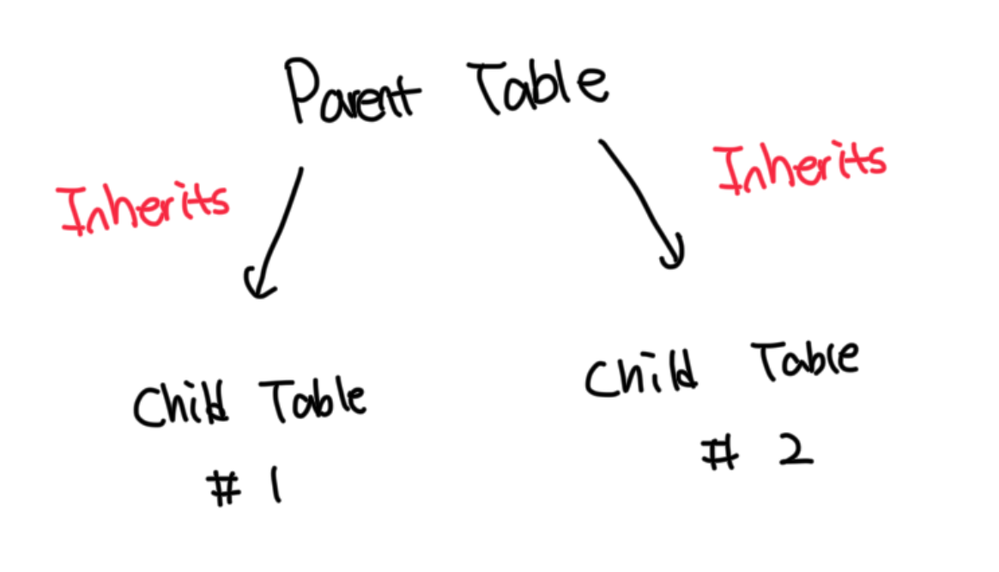

## 파티션
- 대용량 테이블을 효율적으로 관리하기 위한 필수적인 기능
- pg 9.6 까지는 파티션 구현 방식이 매우 복잡했으나 10 부터는 매우 편리해졌다

<br>

## pg 파티션 특징
- pg 10 부터 `선언적 파티션 생성 문법`을 지원하지만 내부적으로는 기존 방식을 사용한다
- 기존에는 부모 테이블을 생성한 후 그 구조를 상속해서 자식 테이블을 생성하는 구조다
- 물리적인 관점에서 보면 부모 테이블과 자식 테이블은 서로 별개의 테이블이다



<br>

## pg 파티션 유형
- RANGE, LIST, HASH 3가지를 지원하며 이러한 유형을 조합해서 서브 파티션 구성도 가능하다
- 하지만 실제로는 서브 파티션을 적용하는 경우는 매우 드물다

<br>

## RANGE 파티션
- 이력 테이블을 효율적으로 관리하는 데 큰 장점을 제공한다
- 단일 테이블에 모든 이력을 저장하는 경우 관리 이슈가 발생하게된다
- 오래된 데이터 제거시 `DELETE`를 사용하면 대량의 WAL이 발생해서 부하가 증가한다
- 테이블 단위 백업이나 바큠 명령어 수행 시에도 많은 시간이 소요된다
- RANGE 파티션을 적용하면 파티션 단위로 작업이 가능해서 관리효율이 크게 향상된다

<br>

### 예제
- 부모 테이블 생성시 파티션 유형을 정의하며 `\d`를 통해서 테이블이 파티션 테이블로 생성된걸 확인할 수 있다
- 최초 생성시에는 자식 테이블이 없기때문에 파티션 개수는 0개임

```sql
postgres@localhost:postgres> create table svc.t1_r (
 c1 integer not null,
 log_date varchar(8) not null,
 dummy varchar(10)
)
partition by range(log_date);


postgres@localhost:postgres> \d svc.t1_r;
+----------+-----------------------+-----------+
| Column   | Type                  | Modifiers |
|----------+-----------------------+-----------|
| c1       | integer               |  not null |
| log_date | character varying(8)  |  not null |
| dummy    | character varying(10) |           |
+----------+-----------------------+-----------+
Partition key: RANGE (log_date)

Time: 0.017s
postgres@localhost:postgres>
```

<br>

### 자식 테이블 생성
- RANGE 파티션의 자식 테이블은 `FROM(시작)`, `TO(다음 파티션 시작값)` 구문을 이용해서 범위를 지정함
- TO에 지정된 값은 해당 파티션에 포함되지 않는다는 점에 유의해야함
- 만약 기존에 운영중인 테이블에 파티션을 생성한다면 `FROM(MINVALUE)`을 사용해서 오래된 데이터를 하나의 파티션으로 묶을 수 있음

```sql
-- 제일 작은 값부터 20210101까지 파티션 생성
postgres@localhost:postgres> create table svc.t1_r_p2020 partition of svc.t1_r for values from(MINVALUE) to ('20210101');

-- 20210101부터 20220101까지 파티션 생성
postgres@localhost:postgres> create table svc.t1_r_p2021 partition of svc.t1_r for values from('20210101') to ('20220101');

-- 20220101부터 20230101까지 파티션 생성
postgres@localhost:postgres> create table svc.t1_r_p2022 partition of svc.t1_r for values from('20220101') to ('20230101');

-- 파티션 정보 확인
postgres@localhost:postgres> \d+ svc.t1_r;
+----------+-----------------------+-----------+----------+
| Column   | Type                  | Modifiers | Storage  |
|----------+-----------------------+-----------+----------|
| c1       | integer               |  not null | plain    |
| log_date | character varying(8)  |  not null | extended |
| dummy    | character varying(10) |           | extended |
+----------+-----------------------+-----------+----------+
Partition key: RANGE (log_date)
Partitions: svc.t1_r_p2020 FOR VALUES FROM (MINVALUE) TO ('20210101')
            svc.t1_r_p2021 FOR VALUES FROM ('20210101') TO ('20220101')
            svc.t1_r_p2022 FOR VALUES FROM ('20220101') TO ('20230101')

Time: 0.008s
postgres@localhost:postgres>
```

<br>

## LIST 파티션
- 코드 값을 기준으로 테이블을 분할하는 방식임
- 국가별, 지점별 등 대분류 항목에 따라 테이블을 나누고자 할 때 유용함
- `IN` 절을 사용해서 각 자식 테이블에 입력될 코드 값을 명시적으로 지정함
- 간혹 새로운 코드 값이 반영되지 않아 오류가 발생할 수 있으니 `DEFAULT 파티션`을 함께 생성하는게 좋음

<br>

### 파티션 생성 예제
```sql
-- A, B 코드 값을 가지는 데이터는 t1_l_p1 파티션에 저장
postgres@localhost:postgres> create table svc.t1_l_p1 partition of svc.t1_l for values in ('A', 'B');

-- C 코드 값을 가지는 데이터는 t1_l_p2 파티션에 저장
postgres@localhost:postgres> create table svc.t1_l_p2 partition of svc.t1_l for values in ('C');

-- 나머지 코드 값을 가지는 데이터는 t1_l_pd 파티션에 저장
postgres@localhost:postgres> create table svc.t1_l_pd partition of svc.t1_l default;
```

<br>

### 파티션에 등록되지 않은 값을 생성하면 DEFAULT 파티션에 저장되는 모습
```sql
-- D 코드 값을 가지는 데이터는 t1_l_pd 파티션에 저장
postgres@localhost:postgres> insert into svc.t1_l values(1, 'D', 'dummy');

-- DEFAULT 파티션에 저장된 데이터 확인
postgres@localhost:postgres> select * from svc.t1_l_pd;
+----+---------+-------+
| c1 | divcode | dummy |
|----+---------+-------|
| 1  | D       | dummy |
+----+---------+-------+
```

<br>

### DEFAULT 파티션에 들어간 값으로 새로운 자식 테이블 생성시 발생하는 오류
- 오라클의 경우 파티션을 분할하는 `스플릿` 기능을 제공하지만 pg의 경우 아직 지원하지 않음
- 아래 방식대로 pg에서도 유사하게 작업이 가능함
  - DEFAULT 파티션에서 스플릿 대상 데이터 추출
  - DEFAULT 파티션에서 스플릿 대상 데이터 삭제
  - 신규 자식 테이블 생성
  - 추출한 데이터를 신규 자식 테이블에 입력

```sql
postgres@localhost:postgres> create table svc.t1_l_p3 partition of svc.t1_l for values in ('D');
updated partition constraint for default partition "t1_l_pd" would be violated by some row
```

<br>

## HASH 파티션
- 동시에 대량의 입력 작업이 발생한다면 핫 블록 발생으로 인해서 병목 현상이 발생할 수 있음
- 이러한 병목을 개선하기 위해서 입력 위치를 분산시키는 것이 효과적인데 이 때 사용 가능한 방법이 해시 파티션임

<br>

### Hot Block
- 동시에 많은 트랜잭션들이 동일한 데이터 블록에 접근하려고 할 때 발생하는 경합 현상임
- 여러개의 세션이 동시에 같은 블록의 데이터를 생성, 수정, 삭제시 발생할 수 있음
- 해당 블록에 대한 락을 획득하기 위해서 대기하는데 이 때 병목이 발생함

<br>

## mod 연산을 통해서 데이터를 각 자식 테이블에 저장하기
- 해시키는 `hash(seqno) % modulus = remainder` 방식으로 작동함
- 아래 예제에서는 pk를 기준으로 나머지가 0,1,2,3인 데이터를 각 파티션에 저장할 수 있도록 파티션이 생성됨

```sql
-- 해시 파티션 생성
postgres@localhost:postgres> create table svc.t1_h (
 c1 integer not null,
 seqno integer not null,
 dummy varchar(10))
 partition by hash(seqno);

-- modulus 4, remainder 0: hash(seqno) % 4 = 0인 데이터
postgres@localhost:postgres> create table svc.t1_h_p1 partition of svc.t1_h for values with (modulus 4, remainder 0);

-- modulus 4, remainder 1: hash(seqno) % 4 = 1인 데이터
postgres@localhost:postgres> create table svc.t1_h_p2 partition of svc.t1_h for values with (modulus 4, remainder 1);

-- modulus 4, remainder 2: hash(seqno) % 4 = 2인 데이터
postgres@localhost:postgres> create table svc.t1_h_p3 partition of svc.t1_h for values with (modulus 4, remainder 2);

-- modulus 4, remainder 3: hash(seqno) % 4 = 3인 데이터
postgres@localhost:postgres> create table svc.t1_h_p4 partition of svc.t1_h for values with (modulus 4, remainder 3);
```

<br>

## 파티션 인덱스
- 파티션 인덱스를 생성할때는 반드시 파티션 컬럼을 포함해서 생성해야함. 미포함시 에러가 발생함

<br>

### 자동 인덱스 생성 방식
- 11 버전부터 지원하며 부모 테이블에 인덱스를 생성하면 자식 테이블에도 동일한 인덱스가 자동으로 생성되는 방식
- 이전 버전에서는 자식 테이블을 추가할 때마다 인덱스를 수동으로 생성해야되서 불편함이 있었는데 그걸 개선한 방식

<br>

#### 파티션 인덱스 생성
```sql
postgres@localhost:postgres> alter table svc.t1_r add constraint t1_r_pk primary key (c1, log_date);
postgres@localhost:postgres> create index t1_r_n1 on svc.t1_r(log_date);
```

<br>

#### 인덱스가 생성된 모습
```sql
-- 부모 테이블
postgres@localhost:postgres> \d svc.t1_r;
+----------+-----------------------+-----------+
| Column   | Type                  | Modifiers |
|----------+-----------------------+-----------|
| c1       | integer               |  not null |
| log_date | character varying(8)  |  not null |
| dummy    | character varying(10) |           |
+----------+-----------------------+-----------+
Indexes:
    "t1_r_pk" PRIMARY KEY, btree (c1, log_date)
    "t1_r_n1" btree (log_date)
Partition key: RANGE (log_date)
Number of partitions 3: (Use \d+ to list them.)


-- 자식 테이블
postgres@localhost:postgres> \d svc.t1_r_p2022;
+----------+-----------------------+-----------+
| Column   | Type                  | Modifiers |
|----------+-----------------------+-----------|
| c1       | integer               |  not null |
| log_date | character varying(8)  |  not null |
| dummy    | character varying(10) |           |
+----------+-----------------------+-----------+
Indexes:
    "t1_r_p2022_pkey" PRIMARY KEY, btree (c1, log_date)
    "t1_r_p2022_log_date_idx" btree (log_date)
Partition of: svc.t1_r FOR VALUES FROM ('20220101') TO ('20230101')
Partition constraint: ((log_date IS NOT NULL) AND ((log_date)::text >= '20220101'::character varying(8)) AND ((log_date)::text < '20230101'::character varying(8)))


-- 자식 테이블
postgres@localhost:postgres> \d svc.t1_r_p2022;
+----------+-----------------------+-----------+
postgres@localhost:postgres> \d svc.t1_r_p2021;
| Column   | Type                  | Modifiers |
|----------+-----------------------+-----------|
| c1       | integer               |  not null |
| log_date | character varying(8)  |  not null |
| dummy    | character varying(10) |           |
+----------+-----------------------+-----------+
Indexes:
    "t1_r_p2021_pkey" PRIMARY KEY, btree (c1, log_date)
    "t1_r_p2021_log_date_idx" btree (log_date)
Partition of: svc.t1_r FOR VALUES FROM ('20210101') TO ('20220101')
Partition constraint: ((log_date IS NOT NULL) AND ((log_date)::text >= '20210101'::character varying(8)) AND ((log_date)::text < '20220101'::character varying(8)))
```

<br>

### 수동 인덱스 생성 방식
- 자식 테이블마다 개별적으로 인덱스를 생성하는 방ㅅ힉
- 자동 인덱스 생성 기능이 추가된 이후로는 딱히 사용하지는 않지만 특정 상황에서는 여전히 유용함
- 특정 파티션에만 선별적으로 인덱스가 필요한 경우는 수동 인덱스 생성 방식을 고려할 필요가 있음
  - 이는 자동으로 생성된 인덱스는 자식 테이블 단위로 인덱스 제거가 불가능하기 때문임

<br>

#### 예제
```sql
-- 기존 인덱스 제거
postgres@localhost:postgres> drop index svc.t1_r_n1;

-- 자식 테이블에 인덱스 추가
postgres@localhost:postgres> create index t1_r_p2022_n1 on svc.t1_r_p2022 (log_date);

-- 부모 테이블에는 인덱스가 없는 모습
postgres@localhost:postgres> \d+ svc.t1_r
+----------+-----------------------+-----------+----------+
| Column   | Type                  | Modifiers | Storage  |
|----------+-----------------------+-----------+----------|
| c1       | integer               |  not null | plain    |
| log_date | character varying(8)  |  not null | extended |
| dummy    | character varying(10) |           | extended |
+----------+-----------------------+-----------+----------+
Indexes:
    "t1_r_pk" PRIMARY KEY, btree (c1, log_date)
Partition key: RANGE (log_date)
Partitions: svc.t1_r_p2020 FOR VALUES FROM (MINVALUE) TO ('20210101')
            svc.t1_r_p2021 FOR VALUES FROM ('20210101') TO ('20220101')
            svc.t1_r_p2022 FOR VALUES FROM ('20220101') TO ('20230101')


-- 자식 테이블에만 인덱스가 존재하는 모습
postgres@localhost:postgres> \d svc.t1_r_p2022;
+----------+-----------------------+-----------+----------+--------------+-------------+
| Column   | Type                  | Modifiers | Storage  | Stats target | Description |
|----------+-----------------------+-----------+----------+--------------+-------------|
| c1       | integer               |  not null | plain    | <null>       | <null>      |
| log_date | character varying(8)  |  not null | extended | <null>       | <null>      |
| dummy    | character varying(10) |           | extended | <null>       | <null>      |
+----------+-----------------------+-----------+----------+--------------+-------------+
Indexes:
    "t1_r_p2022_pkey" PRIMARY KEY, btree (c1, log_date)
    "t1_r_p2022_n1" btree (log_date) -- 이거
Partition of: svc.t1_r FOR VALUES FROM ('20220101') TO ('20230101')
Partition constraint: ((log_date IS NOT NULL) AND ((log_date)::text >= '20220101'::character varying(8)) AND ((log_date)::text < '20230101'::character varying(8)))
Has OIDs: no
```

<br>

## 인덱스 ONLY 옵션
- 파티션 테이블에 인덱스 생성시 `ONLY` 옵션을 사용하면 부모 테이블에만 INVALID 상태의 인덱스가 생성됨
- 자식 테이블에는 인덱스가 생성되지 않는데 이러한 이유로 ONLY 옵션으로 생성된 인덱스는 실제로 사용이 불가능함

```sql
-- ONLY 옵션을 적용해서 인덱스 생성
postgres@localhost:postgres> create index t1_r_n1 on only svc.t1_r(log_date);

-- 인덱스가 INVALID 상태로 생성된 모습
postgres@localhost:postgres> \d svc.t1_r;
+----------+-----------------------+-----------+
| Column   | Type                  | Modifiers |
|----------+-----------------------+-----------|
| c1       | integer               |  not null |
| log_date | character varying(8)  |  not null |
| dummy    | character varying(10) |           |
+----------+-----------------------+-----------+
Indexes:
    "t1_r_pk" PRIMARY KEY, btree (c1, log_date)
    "t1_r_n1" btree (log_date) INVALID
Partition key: RANGE (log_date)
Number of partitions 3: (Use \d+ to list them.)

-- 자식 테이블에는 인덱스가 만들어지지 않았음
postgres@localhost:postgres> \d svc.t1_r_p2022;
+----------+-----------------------+-----------+
| Column   | Type                  | Modifiers |
|----------+-----------------------+-----------|
| c1       | integer               |  not null |
| log_date | character varying(8)  |  not null |
| dummy    | character varying(10) |           |
+----------+-----------------------+-----------+
Indexes:
    "t1_r_p2022_pkey" PRIMARY KEY, btree (c1, log_date)
Partition of: svc.t1_r FOR VALUES FROM ('20220101') TO ('20230101')
Partition constraint: ((log_date IS NOT NULL) AND ((log_date)::text >= '20220101'::character varying(8)) AND ((log_date)::text < '20230101'::character varying(8)))
```

<br>

### ONLY 옵션의 필요성
- 만약 운영중인 파티션 테이블에 인덱스를 추가해야되는 상황이 생긴다고 가정한다
- 하지만 PG의 경우 부모 테이블에 대해서 온라인(CIC)으로 인덱스 생성을 지원하지 않음
- 위 같은 상황이 발생하는 경우 ONLY 옵션을 통해서 생성하면 된다
  - ONLY 옵션으로 부모 테이블에 인덱스 생성
  - 자식 테이블 각각에 대해 CIC 옵션으로 인덱스 생성
  - 자식 테이블에 생성한 인덱스를 부모 테이블 인덱스에 `ATTACH`

<br>

#### 자식 테이블에 각각 온라인으로 인덱스 생성하기
```sql
postgres@localhost:postgres> create index concurrently t1_r_p2020_n1 on svc.t1_r_p2020(log_date);
postgres@localhost:postgres> create index concurrently t1_r_p2021_n1 on svc.t1_r_p2021(log_date);
postgres@localhost:postgres> create index concurrently t1_r_p2022_n1 on svc.t1_r_p2022(log_date);
```

<br>

#### 자식 테이블에 생성된 인덱스를 부모 테이블 인덱스에 ATTACH 하기
```sql
-- ATTACH 진행
postgres@localhost:postgres> alter index svc.t1_r_n1 attach partition svc.t1_r_p2020_n1;
postgres@localhost:postgres> alter index svc.t1_r_n1 attach partition svc.t1_r_p2021_n1;
postgres@localhost:postgres> alter index svc.t1_r_n1 attach partition svc.t1_r_p2022_n1;

-- 모든 자식 테이블의 인덱스가 ATTACH된 이후에 부모 테이블의 인덱스 상태가 VALID로 변경된 모습
postgres@localhost:postgres> \d+ svc.t1_r;
+----------+-----------------------+-----------+----------+
| Column   | Type                  | Modifiers | Storage  |
|----------+-----------------------+-----------+----------|
| c1       | integer               |  not null | plain    |
| log_date | character varying(8)  |  not null | extended |
| dummy    | character varying(10) |           | extended |
+----------+-----------------------+-----------+----------+
Indexes:
    "t1_r_pk" PRIMARY KEY, btree (c1, log_date)
    "t1_r_n1" btree (log_date) -- INVALID 사라짐
Partition key: RANGE (log_date)
Partitions: svc.t1_r_p2020 FOR VALUES FROM (MINVALUE) TO ('20210101')
            svc.t1_r_p2021 FOR VALUES FROM ('20210101') TO ('20220101')
            svc.t1_r_p2022 FOR VALUES FROM ('20220101') TO ('20230101')

Time: 0.005s
```

<br>

## 파티션 관리 명령어
### 자식 테이블 추가
- `create table ... partition of` 구문을 통해서 자식 테이블 추가가 가능함
```sql
postgres@localhost:postgres> create table svc.t1_r_p2020 partition of svc.t1_r for values from
```

<br>

### 자식 테이블 제거
- 일반적인 테이블 제거 명령어인 `DROP TABLE`을 사용함
```sql
-- 테이블 제거
postgres@localhost:postgres> drop table svc.t1_r_p2020;

-- 자식 테이블이 없어진 모습
postgres@localhost:postgres> \d+ svc.t1_r;
+----------+-----------------------+-----------+----------+
| Column   | Type                  | Modifiers | Storage  |
|----------+-----------------------+-----------+----------|
| c1       | integer               |  not null | plain    |
| log_date | character varying(8)  |  not null | extended |
| dummy    | character varying(10) |           | extended |
+----------+-----------------------+-----------+----------+
Indexes:
    "t1_r_pk" PRIMARY KEY, btree (c1, log_date)
    "t1_r_n1" btree (log_date)
Partition key: RANGE (log_date)
Partitions: svc.t1_r_p2021 FOR VALUES FROM ('20210101') TO ('20220101')
            svc.t1_r_p2022 FOR VALUES FROM ('20220101') TO ('20230101')
postgres@localhost:postgres>
```

<br>

### 자식 테이블 분리(DETACH)
- 자식 테이블을 제거하는게 아닌 부모와 분리해서 보관이 가능함
- DETACH 명령어를 통해서 분리가 가능함
- CIC도 지원하므로 온라인으로 작업이 가능함

<br>

#### 파티션 구성 상태 확인하기
```sql
postgres@localhost:postgres> select pg_partition_tree('svc.t1_r');
+------------------------------------------+
| pg_partition_tree                        |
| ---------------------------------------- |
| ('svc.t1_r', None, 'f', '0')             |
| ('svc.t1_r_p2021', 'svc.t1_r', 't', '1') |
| ('svc.t1_r_p2022', 'svc.t1_r', 't', '1') |
+------------------------------------------+
```

<br>

#### 자식 테이블 분리하기
```sql
-- 테이블 분리하기
postgres@localhost:postgres> alter table svc.t1_r detach partition svc.t1_r_p2021 concurrently;

-- 테이블이 분리된 모습
postgres@localhost:postgres> select pg_partition_tree('svc.t1_r');
+------------------------------------------+
| pg_partition_tree                        |
| ---------------------------------------- |
| ('svc.t1_r', None, 'f', '0')             |
| ('svc.t1_r_p2022', 'svc.t1_r', 't', '1') |
+------------------------------------------+
```

<br>

### 파티션 ATTACH
- 일반 테이블을 자식 테이블로 빠르게 전환이 가능하며 일부 두 가지 원칙이 자동으로 적용됨
- 자동 인덱스 생성 기능이 적용되는데 만약 자식 테이블에 이미 인덱스가 생성되어 있다면 이 단계를 생략됨
- 자식 테이블에 대한 체크 제약 조건을 검사하는데 만약 이미 체크 제약 조건이 있다면 건너뜀
  - 해당 과정은 자식 테이블이 파티션 범위를 충족하는지를 확인하는 과정임
- 빠른 ATTACH 작업을 위해서는 인덱스를 미리 생성해놓고 제약조건도 미리 생성해놓는게 좋음

<br>

#### 테스트용 데이터 생성
```sql
-- 테이블 생성
postgres@localhost:postgres> create table svc.t_log (
 c1 integer not null,
 log_date varchar(8) not null,
 dummy varchar(10));

-- PK 제약조건 추가
postgres@localhost:postgres> alter table svc.t_log add constraint t_log_pk primary key (c1, log_date);

-- 인덱스 생성
postgres@localhost:postgres> create index t1_log_n1 on svc.t_log(log_date);

-- 데이터 생성
postgres@localhost:postgres> insert into svc.t_log select c1, c2, 'dummy' from (select row_number() over () as c1, to_char(c2, 'YYYYMMDD')
  c2 from (select c2, generate_series(1, 1000) as per_day from generate_series('2020-01-01'::DATE, '2025-03-23'::DATE, '1 day') as c2) as 
 t) as t;

-- RANGE 파티션 테이블 생성
postgres@localhost:postgres> create table svc.t_log_r (
 c1 integer not null,
 log_date varchar(8) not null,
 dummy varchar(10))
 partition by range(log_date);
```

<br>

#### 빠른 작업을 위한 사전 작업
```sql
-- 원본 테이블과 동일한 제약조건 생성
postgres@localhost:postgres> alter table svc.t_log_r add constraint t_log_r_pk primary key (c1, log_date);

-- 원본 테이블과 동일한 인덱스 생성
postgres@localhost:postgres> create index t_log_r_n1 on svc.t_log_r(log_date);

-- 파티션을 위한 제약조건 생성
postgres@localhost:postgres> alter table svc.t_log add constraint t_log_chk1 check (log_date < '20260101');
```

<br>

#### 파티션 ATTACH
```sql
-- 파티션 ATTACH
postgres@localhost:postgres> alter table svc.t_log_r attach partition svc.t_log for values from (MINVALUE) to ('20260101');

-- 파티션 ATTACH 후 모습
postgres@localhost:postgres> \d svc.t_log_r;
+----------+-----------------------+-----------+
| Column   | Type                  | Modifiers |
|----------+-----------------------+-----------|
| c1       | integer               |  not null |
| log_date | character varying(8)  |  not null |
| dummy    | character varying(10) |           |
+----------+-----------------------+-----------+
Indexes:
    "t_log_r_pk" PRIMARY KEY, btree (c1, log_date)
    "t_log_r_n1" btree (log_date)
Partition key: RANGE (log_date)
Number of partitions 1: (Use \d+ to list them.)
```


