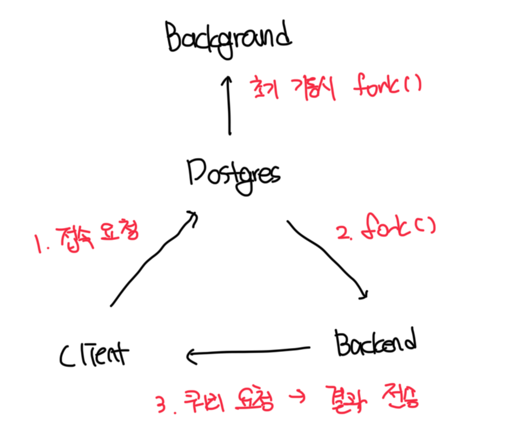

## 공유 메모리
- DBMS의 핵심 요소는 `안전성`과 `성능`으로 이는 트랜잭션의 안정성을 보장하면서 최대한의 성능을 제공해야함
- PG에선 성능을 극대화하기 위해서 공유 메모리를 활용하는데 제일 중요한게 `공유 버퍼`와 `WAL 버퍼`임

<br>

### 공유 버퍼
- 공유 버퍼는 Disk I/O를 최소화함으로써 성능을 향상시키는 것을 목적으로함
- 큰 크기의 공유 버퍼도 빠르게 접근이 가능해야하고 다수의 사용자가 접근해도 경합을 최소화 해야함
- 또한 자주 사용되는 블록은 가능한 오랫동안 공유 버퍼에 유지되어야함

<br>

### WAL 버퍼
- DBMS에서 트랜잭션 처리의 신뢰성 보장은 필수인데 즉 커밋된 트랜잭션은 반드시 DB에 반영되야한다
- PG에선 이를 보장하기 위해서 `WAL(Write-Ahead Logging)` 방식을 사용함
- 이 방식은 트랜잭션의 내용을 데이터 파일에 기록하기 전에 WAL 파일에 먼저 기록하는 방식임
- 하지만 매번 WAL에 기록하면 디스크 I/O로 인해 성능문제가 발생할 수 있다
- 이를 해결하기 위해서 공유 메모리 내에 WAL 버퍼를 두고, 트랜잭션 정보를 임시로 저장한 후 일정 조건을 만족하면 WAL 파일에 기록한다

<br>

## 프로세스
### postgres 프로세스
- 인스턴스 기동 시 가장 먼저 시작되는 프로세스다
- 인스턴스 복구 작업, 공유 메모리 초기화 등 작업을 수행하게됨
- 4가지 프로세스가 존재하는데 관계도는 아래와 같음




<br>

### 백그라운드 프로세스
- PG는 백그라운드 프로세스를 이용해서 시스템을 유지/관리함
- logger, checkpointer, walwriter 등 여러가지 프로세스가 존재함

<br>

### 백엔드 프로세스
- 클라이언트 프로세스의 요청을 받아서 쿼리를 수행 및 결과를 반환하는 역할을함
- 쿼리 수행을 위해서 백엔드 프로세스 메모리 내부에 할당되는 공간을 로컬 메모리라고 부름
- 로컬 메모리는 `work_mem`, `temp_buffers` 등 파라미터를 통해서 튜닝이 가능함

<br>

## DB 클러스터 주요 디렉토리 및 파일들
### postgresql.conf
- 인스턴스 환경 설정용 파일임
- 만약 파일 내부에 동일한 파라미터가 있다면 아래 부분에 위치한 파라미터의 우선 순위가 더 높음
```bash
#------------------------------------------------------------------------------
# ERROR HANDLING
#------------------------------------------------------------------------------

#exit_on_error = off                    # terminate session on any error?
#restart_after_crash = on               # reinitialize after backend crash?
#data_sync_retry = off                  # retry or panic on failure to fsync
                                        # data?
                                        # (change requires restart)
#recovery_init_sync_method = fsync      # fsync, syncfs (Linux 5.8+)


#------------------------------------------------------------------------------
# CONFIG FILE INCLUDES
#------------------------------------------------------------------------------

# These options allow settings to be loaded from files other than the
# default postgresql.conf.  Note that these are directives, not variable
# assignments, so they can usefully be given more than once.

include_dir = 'conf.d'                  # include files ending in '.conf' from
                                        # a directory, e.g., 'conf.d'
#include_if_exists = '...'              # include file only if it exists
#include = '...'                        # include file


#------------------------------------------------------------------------------
# CUSTOMIZED OPTIONS
#------------------------------------------------------------------------------

# Add settings for extensions here
```

<br>

### postgresql.auto.conf
- 동일하게 인스턴스 환경 설정용 파일이나 `ALTER SYSTEM SET` 명령어로 파라미터 변경시 여기에 기록됨
- `ALTER SYSTEM SET ... TO DEFAULT` 명령어를 통해서 삭제가 가능함
- 만약 동일한 파라미터가 `postgresql.conf`에도 존재한다면 해당 파일에 존재하는 설정이 우선순위가 더 높음
- 파라미터의 최종 적용값을 확인할려면 두 파일을 다 살펴봐야하므로 해당 파일을 이용한 변경은 최소화하는게 좋다