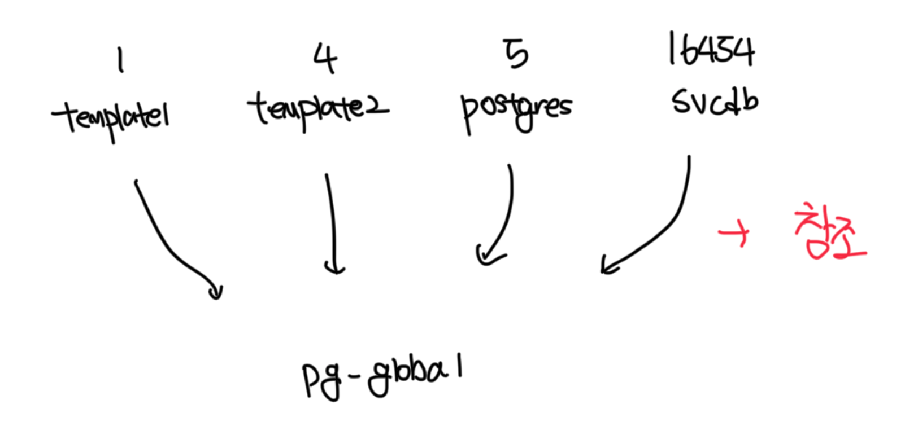

## 테이블스페이스
- PG에서 테이블스페이스는 하나의 디스크 볼륨(or 디렉토리)이다
- PG의 경우 테이블스페이스 단위로 수행할 수 있는 작업이 거의 없고 사용자 테이블스페이스를 생성하면 오히려 복잡하다
- initdb 명령어를 통해서 테이블스페이스를 생성하면 기본적으로 2개(default, global)가 생성된다

```sql
-- 테이블스페이스 목록 조회
postgres@localhost:postgres> \db
+------------+----------+----------+
| Name       | Owner    | Location |
|------------+----------+----------|
| pg_default | postgres |          |
| pg_global  | postgres |          |
+------------+----------+----------+
```

<br>

## pg_default 테이블스페이스
- `$PGDATA/base` 폴더에 생성되며 만약 테이블스페이나 인덱스를 생성할 때 따로 지정하지 않으면 여기 생성됨
- 해당 폴더에는 데이터베이스 OID 별로 서브 디렉토리가 생성됨
- `1 : template1`, `4: template0`, `5: postgres` 데이터베이스 폴더다
  - `svcdb` 라는 새로운 데이터베이스를 만들면 새로운 OID가 할당되고 해당 폴더가 만들어진다
- PG의 테이블은 파일 단위이며 저장 경로는 `pg_relation_filepath()` 함수로 확인이 가능하다

```
root@68212c6c65f5:/# ls -al $PGDATA/base
total 20
drwx------ 1 postgres postgres   24 Nov  1 08:48 .
drwx------ 1 postgres postgres  512 Oct 30 04:54 ..
drwx------ 1 postgres postgres 2990 Nov  2 06:29 1
drwx------ 1 postgres postgres 2958 Oct 30 04:02 4
drwx------ 1 postgres postgres 3238 Nov  2 06:42 5
drwx------ 1 postgres postgres    0 Nov  1 09:23 pgsql_tmp
root@68212c6c65f5:/# 
```

```sql
-- 테이블 저장 경로 조회
postgres@localhost:postgres> select pg_relation_filepath('svc.t1')
+----------------------+
| pg_relation_filepath |
| -------------------- |
| base/5/16431         |
+----------------------+
```

```sql
-- 데이터베이스 목록 조회
postgres@localhost:postgres> \l
+-----------+----------+----------+------------+------------+-----------------------+
| Name      | Owner    | Encoding | Collate    | Ctype      | Access privileges     |
|-----------+----------+----------+------------+------------+-----------------------|
| postgres  | postgres | UTF8     | en_US.utf8 | en_US.utf8 | <null>                |
| template0 | postgres | UTF8     | en_US.utf8 | en_US.utf8 | =c/postgres           |
|           |          |          |            |            | postgres=CTc/postgres |
| template1 | postgres | UTF8     | en_US.utf8 | en_US.utf8 | =c/postgres           |
|           |          |          |            |            | postgres=CTc/postgres |
+-----------+----------+----------+------------+------------+-----------------------+
```

<br>

## pg_global 테이블스페이스
- `$PGDATA/global` 폴더에 데이터가 저장되며 데이터베이스 클러스터 전체에 걸친 공통 데이터를 저장함
- DB 목록, 사용자 및 규칙 정보들은 어떤 디비에서 조회해도 동일한 결과가 출력되며 모두 `pg_global`에 저장됨



<br>

## TEMP 테이블스페이스
- 정렬 또는 해시 작업 수행 시 로컬 메모리가 부족하면 임시 파일을 사용하게됨
- 작업이 끝나면 자동으로 삭제되며 `$PGDATA` 내부에 임시파일이 생기므로 용량 계획시 해당 공간도 고려해야함
- 일반적으로는 임시 파일용 Temp 테이블스페이스를 별도로 만들진 않지만 예외적으로 구성하는 경우가 존재하긴함
