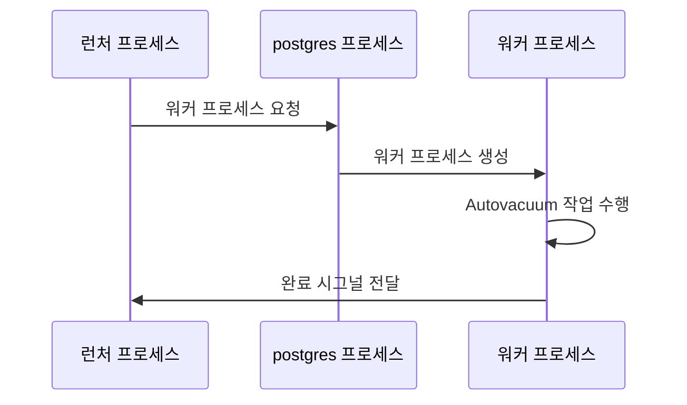

## Autovacuum 프로세스의 역할
- 통계 정보 갱신, 데드 튜플 정리, 입력 레코드 바큠, XID Frozen 작업을 자동으로 수행함
- XID Frozen의 경우 MVCC 일관성 유지를 위한 필수 작업으로 관련 파라미터가 off여도 작동함
- 오토바큠은 백그라운드에서 자동으로 수행되는 작업이라 파라미터 조정을 통해 업무 시간대 부하를 최소화해야함

<br>

### 입력 레코드에 대한 오토바큠
- 13 버전부터 추가된 기능으로 이전까지는 데드 튜플이 존재하는 블록에 대해서만 작업이 수행되었음
- 버전 13부터는 데드 튜플이 없이 레코드가 추가만 발생한 블록에 대해서도 자동으로 작업이 수행됨

<br>

## Autovacuum 작업 주기 설정용 파라미터
### 작업 수행 흐름
- 런처 프로세스 -> postgres 프로세스로 워커 프로세스를 요청
- postgres 프로세스는 워커 프로세스를 생성
- 생성된 워커 프로세스가 Autovacuum 작업을 수행
- 작업이 완료되면 워커 프로세스가 런처 프로세스에게 완료 시그널을 전달



<br>

### autovacuum_naptime
- 런처 프로세스가 postgres 프로세스에게 워커 프로세스를 요청하는 주기를 설정하는 파라미터
- 기본값은 60초며 CIC 옵션으로 변경이 가능함
- 런처 프로세스는 해당 파라미터 설정 주기마다 1개의 워커 프로세스를 요청함
- 만약 오토바큠 대상이 많아서 60초 이내에 작업이 처리되지 않으면 최초 워커 생성 60초 후에 새로운 프로세스가 추가로 생성됨

<br>

### autovacuum_max_workers
- 최대 생성 가능한 워커 프로세스 수를 설정함
- 기본값은 3이며 시스템 리소스에 따라서 조정이 가능함

<br>

## Autovacuum 작업 부하 조절용 파라미터
- 오보카뮤은 대상 레코드가 많을수록 작업양이 커지는데 그에 따라서 시스템에 주는 부하도 커지게됨
- 수동 바큠처럼 실행 시점 조정이 불가능해서 피크타임에도 오토 바큠이 실행될 수 있음
- 그래서 오토 바큠은 가능한 적은 부하로 백그라운드에서 실행될 수 있게 설계되어있고 파라미터 조정을 통해서 최적화가 가능함

<br>

### autovacuum_vacuum_cost_delay
- 기본값은 2ms으로 오토바큠 프로세스가 일정 작업량을 처리한 후 얼마나 오래 대기할지를 결정함
- 시간이 길수록 시스템 부하는 줄지만 작업이 오래걸리고, 반대로 짧을수록 시스템 자원 사용률이 올라가고 작업이 금방끝남
- 리소스 여유가 있는 시스템에서는 이 값을 줄이고, 여유가 없는 경우는 더 크게 설정하면됨
- 수동 바큠의 경우 해당 값이 0이므로 쉬지 않고 연속으로 작업함

<br>

### autovacuum_vacuum_cost_limit
- 기본값은 -1 이며 작업 단위를 설정하는 데 사용함
- 만약 -1 인 경우는 `vacuum_cost_limit` 파라미터를 사용하고 해당 파라미터는 기본값이 200임
- 오토바큠은 `autovacuum_vacuum_cost_limit` 만큼 작업을 수행하고 `autovacuum_vacuum_cost_delay` 만큼 대기하는 방법으로 동작함

<br>

#### 작업 단위 계산
- 작업 대상이 이미 버퍼에 있는지(1), 디스크 IO가 필요한지(2), Dirty 페이지인지(20)에 따라 달라짐
- 버퍼에 존재하면 200, 디스크 IO가 필요하면 100, 더티 페이지면 10으로 계산됨
- 즉 (200, 100, 10)개만 작업하고 `sleep(autovacuum_vacuum_cost_delay)`하는 구조임

<br>

## Vacuum 및 Analyze 작업 시점 계산용 파라미터
- autovacuum_analyze_scale_factor(0.1) : 통계 정보 수행을 위한 최소 변경 비율
- autovacuum_analyze_threshold(50) : 통계 정보 수행을 위한 최소 변경 건수
- autovacuum_vacuum_insert_scale_factor(0.2) : 입력 레코드 바큠 수행 최소 비율
- autovacuum_vacuum_insert_threshold(1000) : 입력 레코드 바큠 수행 최소 건수
- autovacuum_vacuum_scale_factor(0.2) : 데드 튜플 정리 작업을 위한 최소 변경 비율
- autovacuum_vacuum_threshold(50) : 데드 튜플 정리 작업을 위한 최소 변경 건수

<br>

### 통계 정보 생성 시점
- 공식 : `autovacuum_analyze_threshold` + `autovacuum_analyze_scale_factor` x `reltuples`
- 테이블이 생성되고 직후에는 통계 정보가 생성되지 않은 상태에서는 `reltuples`가 -1로 생성됨
  - 실제 계산시 -1은 0으로 처리됨
- 그래서 기본값을 기준으로 테이블이 생성되고 레코드가 50개가 추가되면 자동으로 통계 정보가 생성됨
- 이후에는 `pg_stat_all_tables.n_mod_since_analyze` 컬럼을 이용해서 갱신 여부를 판단함

<br>

### 입력 레코드 바큠 시점
- 공식 : `autovacuum_vacuum_insert_threshold` + `autovacuum_vacuum_insert_scale_factor` x `reltuples`
- 테이블이 생성되고 1000건의 레코드가 입력되는 시점에 입력 레코드에 대해서 오토바큠이 동작함
- 이후에는 `pg_stat_all_tables.n_ins_since_vacuum` 컬럼을 이용해서 갱신 여부를 판단함

<br>

### 데드 튜플 정리 시점
- 공식 : `autovacuum_vacuum_threshold` + `autovacuum_vacuum_scale_factor` x `reltuples`
- 위 값보다 `pg_stat_all_tables.n_dead_tup` 컬럼이 크면 데드 튜플 정리 작업이 수행됨

<br>

## Frozen 작업 관련 파라미터
- 현재 XID 기준으로 21.5억 이내의 레코드는 항상 VISIBLE 상태를 유지함
- 비교적 느슨한 기준으로 수행 시점이 계산됨

<br>

### 파라미터
- autovacuum_freeze_max_age(200,000,000) : Frozen 대상 테이블 나이
- autovacuum_multixact_freeze_max_age(400,000,000) : 멀티 트랜잭션 기준 테이블 나이
- vacuum_freeze_min_age(50,000,000) : Frozen 작업 대상 레코드의 최소 나이

<br>

### Frozen 작업 수행 방식
- 조건 : 테이블의 나이 > `autovacuum_freeze_max_age`인 경우
- 하지만 모든 레코드를 Frozen 처리하면 테이블의 나이는 0살이 되지만 실제로는 모든 레코드를 처리하지 않음
- `vacuum_freeze_min_age` 값 이상인 레코드만 Frozen 처리를 수행함

<br>

#### Frozen 작업 수행 예시 : 테이블 AGE가 200,000,000인 경우
- AGE가 `vacuum_freeze_min_age` 이상인 레코드는 Frozen 처리 대상에서 제외
- Frozen 처리 이후 테이블의 나이는 다시 `vacuum_freeze_min_age`로 리셋됨
- 이후 트랜잭션이 1.5억개 더 발생..
- 다시 Frozen 작업 수행

<br>

### Frozen 작업 성능 최적화 : VM(Visibility Map)을 활용한 스킵 처리
- PG 9.6 버전부터는 VM을 활용해 이미 Frozen 처리된 블록 스킵이 가능해짐
- 반복적인 Frozen 작업으로 인한 시스템 부하 문제를 효과적으로 해소할 수 있게 되었음

<br>

### 멀티 트랜잭션 기준
- 멀티 트랜잭션에 대해 별도로 관리되는 나이 기준임
- 멀티 트랜잭션은 `pg_class.relminmxid`를 기준으로 나이를 계산하게됨

```sql
postgres=# select mxid_age(relminmxid) from pg_class where relname='at1';
 mxid_age 
----------
        0
```