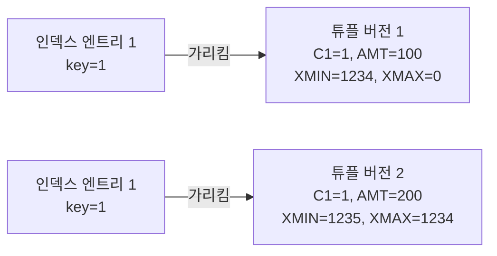
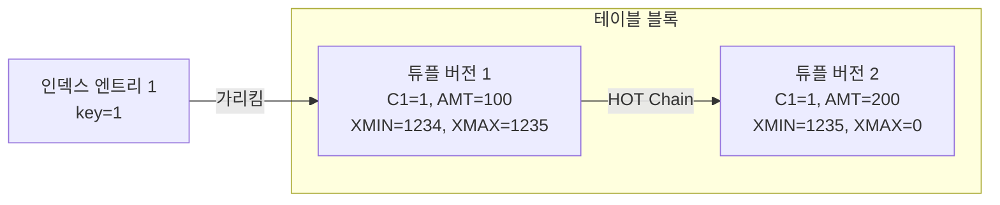

## HOT(Heap-Only Tuples)
- PG의 MVCC 모델에서 발생할 수 있는 성능 저하를 완화하기 위한 중요한 튜닝 기법중 하나
- HOT은 MVCC 및 Vacuum과 밀접하게 연결되어 있음

<br>

## HOT 탄생 배경과 기본 컨셉
- PG의 MVCC는 데드 튜플을 통해서 지원하는데 그래서 UPDATE의 경우 기본적으로 INSERT + DELETE로 동작함
- 이러한 방식은 MVCC 구현에선 유리하지만 테이블과 인덱스의 크기가 증가한다는 부작용이 존재함
- 특히나 인덱스 컬럼 값이 변경되지 않았어도 레코드가 새로 추가되면서 인덱스도 생성되는 문제가 있음
- 인덱스가 많을수록 더욱 심해지는데 이는 성능 저하뿐 아니라 디스크 공간도 낭비되는 문제가 발생함
- 이러한 문제를 해결하기 위해서 도입된 기능이 바로 `HOT` 임




<br>

### HOT 기본 컨셉
- 핵심 아이디어는 인덱스 컬럼이 변경되지 않았다면 인덱스를 갱신하지 않는다는 것임
- 인덱스가 생성되지 않은 컬럼에 대해서 UPDATE를 수행하면 인덱스에는 아무런 변화 없이 테이블 내 레코드만 변경함
- 이러한 방법을 지원하기 위해서 PG는 테이블 블록 내부에 HOT 체인을 생성함
- 인덱스는 기존의 테이블 위치를 그대로 가르키고, 쿼리 실행 시 해당 ㅊ위치에서 HOT 체인을 따라가 최종 라이브 튜플을 찾음



<br>

### HOT 제약 사항
- 가장 중요한 조건은 변경된 레코드가 기존 레코드와 동일한 테이블 블록에 위치해야 된다는 점임
- 만약 위 조건을 만족하지 않는 경우 HOT는 적용되지 않고 DELETE + INSERT로 동작함
- 여러 블록에 걸친 체인도 기술적으로 가능하긴하지만 조회시 여러 블록을 탐색해야되서 동일 블록내로 제한함
- 만약 업데이트가 자주 발생하는 테이블이라면 HOT의 동작 가능성을 위해서 fillfactor 값을 조정해서 블록 내 여유공간을 확보해두는게 중요함

<br>

## HOT 동작 원리
### CTID
- 인덱스와 테이블 간 연결고리를 뜻하는 컬럼
- 블록 번호와 슬롯 번호 형태로 구성되며 인덱스에는 이 CTID랑 키 값이 저장됨

<br>

### INSERT 이후 매우 짧은 시간 내에 UPDATE 수행 패턴
- 레코드 입력 직후에 업데이트가 연속해서 발생하는 경우, 테이블 블록 내에 충분한 여유 공간이 존재하면 HOT가 동작함
- 인덱스는 최초 체로드 위치를 그대로 유지하고, 테이블 내부에서는 HOT 체인을 따라서 최신 레코드를 찾는 방식으로 구현됨
#### 테스트 데이터 추가
```sql
postgres=# create table ht1 (c1 integer, amt integer);
postgres=# alter table ht1 add constraint ht1_pk primary key (c1);
postgres=# insert into ht1 values(1, 1);
```

<br>

#### CTID 확인
```sql
-- 삽입한 레코드의 CTID는 블록 0번 + 슬롯 1번으로 구성됨
postgres=# select ctid, c1, amt from ht1 where c1 = 1;
 ctid  | c1 | amt 
-------+----+-----
 (0,1) |  1 |   1

-- 실제 데이터가 페이지에 어떻게 저장됬는지 확인
postgres=# select ctid, data from bt_page_items('ht1_pk', 1);
 ctid  |          data           
-------+-------------------------
 (0,1) | 01 00 00 00 00 00 00 00

postgres=# select t_ctid, lp, lp_off, t_xmin, t_xmax, t_data from heap_page_items(get_raw_page('ht1', 0));
 t_ctid | lp | lp_off | t_xmin  | t_xmax |       t_data       
--------+----+--------+---------+--------+--------------------
 (0,1)  |  1 |   8160 | 4960979 |      0 | \x0100000001000000
```

<br>

#### 업데이트 수행하고 HOT 동작여부 확인
```sql
-- 업데이트 수행
postgres=# update ht1 set amt = amt + 1 where c1 = 1;

-- CTID가 0, 2로 변경되었음
postgres=# select ctid, c1, amt from ht1 where c1 = 1;
 ctid  | c1 | amt 
-------+----+-----
 (0,2) |  1 |   2
(1 row)

-- 인덱스는 여전히 0, 1을 가르키는중
postgres=# select ctid, data from bt_page_items('ht1_pk', 1);
 ctid  |          data           
-------+-------------------------
 (0,1) | 01 00 00 00 00 00 00 00
(1 row)

-- 레코드가 DELETE + INSERT로 동작하면서 t_xmax가 추가된 모습
postgres=# select t_ctid, lp, lp_off, t_xmin, t_xmax, t_data from heap_page_items(get_raw_page('ht1', 0));
 t_ctid | lp | lp_off | t_xmin  | t_xmax  |       t_data       
--------+----+--------+---------+---------+--------------------
 (0,2)  |  1 |   8160 | 4960979 | 4960980 | \x0100000001000000
 (0,2)  |  2 |   8128 | 4960980 |       0 | \x0100000002000000
(2 rows)
```

<br>

### INSERT 이후 매우 오랜 시간 후에 UPDATE 수행 패턴
- PG의 경우 하나의 블록에 약 220건 정도의 레코드 저장이 가능하다
- 아래 쿼리에서는 300건을 저장해서 블록이 넘어가게 설정한다

```sql
-- 테이블 초기화
postgres=# truncate ht1;

-- 데이터 300건 추가, 0번째 블록의 저장공간을 모두 사용함
postgres=# insert into ht1 select i, i from generate_series(1, 300) i;

-- 첫번째 레코드 업데이트 수행
postgres=# update ht1 set amt = amt + 1 where c1 = 1;

-- UPDATE 연산 이후에 새로 생성된 레코드는 1번째 블록에 저장된 모습
postgres=# select ctid, c1, amt from ht1 where c1 = 1;
  ctid  | c1 | amt 
--------+----+-----
 (1,75) |  1 |   2

-- 인덱스 상태 확인
-- 기존 (0, 1)은 dead 상태로 업데이트가 HOT로 처리되지 않았음
postgres=# select ctid, data, dead  from bt_page_items('ht1_pk', 1);
  ctid   |          data           | dead 
---------+-------------------------+------
 (0,1)   | 01 00 00 00 00 00 00 00 | t
 (1,75)  | 01 00 00 00 00 00 00 00 | f
```

<br>

## fillfactor와 HOT 업데이트 최적화
- 테이블이나 인덱스 블록에 데이터를 어느정도까지 채울지를 지정하는 옵션
- 기본값은 테이블 100%, 인덱스 90%로 설정되어있음
- 기본값을 사용하는 경우 테이블 블록에는 향후 업데이트를 위한 여유 공간이 전혀 없는 상태가 되는것임
- 기본값을 사용하면 블록 저장 효율은 높아지지만 이후 업데이트 발생시 HOT 방식으로 처리되지 않는 문제가 있음
- 테이블의 업데이트 유형과 발생 빈도에 따라서 적절한 fillfactor 값을 설정하는게 중요함

<br>

### 운영 환경에서의 fillfactor 설정 기준
- 프로젝트 초기 단계에서는 테이블 별 업데이트 패턴이나 빈도를 정확하게 알 수 없음
- 이런 경우는 가능성이 있는 테이블에 대해서 fillfactor 값을 90% ~ 95% 정도로 설정하는게 일반적임
- 운영 단계에서는 pg_stat_all_tables 뷰를 통해서 테이블 별 업데이트 패턴 확인이 가능하다

<br>

#### 테이블 별 업데이트 패턴 확인
- n_tup_upd : 업데이트 레코드 수로 아래는 레코드가 2번 업데이트됬다
- n_tup_hot_upd : HOT 방식으로 업데이트된 레코드 수로 1번 업데이트됬다
- n_tup_newpage_upd : non-HOT 방식으로 업데이트된  레코드 수로 1번 업데이트됬다
```sql
postgres=# select relname, n_tup_upd, n_tup_hot_upd, n_tup_newpage_upd
from pg_stat_all_tables where relname='ht1';
 relname | n_tup_upd | n_tup_hot_upd | n_tup_newpage_upd 
---------+-----------+---------------+-------------------
 ht1     |         2 |             1 |                 1
(1 row)

postgres=# 
```

<br>

#### fillfactor 설정
```sql
-- fillfactor 90%로 설정
postgres=# alter table ht1 set (fillfactor=90);

-- fillfactor 설정 확인
postgres=# select relname, reloptions from pg_class where relname='ht1';
 relname |   reloptions    
---------+-----------------
 ht1     | {fillfactor=90}
```

<br>

### 기존 블록에 적용하기 위한 VACUUM FULL
- fillfactor를 변경하더라도 기존에 있던 블록에는 설정이 적용되지 않음
- 변경사항은 새로운 블록에 반영하기 위해서는 `VACUUM FULL` 명령어 수행이 필요함

<br>

### fillfactor 설정에 따른 장단점
- 테이블에 생성된 인덱스 수가 많을수록 HOT 방식의 업데이트는 성능상 큰 이점을 제공함
- 만약 10개의 인덱스가 있고 대부분의 업데이트가 인덱스랑 무관한 필드에 발생한다고 가정한다
  - non-HOT : 업데이트시 테이블에 1건, 인덱스에 10건이 추가되어 총 11건의 WAL이 발생
  - HOT : 테이블에 1건만 추가되며 인덱스는 그대로 유지
- HOT 방식은 WAL의 양과 디스크 IO를 줄일뿐 아니라 쿼리 응답 속도 개선에도 효과적임