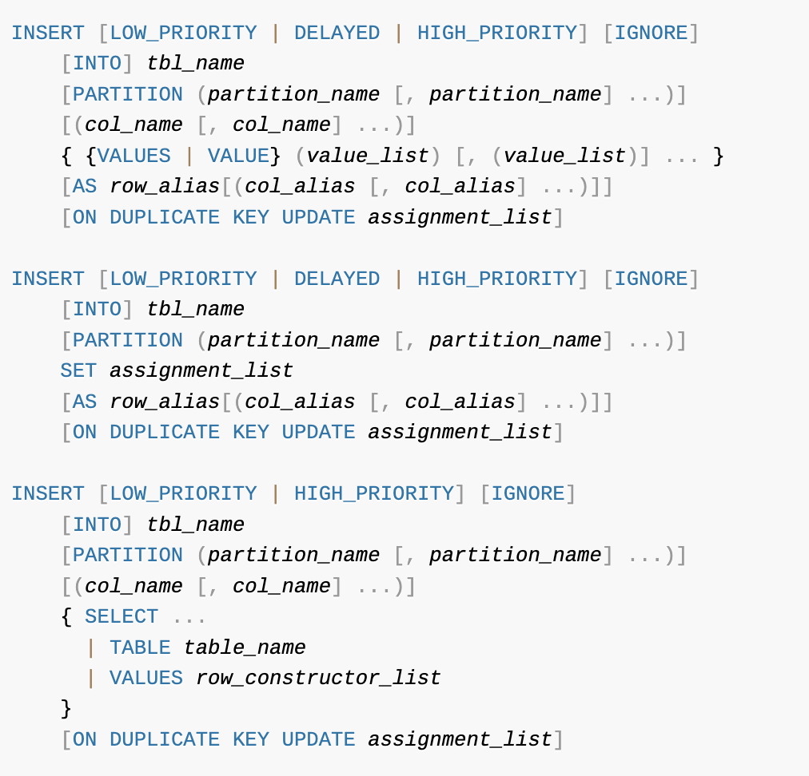

# 메뉴얼의 SQL 문법 표기를 읽는방법

### 이탤릭체

- 사용자가 선택해서 작성하는 토큰을 의미함
- 대부분 테이블명, 컬럼명 등임

 

### 대괄호 ('[]')

- 해당 키워드나 표현식 자체가 선택 사항임을 의미함
- 문법적으로 없어도 에러가 발생하지 않고, 있어도 문법적인 에러가 발생하지 않음

 

### 파이프('|')

- 앞과 뒤의 키워드나 표현식 중 하나만 선택 가능함을 의미함

 

### 중괄호('{}')

- 괄호 내의 아이템 중 무조건 하나는 사용해야 하는 경우를 의미함

 

### "..."

- 명시된 키워드나 표현식의 조합이 반복될 수 있음을 의미함
