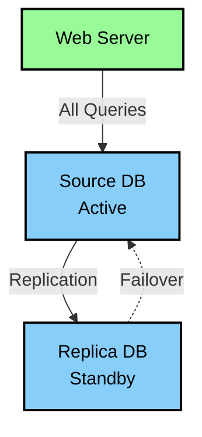
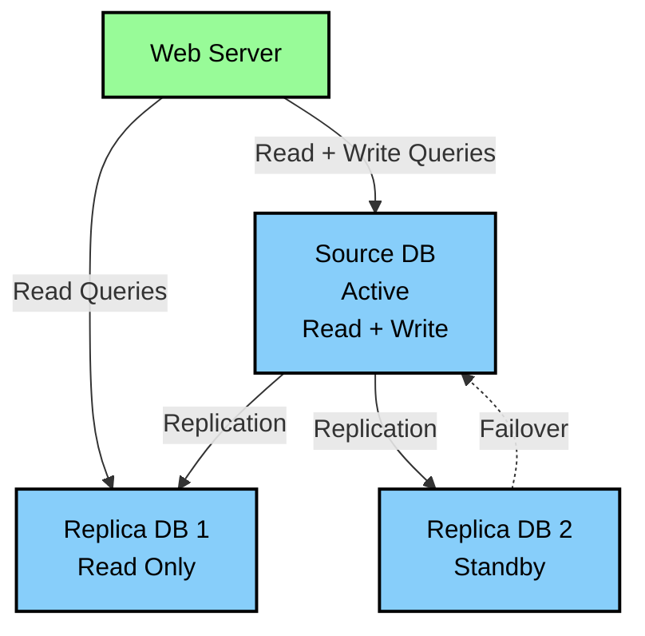
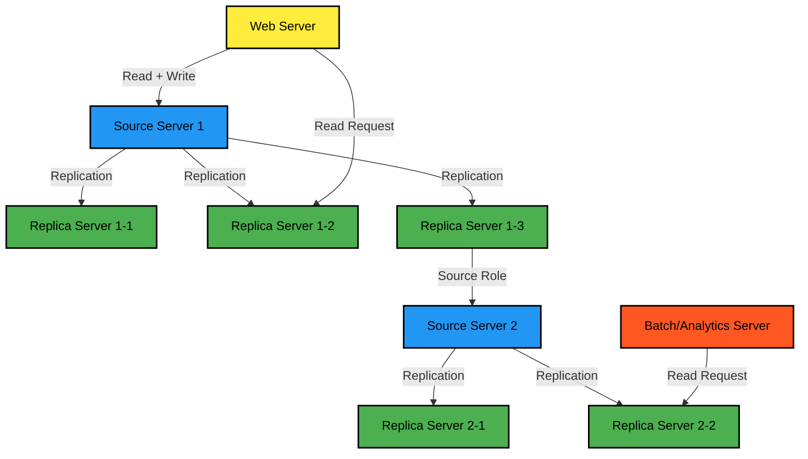
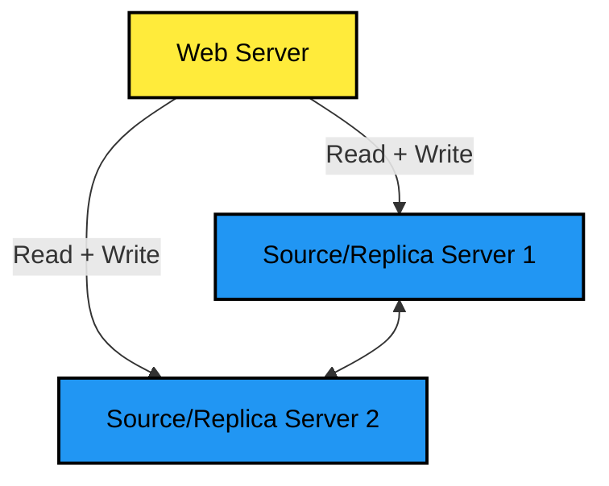
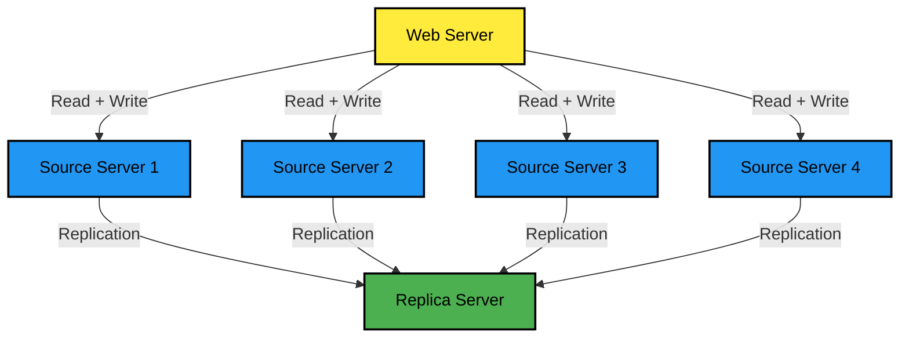

# 싱글 레플리카 복제 구성

- 하나의 소스 서버에 하나의 레플리카 서버만 연결된 형태
- 가장 기본적인 형태로, 가장 많이 사용되는 형태다
- 앱은 소스에만 직접 접근하고, 레플리카는 장애대비 예비서버나, 데이터 백업을 위한 용도로 자주 쓴다
- 이런 형태에서 앱에서 레플리카에도 접근한다면 레플리카에 문제가 발생했을때 위험하므로 예비용 서버로만 쓰는게 좋다

 

# 멀티 레플리카 복제 구성

- 하나의 소스 서버에 2개 이상의 레플리카 서버를 연결한 복제 형태
- 싱글 레플리카 복제 구성에서 추가적인 용도를 위해서 서버가 더 필요할때 자주 사용함
- 레플리카 서버가 2개 이상이므로 읽기+쓰기는 소스로, 읽기는 레플리카로 분산이 가능함
- 읽기 분산용으로 해당 구성을 사용할때는 레플리카 서버 1대는 예비용으로 남겨두는게 좋음

 

# 체인 복제 구성

- 레플리카 서버가 너무 많아서 소스 서버 성능에 악영향이 예상된다면 1:M:M 체인 복제 구성 고려가 가능함
- 또한 장비를 교체할때도 자주 사용하는데 각 그룹은 구/신버전 장비 그룹으로 묶어서 생각하면 편함
- 하지만 토폴로지가 복잡한 만큼 장애를 처리할때도 복잡도가 좀 더 높을수 있음

 

# 듀얼 소스 복제 구성

- 두개의 서버가 서로 소스 서버이자 레플리카 서버로 구성되어있는 형태를 뜻함
- 두 서버가 모두 읽기/쓰기가 가능한게 특징이고 목적에 따라 `active-passive`, `active-active`로 구성이 가능함

 

### ACTIVE-PASSIVE 구성

- 하나의 서버에서만 쓰기 작업이 수행되는 형태
- 싱글 레플리카 복제 구성과 유사하지만, 예비 서버가 바로 쓰기 작업이 가능해서 별도 설정없이 바로 전환이 가능함
- 보통 한 서버에서 다른 서버로 바로 쓰기가 전환될 수 있는 환경이 필요한 경우 주로 사용함

 

### ACTIVE-ACTIVE 구성

- 두 서버 모두에 쓰기 작업을 수행하는 형태
- 지리적으로 매우 떨어진 위치에서 유입되는 쓰기요청도 원활하게 처리하기 위해서 주로 사용함
- 지리적으로 덜어진 만큼 레이턴시로 인해서 서로 일관되지 않은 데이터를 가질수 있음을 유의해야함

 

### 주의사항

- 동시에 유입되는 경우 시점상 나중에 처리된 트랜잭션의 내용이 최종적으로 반영됨
- `ACTIVE-ACTIVE` 구성에서는 동시점에 동일한 데이터를 변경하는 트랜잭션이 존재하면 안됨
- 또한 `AUTO_INCREMENT` 사용을 지양하고 정 사용해야 된다면 `incremnt_offset` 값을 적절히 사용해야함
- 사실상 쓰기 확장 효과는 크기 않고, 쓰기 성능의 확장이 필요하다면 샤딩을 고려하는게 좋음

 

# 멀티 소스 복제 구성

- 레플리카 서버가 둘 이상의 소스 서버를 바라보는 형태
- 아래 목적으로 주로 사용함
  - 여러 서버에 존재하는 각기 다른 데이터를 하나의 서버로 통합
  - 여러 서버에 샤딩되어 있는 테이블 데이터를 하나의 테이블로 통합
  - 여러 서버에 데이터들을 모아 하나의 서버에서 백업 수행
- 하지만 레플리카로 데이터가 복제됬을때 충돌이 발생할만한 부분이 없는지 사전에 충분한 검토가 필요함
- 장애 대비용 레플리카 서버는 멀티소스가 아닌 각 소스 서버와 1:1로 구성하는게 좋음

 

### 멀티 소스 복제 동작

- 레플리카 서버는 연결된 소스 서버들의 변경 이벤트를 동시점에 병렬로 동기화함
- 각 소스 서버들에 대한 복제가 독립적으로 이루어지며 이를 위한 독립된 복제 처리를 채널이라고 부름
- 멀티 소스 복제의 레플리카 서버는 최대 256개의 복체 채널을 가질 수 있음
- `channel replication source to` 명령어에 `for channel`으로 특정 채널 지정이 가능함
  - 만약 지정하지 않을 경우는 전체 복제 채널에 대해서 명령어가 수행됨

 

### 멀티 소스 복제 구축

- 만약 2개 이상의 소스에서 데이터를 가져오는 경우는 공통 db(information_schema 등), 시스템 테이블 스페이스의 충돌과 병합을 고려해야함
- 초기에는 mysqldump + Xtrabackup을 적절하게 가져와서 사용하는게 제일 쉬운 방법이다
- 아래 예시들은 소스 서버인 A, B에서 리플리카 서버 C에서 멀티 소스 복제를 연결한다고 가정한다
- 추가로 해당 복구를 위해서는 `master_info_repository`, `relay_log_info_repository` 2개의 시스템 변수가 모두 table 이여야한다

 

#### mysqldump 같은 논리 수준의 백업 도구 사용

- mysqldump를 사용할때는 시스템 테이블 스페이스를 물리적으로 백업하는게 아니라 괜찮다
- 다만 레코드가 많은 경우는 시간이 많이 소요될 수 있다

 

#### Xtrabackup 같은 물리 수준 도구 이용

- 대용량의 디비를 빠르게 레플리카 서버로 가져올 수 있음
- 하지만 물리적인 테이블 스페이스도 모두 가져오게 되는데 이걸 병합하는건 불가능함

 

#### A, B 모두 데이터가 많지 않은 경우

- 데이터가 많지 않아서 mysqldump로 충분히 복제가 가능함
- 복제 이후에는 스토어드 프로시저나 함수, 유저정보 등 을 이관하면됨

 

#### A는 크고, B는 작은경우

- 작은쪽은 mysqldump, 큰 쪽은 xtrabackup을 쓰면된다
- 테이블의 개수가 더 많은쪽은 C에다가 먼저 복구함, 이후에 B 서버 데이터도 복구함
- 이런 경우도 스토어드 프로시저나 함수, 유저정보 등은 개별로 확인하는게 좋음

 

#### A, B 모두 큰 경우

- 둘 다 xtrabackup으로 물리적인 백업을 하고나서 테이블이 많은쪽을 먼저 C에 복구함
- 남은건 시스템 테이블 스페이스로 인해서 복구가 불가능하므로 ibd 파일을 export 하고 다시 import함
- 모두 수동으로 해야되므로 가능하면 테이블 개수 적은 쪽의 백업에 대해서 위 방법을 쓰는게 좋음
