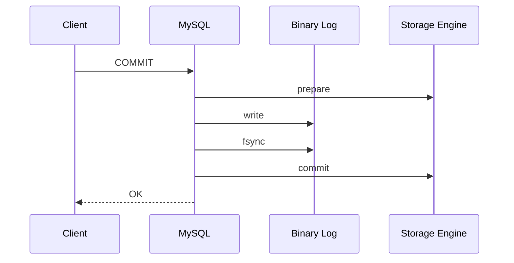

# 지연된 복제(Delayed Replication)

- 원래 복제의 목적은 소스, 레플리카 간 서버의 데이터를 동일한 상태로 만드는것이다
- 지연된 복제를 사용하면 이전 시점의 데이터 값이 확인이 필요한 경우나 부하관련 테스트에도 활용이 가능하다

<br>

### 딜레이 설정하기

- 초 단위로 지정이 가능하고 아래 예시는 1시간의 딜레이를 설정한다
- `show replica status`에서 Seconds_Behind_Source로 확인이 가능하다

```sql
-- mysql 8.0.23 미만
change master to master_delay=86400

-- mysql 8.0.23 이상
change replication source to master_delay=86400
```

<br>

### 8 버전에서 추가된 타임스탬프 값

- 8 버전 부터는 바이너리 로그에 2가지 타임스탬프가 추가되었음

#### OCT(original_commit_timestamp)

- 트랜잭션이 원본 소스 서버에 커밋된 시작, 밀리초 단위 유닉스 타임스탬프
  - 제일 위에있는 소스서버, 트랜잭션이 최초에 실행된 서버가 원본서버다
- 모든 서버가 동일한 값을 가진다

<br>

#### ICT(immediate_commit_timestamp)

- 트랜잭션이 직계 소스 서버에 커밋된 시각, 밀리초 단위 유닉스 타임스탬프
  - 직계 소스 서버는 레플리카 기준 바로 위의 소스 서버를 뜻함
- 레플리카 서버마다 트랜잭션이 커밋되는 시간이 달라서 다 다르다
- 원본 서버는 OCT, ICT의 값이 동일하다
- 해당 값은 모든 복제를 구성하는 서버가 8.0.1 버전 이상에서만 동작한다

<br>

# 멀티 스레드 복제

- 기존에는 단일 스레드 기반으로 동작했는데 대량의 DML 쿼리가 실행되면 복제 동기화에 지연이 발생했다
- 코디네이터 스레드는 릴레이 로그에서 데이터를 읽고 각 큐에 저장하며, 워커 스레드는 이를 서버에 반영한다
- 어떻게 병렬로 처리할지에 따라서 DB기반과 logical lock 기반으로 작동한다
  - 관련된 시스템 변수로는 `slave_parallel_type`, `slave_parallel_workers`, `slave_pending_jobs_size_max`가 있다

<br>

### 관련 시스템 변수

#### slave_parallel_type

- 어떤 처리 방식(DB / logical lock)으로 사용할지 결정함
- 기본값은 DB 기반 멀티 스헤드 복제 방식이다

<br>

#### slave_parallel_workers

- 워커 스레드의 개수를 지정하는 시스템 변수
- 0 ~ 1024 사이의 숫자 지정이 가능하고, 0으로 지정하면 기존 단일 스레드 복제 방식으로 동작
- 0과 1에는 차이가 존재하는데 1로 설정하면 멀티스레드 기반으로 코디네이터 스레드, 워커 스레드가 동작

<br>

#### slave_pending_jobs_size_max

- 워커 스레드의 큐에 할당할 수 있는 최대 메모리의 크기
- 기본값은 128MB 이며 일반적인 OLTP 서비스는 해당 값으로도 충분하다
- 만약 해당 값을 초과해서 큐에 등록되는 경우는 기존 이벤트가 처리될때까지 대기하고 처리된다
  - 해당 값이 자주 초과하는 경우는 레플리카에서 복제 지연이 발생하므로 적절히 큰 값으로 변경하는게 좋다

<br>

### 데이터베이스 기반 멀티 스레드 복제

- 스키가 기반 처리 방식으로도 부르고, 초기에 멀티 스레드 복제를 사용할떄 유일하게 사용가능한 방식이였다
- 이름 그대로 데이터베이스 단위로 병렬 처리를 수행하는 방법을 말하고, 디비가 한개만 있다면 아무런 장점이 없다
- 워커 스레드가 작업중이고 하나의 트랜잭션에서 다른 디비에서 트랜잭션을 실행하는 경우는 다른 워커 스레드에게 작업을 할당함
  - 하지만 기존 작업중인 디비에 또 하나의 트랜잭션이 요청되는 경우는 대기하다가 처리된다
- 테이블이나 레코드 수준의 충돌여부는 고려하지 않고, 디비가 동일한지 아닌지만 비교해서 병렬처리를 수행하는 방식이다
- 소스, 레플리카 사이에 보유한 바이너리 로그에는 차이점이 존재해서 일관성을 보장하긴 어렵다

```bash
[mysqld]
slave_parallel_type='DATABASE'
slave_parallel_workers=N (N > 0)
```

```sql
stop replica sql_thread;
set global slave_parallel_type='DATABASE';
set global slave_parallel_workers=N (N > 0);
start replica sql_thread;
```

<br>

### LOGICAL CLOCK 기반 멀티 스레드 복제

- 멀티 스레드나 분산 시스템에서 상태의 동기화에 많이 사용되는 방법이다
- 소스 서버의 트랜잭션이 바이너리 로그로 기록될때 각 트랜잭션별로 논리적인 순번을 부여해서 레플리카에서 순번을 바탕으로 정해진 기준에 따라서 병렬로 처리하는 방식
- Commit-Parent, Lock, Writeset 총 3가지 방식이 존재한다

<br>

### 바이너리 로그 그룹 커밋

#### 5.5 버전에서의 InnoDB

- 기존 5.5 버전의 InnoDB는 한 시점에 하나의 트랜잭션만 커밋이 가능했다
- 바이너리 로그에 트랜잭션을 기록하고 디스크와 동기화 하는 부분도 여러개가 진행될 수 없었다
- MySQL에는 분산 트랜잭션이라는 개념이 존재하는데 이는 Prepare, Commit 2단계를 거쳐서 처리된다
  - 해당 방식은 스토리지 엔진의 내용과 바이너리 로그 간 일관성을 유지하기 위해서 사용함
- 아래 표는 커밋 5.5 버전까지의 트랜잭션 커밋 과정이다



<br>

#### 5.6 버전 이상에서 도입된 바이너리 로그 그룹 커밋

- 바이너리 로그 그룹 커밋은 Prepare 단계 이후에 총 3개의 단계를 거치면서 최종적으로 커밋된다
- `Flush 단계`
  - 대기 큐에 등록된 각 트랜잭션을 순서대로 바이너리 로그에 기록
- `Sync 단계`
  - 위에서 기록된 바이너리 로그 내용을 디스크와 동기화하는 fsync() 시스템 콜 수행
  - 해당 단계에서는 `sync_binlog` 설정에 따라서 매번 동기화할지 지정이 가능함
  - 많은 트랜잭션이 한번에 동기화과 될수록 더 효율적이며 특정 변수로 해당 단계의 실행지연이 가능함
- `Commit 단계`
  - 대기 큐에 등록된 트랜잭션들에 대해서 스토리지 엔진 커밋을 진행

<br>

#### sync 관련 시스템 변수

- `binlog_group_commit_sync_delay`
  - 바이너리 로그 -> 디스크 동기화 작업을 얼마 정도 지연시킬지 제어하는 변수, 단위는 마이크로초
  - 기본값은 0이며 해당 값이 클수록 그룹핑되는 트랜잭션이 많아져서 `fsync()` 시스템 콜을 줄일 수 있음
  - 하지만 딜레이가 너무 커서 많은 양의 트랜잭션을 한번에 처리하면 성능에 영향이 갈수도 있으니 적절하게 설정해야함
- `binlog_group_commit_sync_no_count`
  - 동기화 작업이 진행되기 전에 지연되어 대기할 수 있는 최대 개수를 지정함
  - 만약 딜레이가 0이라면 해당 값은 무시됨

<br>

#### commit 관련 시스템 변수

- `binlog_order_commits`
  - 0, 1, ON, OFF로 설정이 가능함
  - ON인 경우는 트랜잭션이 바이너리 로그 파일에 기록된 순서대로 스토리지 엔진에 커밋됨
  - OFF인 경우 병렬로 처리되며 순서를 보장하지 않음

<br>

### Commit-Parent 기반 LOGICAL CLOCK 방식

- 5.7.2 ~ 5.7.5 까지의 방식으로 동일 시점에 커밋된 트랜잭션들을 레플리카 서버에서 병렬처리하게 해줌
- 해당 방식을 사용하면 바이너리 로그에 트랜잭션을 기록할 때 64비트 정숫값 기반의 `commit_seq_no`를 같이 저장함
  - 해당 값은 최종적으로 스토리지 엔진에 커밋되기 전에 값이 증가됨
- 같은 시점에 커밋 처리가 시작된 트랜잭션들은 동일한 순번을 가지며, 레플리카에선 복제된 트랜잭션들의 순번을 바탕으로 같은 값을 가진 트랜잭션들을 병렬로 처리함
- 같은 그룹으로 커밋된 트랜잭션 수가 많을수록 레클리카에서 트랜잭션 병렬 처리율이 향상됨

<br>

### LOCK 기반 LOGICAL CLOCK 방식

- 5.7.6 버전 이상에선 잠금 기반의 LOGICAL LOCK 방식을 사용함
- 기존 Commit Parent 방식은 트랜잭션들이 동일한 순번을 가져야 병렬처리가 가능했다
- 해당 방식에서는 순번이 동일하지 않더라도 커밋 시점이 동일하면 병렬 처리가 가능하다
  - 해당 방식을 위해서 트랜잭션을 기록할 때 `sequence_number`, `last_commited`를 같이 저장한다
  - `sequence_number` : 커밋된 트랜잭션에 대한 논리적인 순번
  - `last_committed` : 현 트랜잭션 이전에 커밋된 가장 최신 트랜잭션의 순번
  - 바이너리 로그 파일이 새로운 파일로 로테이션되면 `sequence_number`는 1, `last_comitted`는 0이 된다
- 실행하려는 트랜잭션의 `last_comitted` < 현재 실행중인 트랜잭션들이 가지는 가장 작은 `sequence_number` 값 조건을 기준으로 트랜잭션들의 실행 가능 여부를 판단함

<br>

### Writeset 기반 LOGICAL LOCK 방식

- 트랜잭션의커밋 처리 시점이 아닌 트랜잭션이 변경한 데이터를 기준으로 병렬 처리 가능여부를 결정
- 동일한 데이터를 변경하지 않는 모든 트랜잭션들은 병렬로 처리가 가능해짐
- 같은 세션에서 실행된 트랜잭션들의 병렬처리 여부에 따라서 WRITESET, WRITESET_SESSION으로 구분됨
  - `WRITESET` : 동일한 데이터를 변경하지 않는 모든 트랜잭션은 병렬로 실행
  - `WRITESET_SESSION` : 동일한 데이터를 변경하지 않는 모든 트랜잭션은 병렬로 실행 외에 WRITESET과 동일

<br>

#### Writeset

- 내부적으로 트랜잭션에 의해서 변경된 데이터 목록을 관리하며 해당 값은 모두 해시값으로 표현됨
  - 이 때 해싱된 변경 데이터를 Writeset 이라고 부름
- Writeset은 테이블 내부에 존재하는 유니크 키의 개수만큼 만들어짐
- 해시 알고리즘은 `transaction_wrtie_set_extraction`에 의해서 관리되고 기본값은 xxhash64임
  - 해당 값을 다른 알고리즘으로 변경할려면 바이너리 로그 포맷이 ROW 일때만 가능함
- 서버 메모리에서 해시맵 테이블로 히스토리가 관리되는데 최대 아이템은 수정이 가능하고 기본은 25000개임
  - 지정된 데이터 수가 최대로 도달하거나 DDL이 실행되면 해당 값은 초기화됨
- 동일하게 `last_comitted`와 `sequence_number`가 기록되고 이를 통해 병렬처리를 수행함
- 다른 방식들보다 레플리카 서버의 처리량을 높여주지만 Writeset 관리를 위해 오버헤드가 발생한다

```bash
-- source
[mysqld]
binlog_format=ROW
binlog_transaction_dependency_tracking=WRITESET | WRITESET_SESSION
transaction_write_set_extraction=XXHASH64

-- replica
[mysqld]
binlog_format=ROW
slave_parallel_type=LOGICAL_CLOCK
slave_parallel_workers=N (N > 0)
```

<br>

### 멀티 스레드 복제와 복제 포지션 정보

- 각 워커 스레드가 실행한 바이너리 로그의 이벤트 포지션은 `slave_worker_info` 에이블이나 데이터 디렉터리 내부의 `worker-relay-log.info` 파일에 기록됨
- 각 테이블이나 파일은 워커 스레드에서 이벤트를 실행 완료할때마다 갱신됨

<br>

# 크래시 세이프 복제(Crash-safe Replication)

- 서버 장애 이후에도 MySQL에서 문제없이 복제가 진행되는 방식
- 대표적으로 `Duplicate Key` 같은 에러가 이에 속함
- MySQL 서버에 장애로 인해서는 해당 방식으로 복구가 가능하지만, OS 자체가 장애인 경우는 보장될 수 없음

<br>

### 서버 장애와 복제 실패

- 복제를 담당하는 스레드는 바이너리 로그를 읽은 포지션, 재실행한 트랜잭션 등 정보를 기록함
- 이 때 파일이나 테이블 형태로 관리하는데 파일의 경우는 처리중인 내용과 포지션 정보를 원자적인 동기화된 상태로 관리할 수 없었음
- 테이블의 경우에는 SQL 스레드가 트랜잭션 적용과 포지션 정보 업데이트를 하나의 트랜잭션에서 원자적으로 처리함
- 테이블의 경우도 릴레이 로그 파일에 이벤트 작성과, 포지션 정보 업데이트 작업은 원자적인 처리가 불가능해서 여전히 불일치 문제가 발생했음
- `relay_log_recovery` 옵션을 통해 완화되었음
  - 서버가 I/O 스레드의 포지션을 마지막으로 실행했던 포지션으로 초기화함
    새로운 릴레이 로그 파일을 생성하고 SQL 스레드가 일겅야되는 릴레이 로그 포지션 위치를 초기화함

```bash
relay_log_recovery=ON
relay_log_info_repository=TABLE
```

<br>

### 복제 사용 형태별 크래시 세이프 복제 설정

- 설정한 내용에 따라서 복제 타입 및 동기화 방식이 다름
- 크게 4개의 종류로 구분이 가능함

#### 바이너리 로그 파일 위치 기반 복제 + 싱글 스레드 동기화

- 해당 방식은 MySQL 서버만 비정상 종료됬을 경우만 복제가 정상적으로 재개됨

```bash
relay_log_recovery=ON
relay_log_info_repository=TABLE
```

<br>

#### 바이너리 로그 파일 위치 기반 복제 + 멀티 스레드 동기화

- 레플리카에서 복제된 트랜잭션 순서가 소스랑 동일하도록 설정됬는지에 따라서 옵셧 셋이 달라짐
- 커밋 순서가 일치하다면 기본 옵션을 사용하지만 불일치시 `sync_relay_log` 옵션을 사용해야함
  - 해당 옵션은 숫자만큼 이벤트가 기록됐을때 디스크와 동기화 한다는 설정이며 기본값은 10000이다. 0인 경우 OS에 맞긴다
- 위 옵션을 1이 아닌 0이나 1 이상의 값을 사용하면 트랜잭션 갭에 의해서 릴레리 로그가 유실될수도 있다
- 트랜잭션 갭은 멀티 스레드 복제에서 병렬 처리로 인해 트랜잭션이 순서대로 처리되지 않아서 일시적으로 발생하는 트랜잭션 간의 간격이다
- 가능하면 멀티 스레드 복제를 사용할떄는 LOGICAL_CLOCK + 커밋 순서가 보장되게 해서 사용하는걸 권장한다

| 소스/레플리카 커밋 순서 일치 여부                                                                 | 크래시 세이프 복제 설정                                                          |
| ------------------------------------------------------------------------------------------------- | -------------------------------------------------------------------------------- |
| `커밋 순서 일치` <br> <br> slave_parallel_type=LOGICAL_CLOCK <br> slave_preserve_commit_order=1   | relay_log_recovery=ON <br> relay_log_info_repository=TABLE                       |
| `커밋 순서 불일치` <br> <br> slave_parallel_type=LOGICAL_CLOCK <br> slave_preserve_commit_order=1 | relay_log_recovery=ON <br> relay_log_info_repository=TABLE <br> sync_relay_log=0 |

<br>

#### GTID 기반 복제 + 싱글 스레드 동기화

- `mysql.gtid_executed` 테이블에 트랜잭션이 커밋될때마다 함께 갱신되는지에 따라서 옵션 셋이 달라짐
- GTID 기반 복제에서는 마지막 트랜잭션 GTID를 얻기 위해서 `mysql.gtid_executed` 테이블을 사용함
- 8.0.17 버전 부터는 트랜잭션이 완료되면 자동으로 `mysql.gtid_executed` 테이블을 업데이트하고 동기화함

매번 갱신되는 경우

```bash
relay_log_recovery=ON
SOURCE_AUTO_POSITION=1
```

매번 갱신되지 않는 경우

```bash
relay_log_recovery=ON
SOURCE_AUTO_POSITION=1
sync_binlog=1
innodb_flush_log_at_trx_commit=1
```

<br>

#### GTID 기반 복제 + 멀티 스레드 동기화

- 설정 자체는 싱글 스레드 동기화와 동일하다
- 복구 작업시 갭을 매우기 작업이 실패하면서 복제 연결이 실패하는 경우가 존재했음
- 8.0.18 or 5.7.28 버전 미만에서는 아래 명령어로 복제 재개가 가능함
  `STOP SLAVE; RESET SLAVE; START SLAVE;`

<br>

# 필터링된 복제(Filtered Replication)

- 소스 서버의 특정 이벤트만 레플리카에 적용이 되도록 필터링 기능을 제공함
- 소스에서 필터링은 데이터베이스 단위로만 가능하고 레플리카 에서는 더 다양한 형태의 필터링 사용이 가능함
- 동작 방식은 소스에서 정하는게 아니라 레플리카에서 일단 모두 가져오고 거기서 필터링 하는 형태로 동작함

### mysqld 설정

```ini
[mysqld]
binlog-do-db=[바이너리 로그에 기록할 디비 선택]
binlog-ignore-db=[바이너리 로그에 기록하지 않을 디비 선택]
```
