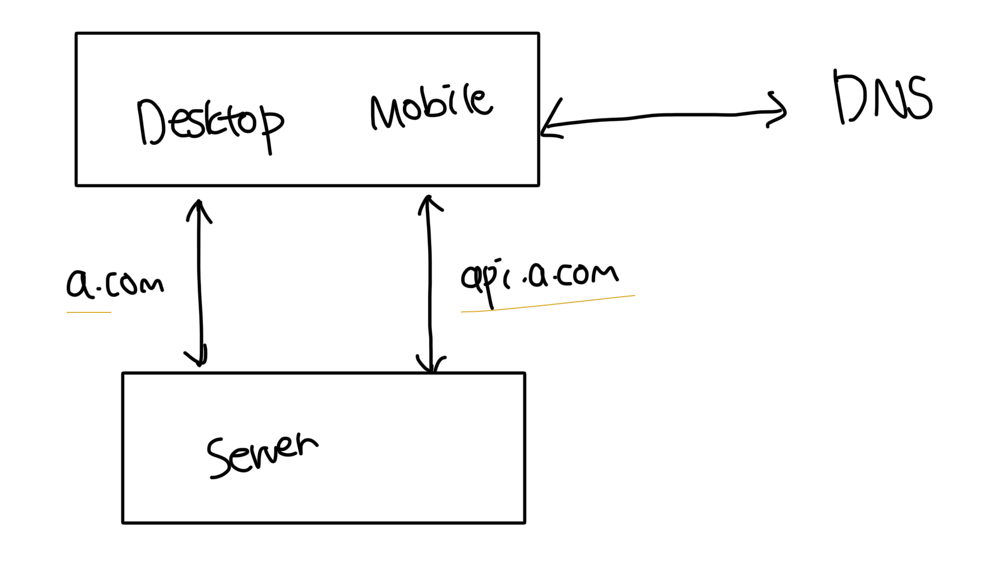

# 단일 서버

- 복잡한 서버라도 시작은 단일 모놀리틱 구조에서 시작된다

 

### 올인원 서버

- 디비, 웹, API 등 모든게 하나의 서버에서 실행되는 구조
- DNS를 통해서 URL에 대한 정보를 조회함
- 서버를 통해 HTML 데이터를 받아오고 API 통신을 통해 동적인 데이터를 받아옴
- API 서버와 통신시 보통 JSON 형식을 사용함

