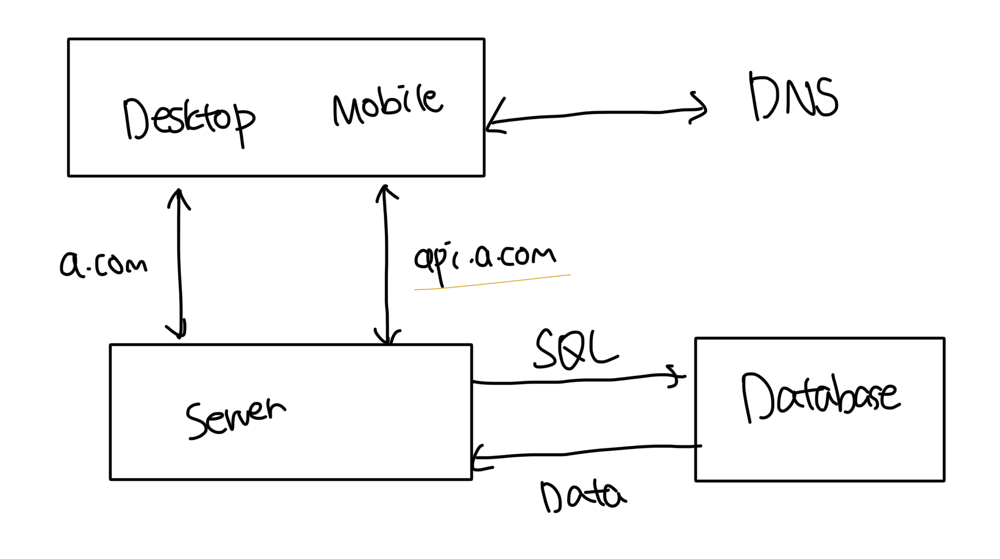

# 데이터베이스

- 트래픽이 늘어나는 경우는 서버 하나로 충분하지 않은 경우가 존재함
- 하나는 API 처리용, 나머지는 데이터베이스 용도로 서버를 분리하곤함
  - 이렇게 분리하면 각각을 독립적으로 확장해 나갈 수 있음

 

# 어떤 디비를 사용해야될까

- 디비에는 대표적으로 관계형과 비-관계형이 존재함

 

### 관계형 데이터베이스(Relational Database)

- Oracle, Mysql, Postgres 등 이 존재함
- 자료를 테이블과 행, 열로 표현함
- SQL을 사용해서 여러개의 테이블에 존재하는 데이터를 JOIN해서 표현할 수 있음
- 대부분의 경우 RDBMS를 사용하는게 일반적임

 

### 비-관계형 데이터베이스(NoSQL)

- MongoDB, DynamoDB, HBase 등 이 존재함
- 보통 4가지로 분류가 가능함
  - 키-값(Key-Value) 저장소
  - 그래프 저장소(Graph Store)
  - 컬럼 저장소(Column Store)
  - 문서 저장소(Document Store)
- 일반적으로 RDBMS 처럼 JOIN은 지원하지 않음
- 구축하려는 시스템에 RDBMS가 안어울리는 경우가 존재할떄 사용하면 좋음
  - 아주 낮은 응답시간(Low-Latency)
  - 다루는 데이터가 비정형(unstructed) 데이터인 경우
  - 등등
