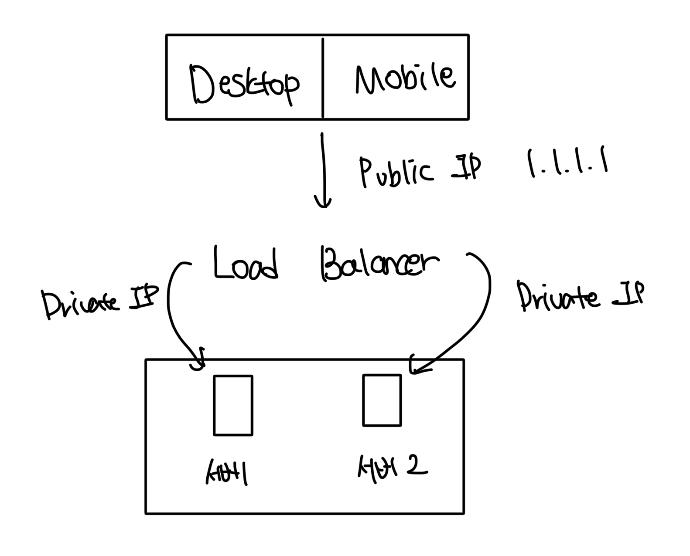
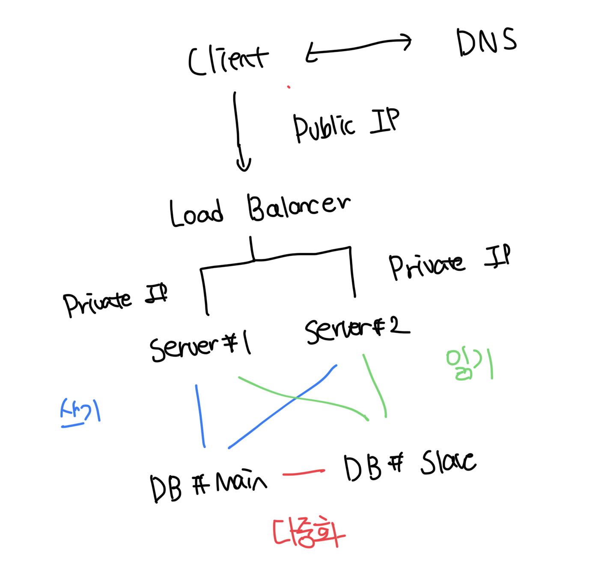

# 수직적 규모 확장(스케일 업)

- 서버에 더 좋은 자원을 할당하는 방식
- 서버로 유입되는 트래픽이 적은 경우는 수직적 확장이 좋은편
- 장점으로는 매우 단순함이다

 

### 단점들

- 서버의 스펙은 한계점이 존재함. CPU/RAM 등은 무한대로 증설이 불가능함
- 장애에 대한 자동복구나 다중화 방안을 제시하지 않음. 단일 서버에서 오류가 발생하면 서비스가 중단됨
  - 대규모 앱을 지원하는 서버에서는 수평적 구모 확장이 더 좋다

 

# 수평적 규모 확장(스케일 아웃)

- 기존 서버에 더 많은 서버를 추가해서 성능을 개선하는 행위
- 서버를 더 많이 둠으로써 트래픽을 분산하면 단일 서버에 대한 부하가 줄어듦

 

# 로드밸런서

- 서버들에게 트래픽을 골고루 분산하는 역할을 담당함
- 외부에서 통신할때는 서버의 IP를 직접 바라보는게 아닌 로드밸런서의 IP를 바라봄
- 로드밸런서는 내부 공개되지 않는 IP로 트래픽을 전달함
- 로드밸런서를 통해서 단일 서버의 자동복구를 못하는 문제를 해소해서 가용성이 올라간다

 

# 로드밸런서를 통한 가용성 보장

- 서버 1 다운시 모든 트래픽은 서버 2로 전달됨
- 만약 서버 2대로도 버티지 못하는 트래픽이 있다면 서버를 증설해서 많은 트래픽 대응도 가능함

 

# 데이터베이스 다중화

- 디비 사이에 주(master)-부(slave) 관계를 설정한다
- 원본은 주 서버에 존재하고, 복제본은 부 서버에 저장하는 방식이다
- 주 디비는 쓰기연산만 지원, 부 디비는 읽기 연산만 지원한다
- 일반적인 서비스에서는 읽기작업이 매우 많기때문에 일반적으로 부 디비의 개수가 많은편이다

 

### 다중화의 장점

- 더 나은 성능: 주, 부 디비별로 연산이 분산되므로 병렬처리가 가능한 쿼리의 수가 늘어나서 성능이 향상됨
- 안정성/가용성: 특정 리전에 장애가 나도 여러개의 리전에 분산해서 디비를 생성해두면 안정성이 보장됨

 

### 여러개의 디비 중 하나가 다운되면 생기는 일

- 부 서버가 한대인데 다운되는 경우는 주 서버가 모든 트래픽을 처리하게 된다. 이후에 새로운 부 서버가 장애가 발생한 부 서버를 대체함
- 주 서버가 다운되면 부 서버중 한대가 주 서버로 승격한다
  - 실제로는 매우 복잡한 과정이 존재한다
