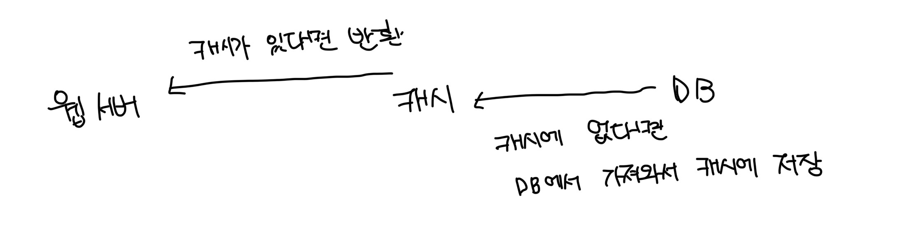

# 캐시

- 값 비싼 연산이나 자주 참조되는 데이터를 메모리 안에 저장하고 요청이 빠르게 처리될 수 있게 하는 저장소
- 앱의 성능은 디비를 얼마나 자주 호출하는지에 따라 크게 좌우되는데, 캐시가 이런 문제를 완화할 수 있음

 

# 캐시 계층

- 데이터가 잠시 보관되는 공간으로, 디비보다 훨씬 빠름
- 캐시에는 다영한 전략이 존재하고 용도에 맞게 사용하면 된다
- 아래 예시는 읽기 주도형 캐시전략의 예시다

 

# 캐시 사용시 주의할 점

- 데이터 갱신은 자주 일어나지 않지만 참조가 자주 일어나는 경우 적합
- 캐시는 휘발성으로 중요한 데이터는 영속성 저장공간에 저장해야된다
- 캐시에 보관되는 데이터는 만료기간을 갖는데 이를 적절하게 설정해야한다
  - 짧으면 디비에 접근이 자주 발생하고, 길면 최신성이 보장되지 않는다
- 원본 데이터와 캐시에 저장되는 일관성은 규모가 커질수록 관리가 힘들다
- SPOF(Single Point of Failture)를 피할려면 여러 리전에 캐시를 분산해야한다
- LRU, LFU 등 캐시 방출전략도 잘 정해야한다
