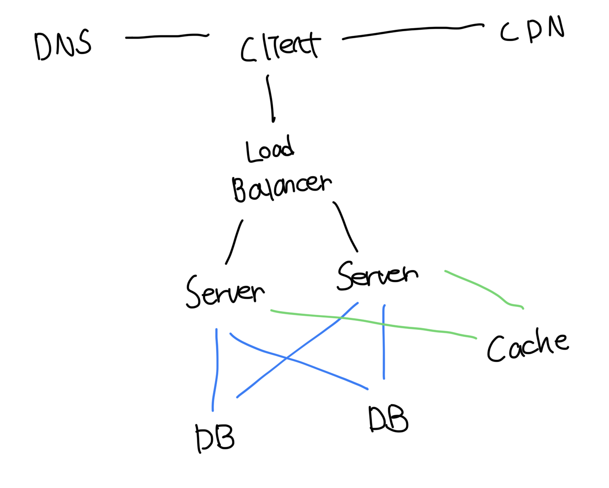

# 콘텐츠 전송 네트워크(CDN)

- 정적 콘텐츠를 전송하는데 쓰이는 지리적으로 분산된 서버의 네트워크
- 간단하게 얘기하면 유저 입장에서 가장 가까운 CDN 서버가 정적 콘텐츠를 전달해줌
- CDN에 콘텐츠가 없다면 원본 서버에서 가져오고 지정한 시간만큼 저장함

pic

 

# CDN에서 고려할 점

### 비용

- 보통 제 3사업자에 의해서 운영됨
- CDN의 데이터 I/O에 기반해서 요금이 부과됨
- 자주 사용하지 않는 콘텐츠 캐싱은 이득이 크지 않음

 

### 만료기간

- 너무 길면 콘텐츠의 신선도가 떨어져서 구 이미지를 볼수도 있음
- 너무 짧으면 원본 서버에 접속하는 일이 빈번해서 좋지 않음

 

### CDN 장애

- CDN 자체가 다운된 경우 웹/앱이 어떻게 동작할지 고려가 필요함
- 예를 들면 CDN에서 응답이 없다면 원본 서버로부터 직접 콘텐츠를 가져오는 등 방법임

 

### 콘텐츠 무효화 방법

- 지정한 만료시간이 되지 않았더라도 직접 무효화가 가능함
- CDN 사업자가 제공하는 API를 사용해서 원하는 경로 또는 파일 등 무효화가 가능
- 콘텐츠의 오브젝트 버저닝을 통해서 새로운 버전이라면 무효화 하기

 

# CDN + Cache 아키텍쳐

