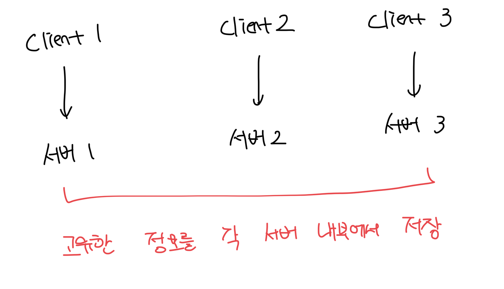
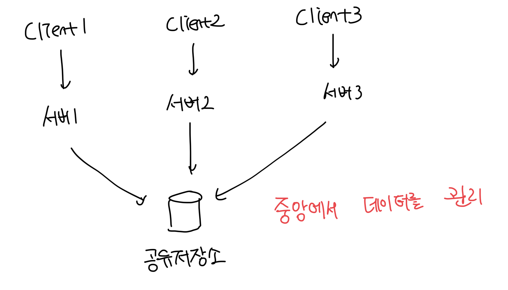

# 무상태(stateless) 웹 계층

- 웹 계층을 수평적으로 확장할 때 필요한 계층이다
- 상태 정보를 데이터베이스나 캐시에 보관하고 필요할 때 가져오는 방법이다

 

# 상태 정보에 의존적인 아키텍쳐

- 상태 정보를 보관하는 서버는 고유한 정보를 서버 세션에 보관한다
- 유저의 정보가 A 서버에 저장되어 있는데 C 서버로 요청이 전송되면 해당 요청은 실패하게된다
- 다만 이러한 문제를 해결하기 위해서 로드밸런서에는 스티키 세션 개념이 존재하는데 이는 로드밸런서에 부담을 준다

 

# 무상태 아키텍쳐

- 여러대의 서버가 로드밸런서를 통해서 트래픽이 분산될 때 중앙저장소를 통해서 데이터를 관리함
- 각 서버는 고유한 데이터를 지니지 않으므로 어떤 서버로 트래픽이 요청되도 동일한 처리가 가능해짐
- 상태 정보는 웹 서버로 부터 분리되어있고, 단순/안정적이며 규모 확장이 쉬움

