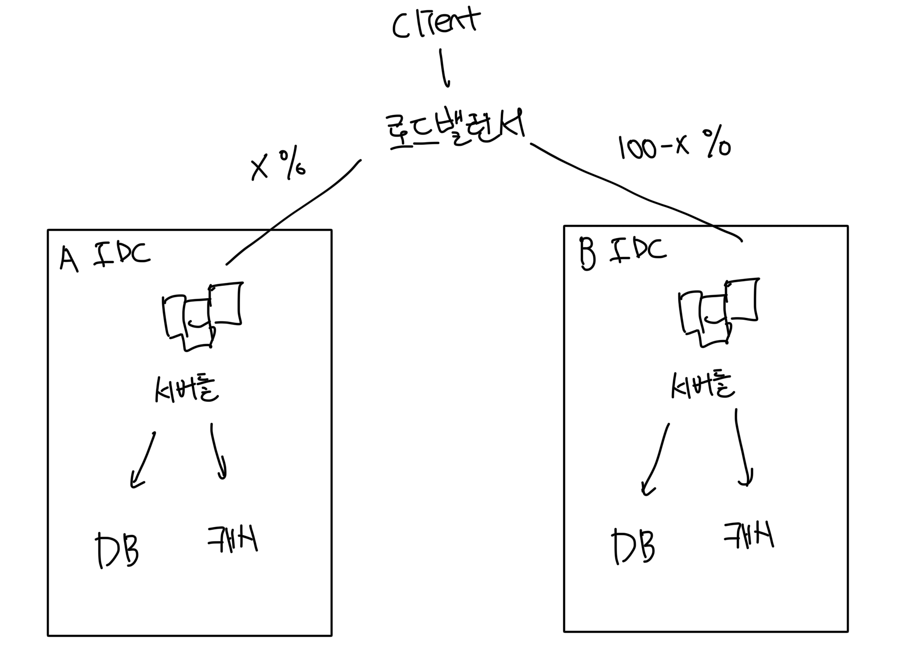

# 데이터 센터

- 2개의 IDC를 사용중인 경우 유저의 지리적 위치에 따라서 트래픽이 분산된다
- 이러한 라우팅 방법을 지리적 라우팅이라고 부름
- A지역에 x%의 트래픽이 전달됬다면 B지역에는 (100-x)%의 트래픽이 전달된다

 

# 데이터 센터의 장애 발생

- 만약 A, B 2개의 IDC가 존재하고 A에 장애가 발생한 경우 모든 트래픽은 B IDC로 전달된다

 

# IDC 이중화의 기술적 난제

- 트래픽 우회
  - 올바른 IDC로 트래픽을 전달하는 방법을 찾아야함
  - GeoDNS는 유저에게 가장 가까운 IDC로 트래픽을 전달할 수 있게 해줌
- 데이터 동기화
  - IDC마다 별도의 DB를 사용중인 경우 장애가 복구되어 트래픽이 우회된다고 해도 다른 IDC의 데이터가 동기화가 안될수도 있다
  - 이러한 상황의 보편적인 전략은 데이터를 여러개의 IDC에 걸쳐 다중화 하는 것이다
