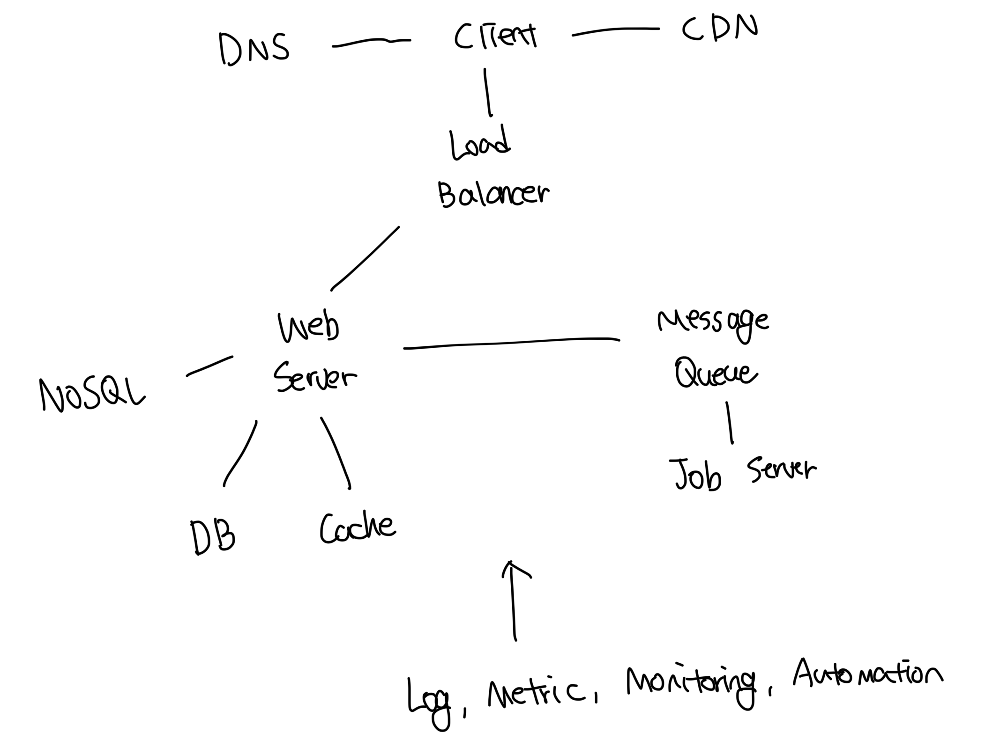

# 로그

- 에러 로그를 모니터링 하는건 매우 중요함
- 서버 단위로 모니터링도 가능하지만, 로그를 단일서버로 모아두면 더 좋음

 

# 메트릭

- 메트릭을 잘 수집하면 사업 현황에 대한 유용한 정보를 얻을수도 있고, 현재 시스템에 상태 파악도 쉽다
- 호스트 단위 : CPU, RAM, 디스크I/O 등
- 종합 메트릭 : DB 계층의 성능, 캐시 계층의 성능 등
- 핵심 비즈니스 메트릭 : 일별 사용자, 수익, 재방문 등

 

# 자동화

- 대표적으로 CI/CD 파이프라인이 존재한다
- 이 외에도 빌드, 테스트 등 다양한 절차를 자동화할수 있다

 

# 메세지큐, 로그, 메트릭을 반영한 아키텍쳐

