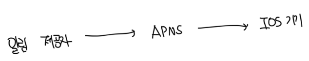

# 설계 범위 정하기

- 알람 종류 : 푸쉬 알림, SMS 메세지, 이메일이 존재함
- 연성 실시간(soft real-time)으로 가정하나 가능한 빨리 전달해야됨
  - 하지만 부하가 있는 경우 일부 딜레이도 허락함
- 지원 플랫폼 : IOS, AOS, 랩톱/데스크톱
- 알람은 클라이언트에서 직접 만들수도있고, 서버에서 스케줄링을 통해 만들수도 있음
- 알람 수신 여부는 사용자가 제어할 수 있음
- 하루에 모바일 푸쉬는 1000만건, SMS는 100만건, 이메일은 500만건 이하로 발송이 가능함

<br>

# 플랫폼 별 알림 시스템 구조

### IOS 푸쉬 알람



#### 알림제공자(Provider)

- 알람 요청을 만들어서 애플 푸시알람 서비스로 발송해주는 주체
- 필요한 데이터는 아래와 같음
  - 단말 토큰(device token) : 알람 요청을 보내는 데 필요한 고유 식별자
  - 페이로드(payload) : 알람 내용을 담은 JSON 객체

```json
{
  "aps": {
    "alert": {
      "title": "내 알림",
      "body": "알림 내용"
    },
    "badge": 5
  }
}
```

<br>

#### APNS(Apple Push Notification Service)

- 애플이 제공하는 원격 서비스
- 푸시 알림을 IOS 기기로 보내는 역할을 담당

<br>

#### IOS 기기

- 알람을 받는 주체

<br>

### 안드로이드 푸쉬 알람

- IOS 푸쉬 알람과 큰 차이는 없음
- APNS 대신 FCM(Firebase Cloud Messaging)를 사용


<br>

### SMS 메세지

- 일반적으로 Twilio, Nexmo 같은 제3 사업자의 서비스를 많이 사용함
- 대부분 상용 서비스라 요금이 부과됨


<br>

### 이메일

- 일반적으로 회사는 고유 이메일 서버를 갖출 역량은 가지고 있음
- 하지만 많은 회사가 상용 이메일 서비스를 사용하곤함
- 유명한 서비스로는 Sendgrid, Mailchimp 등이 있고, 전송 성공률도 높고, 데이터 분석 서비스도 제공함


<br>

# 연락처 정보 수집 절차

- 알람을 보내기 위해서는 전화번호, 이메일, 기기토큰 등 정보 수집이 필요함
- 회원이 로그인, 회원가입 등 특정 상황에서 해당 정보를 수집하게됨
- 데이터베이스에 단말 토큰의 경우 device와 같은 테이블에 저장하게됨


<br>

### 유저 테이블

| column  | type |
| ------- | ---- |
| id      | int  |
| user_id | int  |

<br>

### 디바이스 테이블

| column       | type |
| ------------ | ---- |
| id           | int  |
| user_id      | int  |
| device_token | text |
