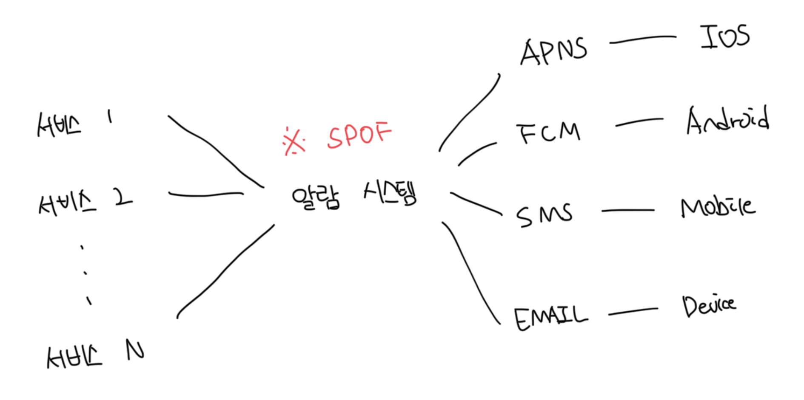
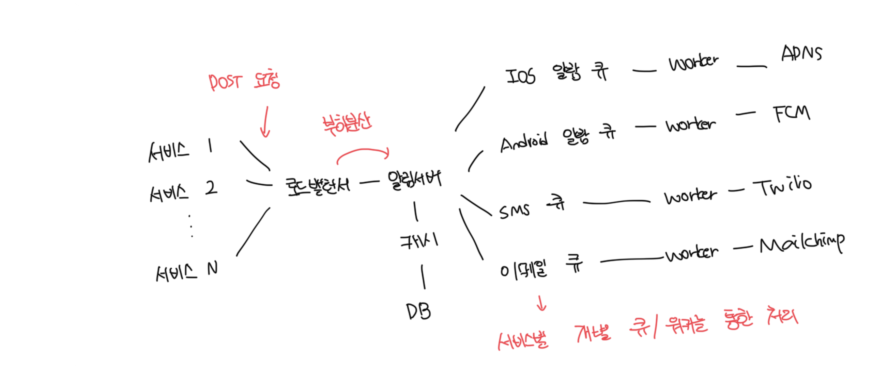

# 1차 설계안

### 1 ~ N개의 서비스

- 해당 서비스는 각 마이크로 서비스, 크론잡, 분산 시스템 컴포넌트 등 다양하다
- 메세지를 발생하는 주체이며 과금서비스, 배송알람 등 이 해당된다

 

### 알림 시스템(Notification System)

- 알림 전송/수신에 핵심이다
- 우선 위 구성도에서는 1개의 서버만 사용한다고 가정한다
- 해당 시스템을 서비스에게 알람 발송을 위한 API를 공개해야되고, 제3자 서비스에 전달할 알림 페이로드를 만들어야함

 

### 제3자 서비스

- 유저에게 알림을 실제로 전달하는 역할을 함
- 제3자 서비스와 통합을 진행할 때 유의할 것은 확장성으로 쉽게 서비스를 제거하거나 추가가 가능해야함
- 또한 국가별로 사용 가능한 서비스에 제약이 있음. 중국의 경우 FCM이 아닌 JPush, PushY같은걸 썽함

 

### SPOF(Single Point Of Failure)

- 위 구조에서는 중앙의 알림 서비스에 장애가 발생하면 모든 서비스의 장애로 이어진다
- 디비나 캐시 등 중요 컴포넌트의 규모를 개별적으로 늘릴 방법이 존재하지 않는다

 

### 성능 병목

- 알림을 처리하고 보내는건 자원을 많이 필요로하는 작업일수도 있다
- 따라서 모든 것을 한 서버로 처리하면 유저 트래픽이 많이 몰리는 시간에는 시스템이 과부화될수도 있다

 

# 2차 설계안(개선버전)

- 디비와 캐시를 주 서버에서 분리하고 알람서버에 로드밸런싱과 오토스케일링을 적용함
- 메세지 큐를 통해서 시스템 컴포넌트 사이 강한 결합을 끊음

 

### 알림 서버가 제공하는 기능

- 알림 전송 API : 사내 서비스나 인증된 API만 이용이 가능함
- 알림 검증 : 이메일이나 전화번호 등에 대한 기본적인 검증을 수행함
- 디비 또는 캐시 질의 : 알림에 포함될 데이터를 가져온다
- 알림 전송 : 알림 데이터를 각 역할별 메세지큐에 전달한다, 여러개의 큐를 사용하므로 병렬처리가 가능하다

