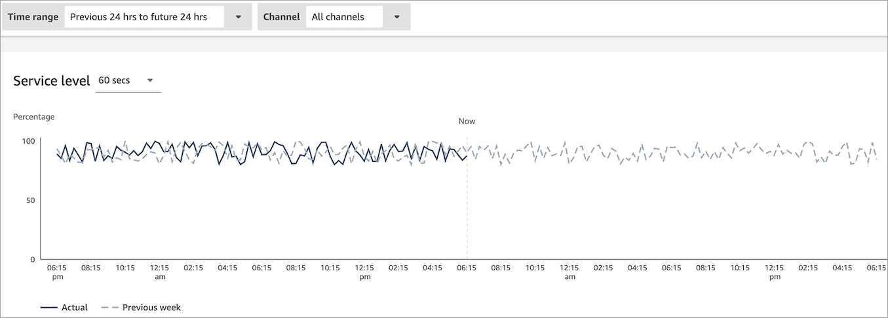
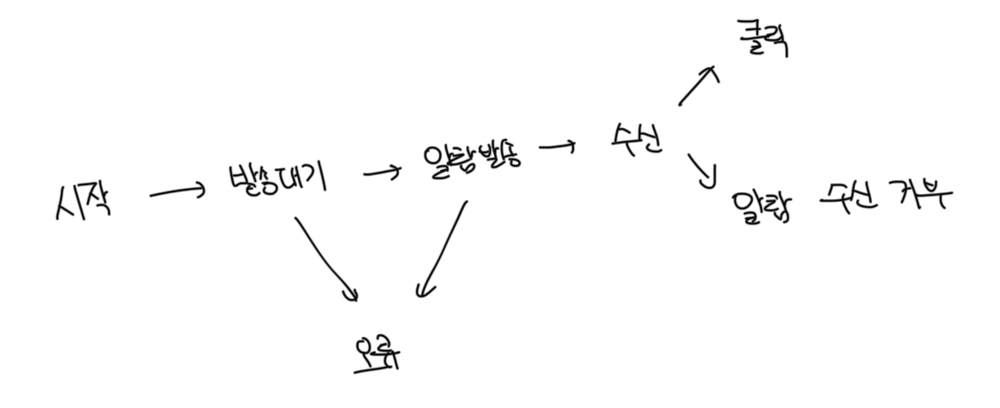
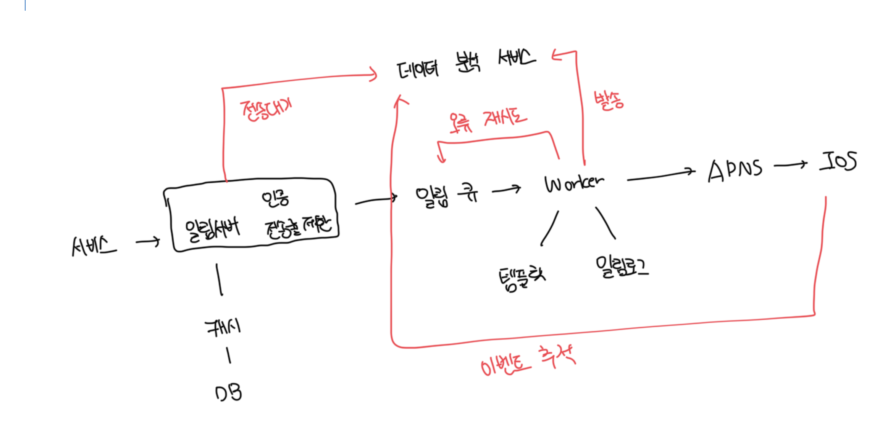

# 안정성

- 분산 환경에서 운영되는 알람 시스템을 설계할 때는 안정석을 확보하기 위한 사항 몇가지를 고려해야함

<br>

### 데이터 손실 방지

- 요구사항 중 하나는 어떤 상황에서도 알람이 소멸되면 안된다이다
- 알림 시스템은 알림 데이터를 데이터베이스에 추가하고 재시도 매커니즘을 구현해야된다

<br>

### 알림 중복 전송 방지

- 같은 알림이 여러번 발송하는걸 완전히 방지하는건 불가능하다
- 대부분은 한번만 전송되겠지만, 분산 시스템의 특성상 가끔은 같은 알림이 중복되서 발송되기도한다
- 빈도를 줄이기 위해서 중복 메세지 감지 매커니즘을 도입하는게 좋다
  - 보내야 할 알림이 도착하면 이벤트 ID를 검사해서 이전에 본 적이 있는 이벤트인지 확인한다

<br>

# 추가 고려사항

### 알람 템플릿

- 알람 시스템은 하루에도 수백만건의 알람을 처리하는데 매번 템플릿 같은걸 다시 만들 필요는 없다
- 템플릿은 인자나 스타일, 링크를 조정하기만 하면 사전에 지정한 형식을 다시 사용할 수 있다
- 템플릿을 사용하면 형식이 일관되게 할 수 있고, 오류 가능성뿐 아니라 알림 작성에 드는 시간을 줄일 수 있다

```
[item_name]이 다시 입고되었습니다.[end_time]까지 세일합니다!
```

<br>

### 전송률 제한

- 사용자에게는 적절한 알림을 보내는게 중요하다
- 너무 알람을 많이 발송하면 알람을 아예 비활성화 할수도 있다

<br>

### 재시도방법

- 제3자 서비스가 알람 발송에 실패하면, 실패한 알람을 다시 큐에 추가한다
- 같은 문제가 N번 이상 발생하면 개발자에게 통보하는 시스템을 구축하면 좋다

<br>

### 푸시 알림과 보안

- 푸시 알림은 appKey, appScrset 을 사용해서 보안을 유지하게된다
- 인증된 또는 승인된 클라이언트만 해당 API를 사용해서 알람 발송이 가능하다

<br>

### 큐 모니터링

- 알림 시스템을 모니터링 할 때 중요한 메트릭 중 하나는 큐에 쌓인 알람의 개수다
- 이 수가 너무 크면 작업 서버들이 이벤트를 빠르게 처리하고 있지 못한다는 뜻이다
- 큐에 알람이 많이 쌓였다면 알람 서버를 증설해서 빠른 처리가 가능하도록 하는게 좋다
- 
  <br>

### 이벤트 추적

- 알람 확인율, 클릭율 등 실제 앱 사용으로 이어지는 비율 같은 메트릭은 사용자를 이해하는데 중요하다
- 데이터 분석 서비스의 경우 보통 이벤트 추적 기능도 같이 제공해준다
- 아래 그림은 데이터 분석 서비스를 통해 추적하게 될 알림 시스템 이벤트의 사례다



<br>

# 최종 설계안


