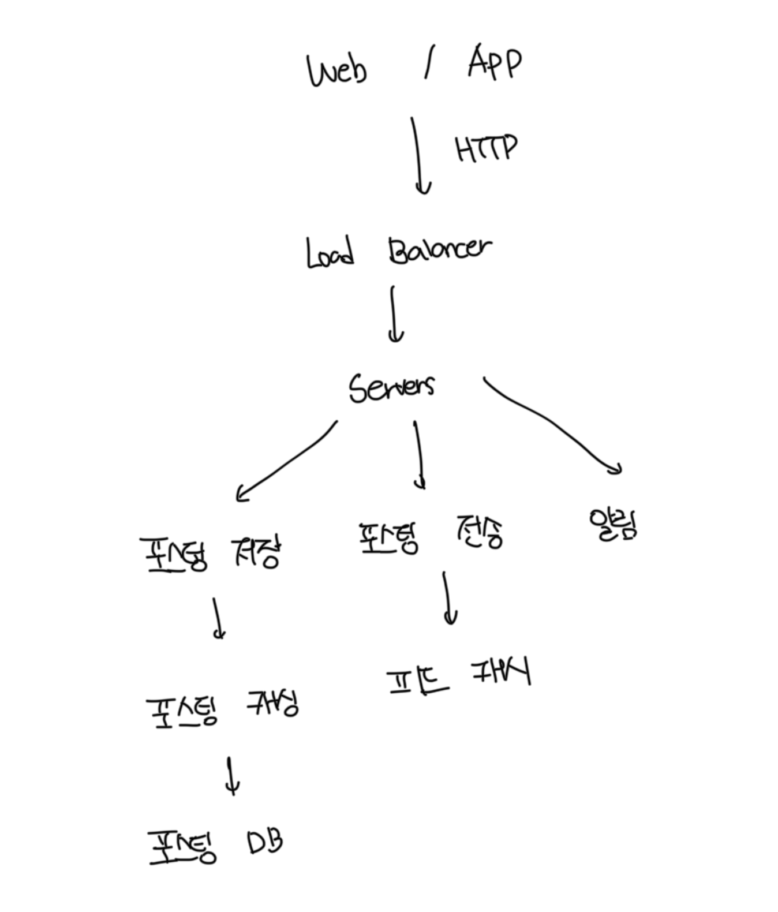

# 문제 이해

- 지원하는 플랫폼 : 웹/앱
- 중요한 기능
  - 뉴스 피드 페이지에 새로운 게시글 업로드
  - 친구들이 올리는 스토리 확인 가능
- 스토리가 표시되는 순서
  - 단순한 시간 흐름 역순으로 표시
- 사용자의 최대 친구
  - 5000명
- 트래픽 규모
  - 매일 천만명이 방문함, 10million DAU
- 피드에 이미지나 비디오 업로드 가능

 

# 뉴스 피드 API

### 피드 발행

- URL : POST /v1/me/feed
- Header : Authorization
- Body: 포스팅 내용

 

### 피드 조회

- URL : GET /v1/me/feed
- Header : Authorization

 
