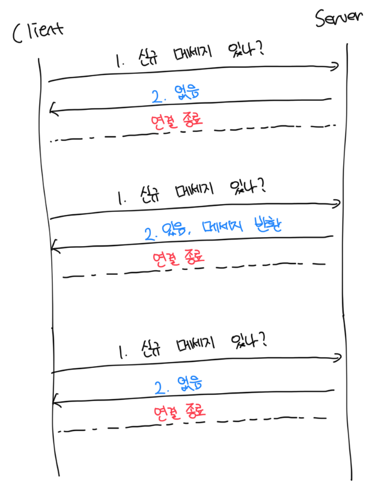
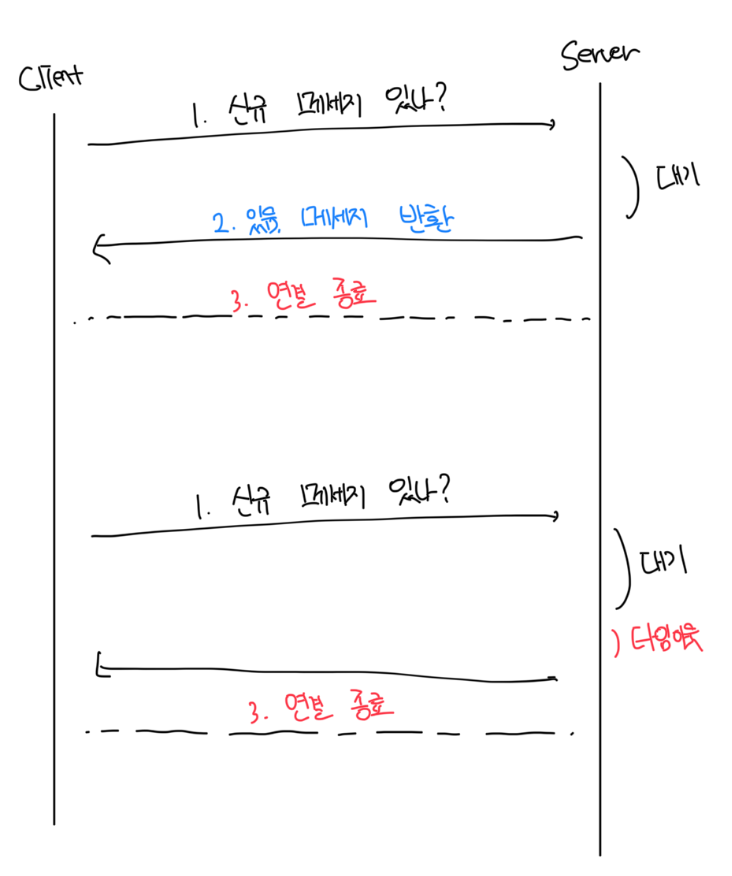
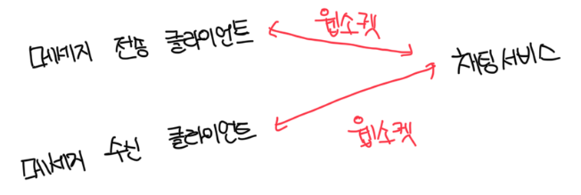

# 기본적으로 제공해야되는 기능

- 클라이언트들로 부터 메세지를 수신메세지
- 메세지 수신자 결정(recipient) 및 전달
- 수신자가 접속 상태가 아닌 경우, 접속할 때까지 해당 메세지 보관

 

# 클라이언트와 채팅 서비스 사이의 관계

 

### 폴링

- 클라이언트가 주기적으로 서버에게 새로운 메세지가 있는지 물어보는 방법
- 메세지가 없더라도 계속 API 요청을 처리해야되므로 자원 낭비가 발생함

 

### 롱 폴링

- 클라이언트는 새 메시지가 반환되거나 타임아웃될 때 까지 연결을 유지함
- 일반 폴링과 동일하게 비효율적임. 메세지를 받지 않는 클라이언트도 타임아웃되면 또 서버에 연결하게됨
- 

 

### 폴링의 문제점

- 로드밸런서에 의해서 HTTP 요청이 이전과 동일한 서버에 닿지 않을수도 있음
  - 기본적으로 로드밸런서는 라운드로빈 알고리즘을 통해 여러개의 서버에 골고루 트래픽은 분산함
- 서버 입장에서는 클라이언트가 연결을 해제했는지 아닌지 알 좋은 방법이 없음

 

### 웹소켓

- 서버가 클라이언트에게 비동기 메세지를 보낼떄 가장 널리 사용하는 기술
- 한번 맺어진 연결은 양방향으로 이루어짐
- 최초에는 HTTP 요청이지만, 핸드셰이크 절차를 거쳐서 웹소켓 연결로 업그레이드함
- HTTP 요청은 충분히 괜찮은 프로토콜 이지만, 웹소켓은 양방향 메세지가 가능하므로 굳이 HTTP를 고집할 필요가 없다
- 웹소켓 연결은 향구적으로 유지되어야해서 서버 측에서 연결 관리를 효율적으로 해야한다

