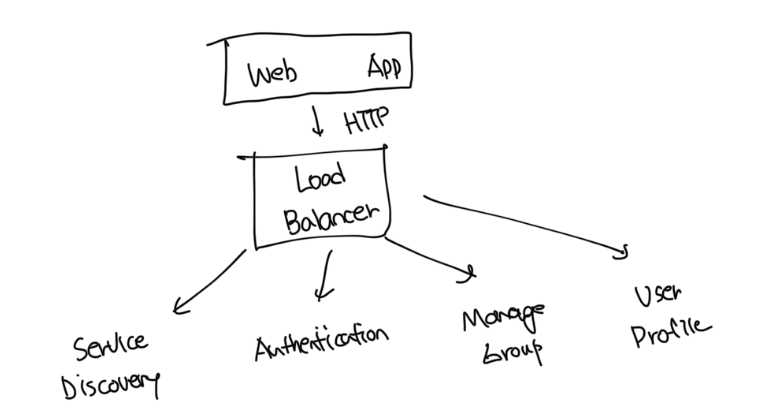
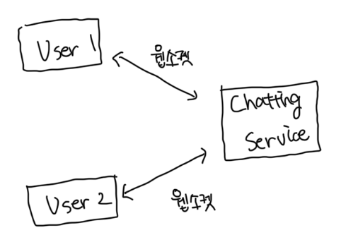
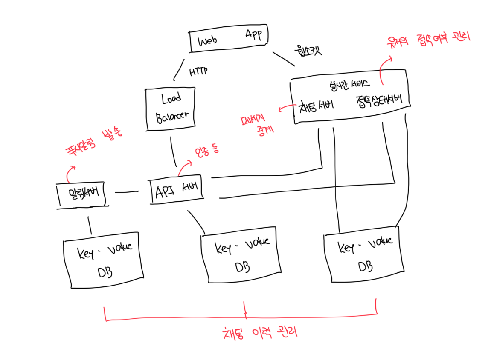

# 무상태 서비스

- 일반적으로 채팅 서비스에서 로그인, 회원가입, 유저 프로필 표시 등 을 위한 전통적인 요청/응답 서비스
- 무상태 서비스가 제공하는 기능은 많은 웹사이트와 앱이 보편적으로 제공하는 기능임

 

# 상태 유지 서비스

- 해당 채팅 서비스에서 유일하게 상태 유지가 필요한 서비스는 채팅 서비스임
- 각 클라이언트가 채팅 서버와 독립적인 네트워크 연결을 유지해야함

 

# 제3자 서비스 연동

- 채팅앱에서 가장 중요한 제3자 서비스는 푸시 알림이다
- 푸시 알람과의 통합은 매우 중요하다

 

# 규모 확장성

- 트래픽이 얼마 안되면 서버 한대로도 충분하다
- 이 때 따져봐야 할 것은 서버 한 대로 얼마나 많은 접속을 동시에 처리하는지다
- 이론상 연결당 10K 메모리가 든다면 10000명의 유저는 10GB 메모리로 충분하다
- 또한 단일 서버의 경우 SPOF에 대한 위험이 존재한다

