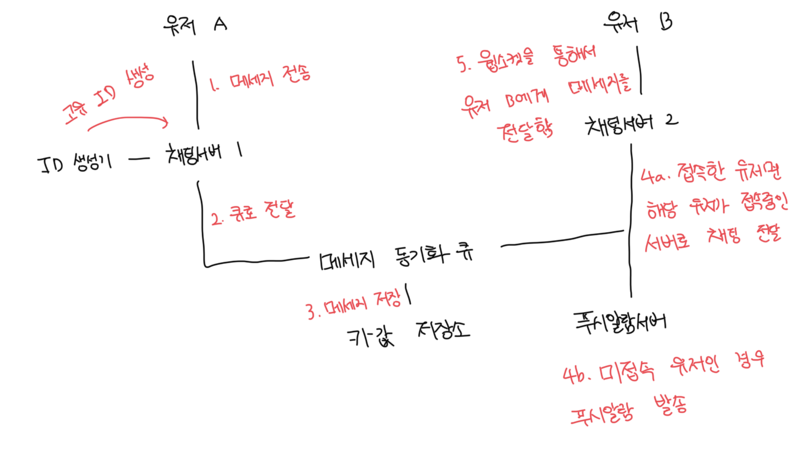

# 서비스 탐색

- 클라이언트에게 가장 적합한 채팅 서버를 추천하는 역할
- 추천하는 기준으로는 위치나 서버의 용량 등이 존재함
- 대표적인 오픈소스로는 Apache Zookeeper가 있음

 

# 메세지 흐름

### 1:1 메세지 처리 흐름

 

### 여러개의 단말 사이의 메세지 동기화

- `cur_max_msg_id`는 각 단말에서 관측된 마지막으로 수신한 메세지의 ID다
- 2개의 조건을 만족하는 메세지는 새로운 메세지라고 간주한다
  - 수신자 ID가 현재 로그인한 사용자 ID와 동일하다
  - 키-값 저장소에 보관된 메세지로서, 그 ID가 `cur_max_msg_id`보다 크다
- `cur_max_msg_id`는 각 단말에서 관리하면 되는 값이라서, 키-값 저장소에서 새로운 메세지를 가져오는 동기화 작업도 쉽게 구현이 가능함

 

### 소규모 그룹 채팅에서의 메세지 흐름

- 아래 방식은 소규모 그룹 채팅방에서 적합함
  - 예를 들어서 Wechat의 경우는 최대 인원을 500명으로 제한해놓음
  - 새로운 메세지 여부는 자기 큐만 화확인하면 되서 메세지 동기화가 단순함
  - 그룹이 크지 않다면, 메세지를 수신자별로 복사해서 큐에 넣는 작업 비용이 문제가 되지 않음
- 한명의 수신자는 여러 사용자로부터 오는 메세지 수신이 가능해야함

 

# 접속상태 표시

### 사용자 로그인

- 로그인 완료되어 세선이 연결되면 키-값 저장소에 정보를 저장함

 

### 로그아웃

- 키-값 저장소에 저장된 status 등 정보가 변경됨
  

 

### 접속 장애

- 인터넷이 순단되는 상황은 터널이나 지하철 등 매우 흔하게 발생함
  - 해당 상황에서는 소켓 연결도 끊어지게됨
- 간단하게는 매번 접속이 끊어졌다 연결될 떄 마다 상태를 변경하면됨
- 하지만 이것은 지나친 일이고 UX에 좋지 않음
- 이러한 문제를 해결하기 위해서 박동검사(Hearthbeat Check)를 통해 해결할 수 있음

 

### 박동검사

- 주기적으로 박동 이벤트를 접속상태 서버로 전송함
- 마지막 이벤트를 받은지 x초 이내에 또 다른 박동 이벤트 메세지를 받으면 해당 유저는 계속 온라인으로 유지함

 

### 사용자의 상태변화 감지하기

- 상태정보 서버는 pub/sub 모델을 사용함
- 각각 친구관계마다 채널을 하나씩 지정함
- 해당 방법은 그룹 크기가 작을때 유용함
- 만약 규모가 커서 점점 비효율적으로 느껴진다면, 그룹 채팅에 입장하는 순간에 상태를 가져오거나, 친구 리스트에 있는 사용자의 접속상태를 갱신하도록 유도하는게 좋음

