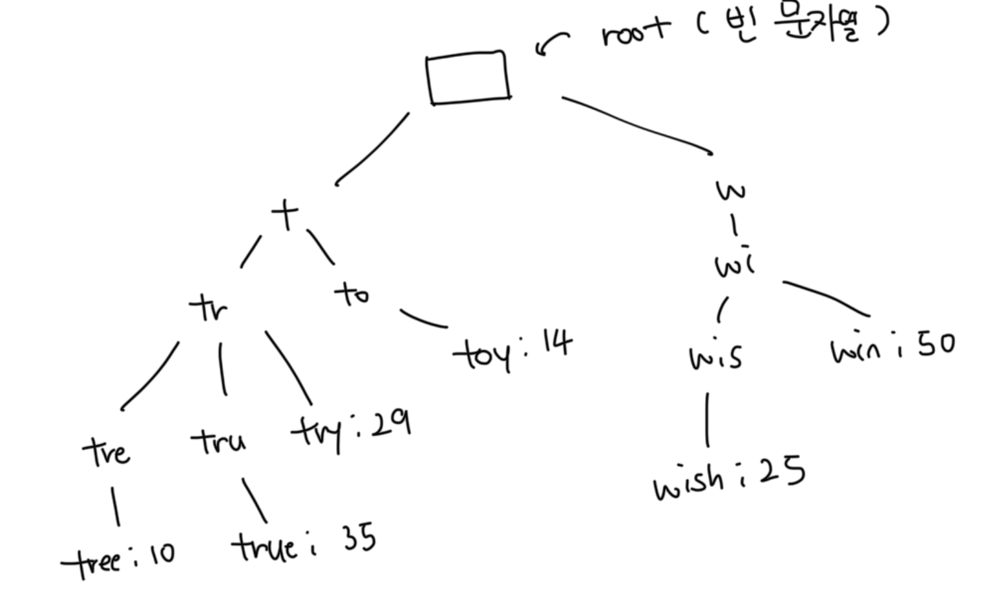
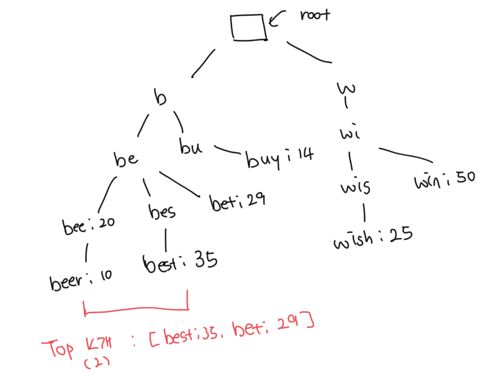
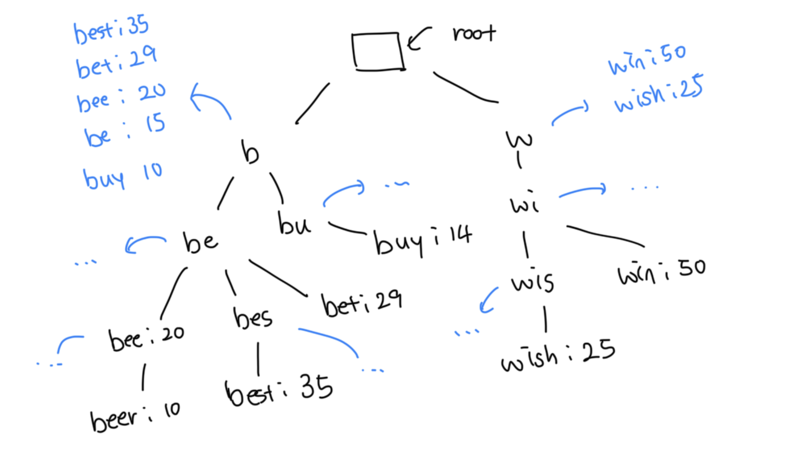
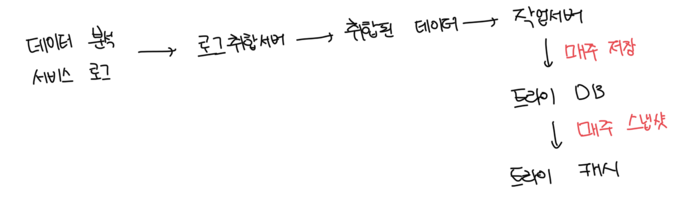
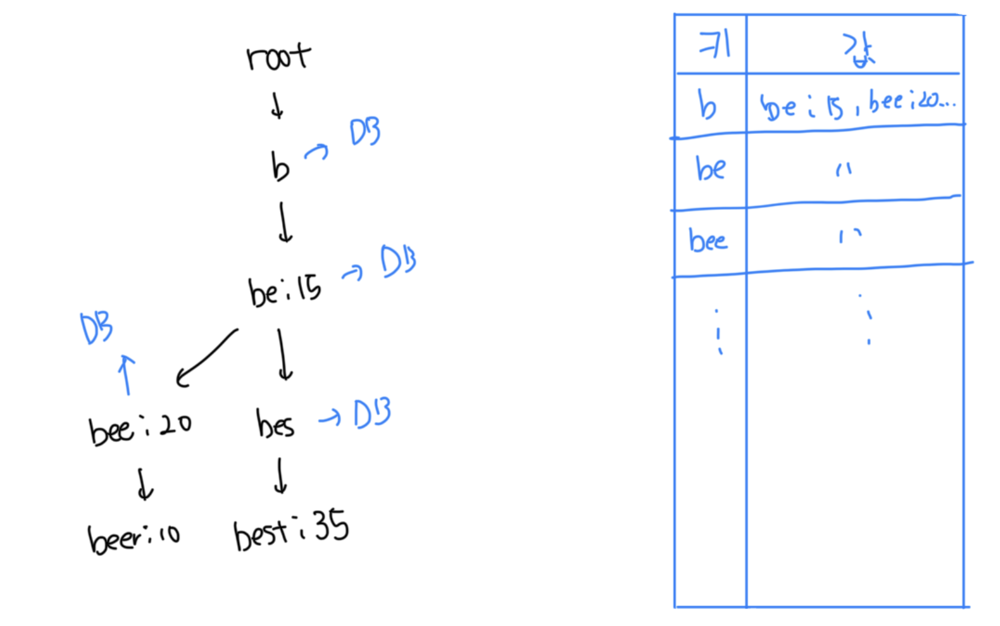
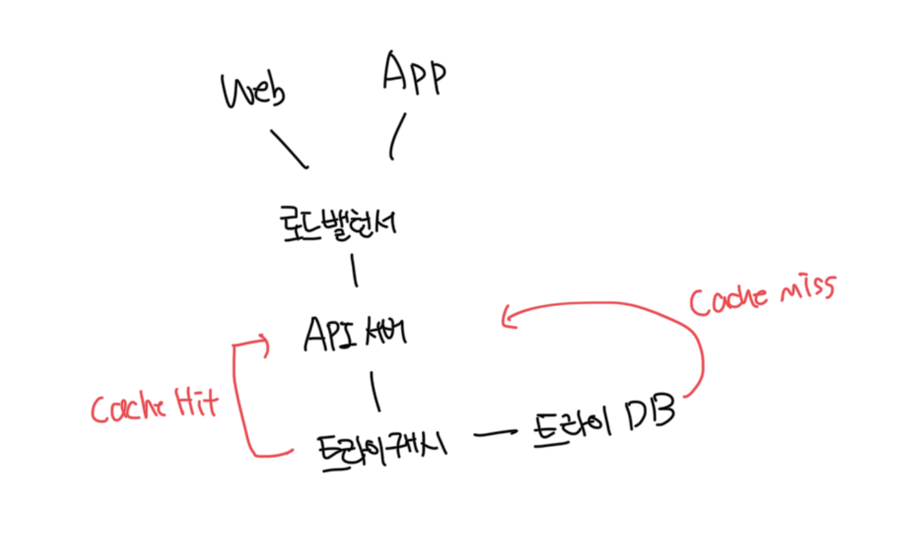

# 트라이 자료구조

- 트라이는 문자열을 간략하게 저장할 수 있는 자료구조
- 트리 형태를 띄며 루트 노드는 빈 문자열을 나타냄
- 각 노드는 글자를 1개씩 저장하며, 26개의 자식 노드를 가질 수 있음
- 이전에 사용한 데이터베이스를 사용한 설계의 단점을 극복할 수 있음

 

### 트라이 자료구조 예시

| query | frequency |
| ----- | --------- |
| tree  | 10        |
| try   | 29        |
| true  | 35        |
| toy   | 14        |
| wish  | 25        |
| win   | 50        |

 

 

### 구현방식

- p : 접두어(prefix)의 길이
- n : 트라이 안에 있는 노드의 개수
- c : 주어진 노드의 자식 개수
- 가장 많이 사용된 접두어 찾는 로직
  - 해당 접두어는 표현하는 노드를 찾음, 시간복잡도는 O(p)
  - 해당 노드부터 시작하는 하위 트리를 탐색해서 모든 유효 노드 탐색
    - 유효한 검색 문자열을 구서하는 노드가 유효 노드다. 시간복잡도는 O(c)
  - 유효 노드를 정렬해서 가장 인기 있는 검색어 k개를 찾음. 시간복잡도는 O(c log c)

 

### 구현 예시

- be를 입력하고 관련 검색어 2개를 찾을때 구현예시다
  - be로 시작하는 노드를 탐색
  - 해당 노드부터 시작하는 하위 트리를 탐색해서 모든 유효노드 찾음
  - 유효 노드를 정렬해서 2개만 골라냄

 

# 트라이 최적화

- 트라이 자료구조는 트리와 같은 형태라서 최작의 경우 k개의 결과를 얻기위해 전체 트라이를 다 검색할수도 있음

 

### 접두어 최대 길이 제한

- 일반적으로 길이가 긴 검색어를 입력하는 일은 거의 없음
- 따라서 검색어의 길이는 가령 작은 정숫값(50 등)이라고 해도 안전함
- 만약 검색어의 최대 길이를 제한할 수 있다면 접두어 노드를 찾는 단계의 시간복잡도를 O(p) -> O(1)로 줄일 수 있음

 

### 노드에 인기 검색어 캐싱

- 각 노드에 k개의 인기 검색어를 캐싱해두면 전체 트라이를 검색하는 일을 방지할 수 있음
- 단점은 캐싱을 위한 추가적인 저장공간이 필요함
- 빠른 응답속도를 위해서는 저장공간을 희생할만한 가치는 있음
- 해당 방식으로 최적화를 진행하면 시간복잡도가 모두 O(n) -> O(1)로 줄일 수 있음

 

# 개선된 설계방안

- 기존 구성의 경우는 유저가 실시간으로 검색어를 입력할 때 마다 트라이를 갱신함
- 매일 수천만건의 질의가 발생할텐데 매번 갱신하면 서비스는 상당히 느려질것임
- 일단 트라이가 만들어지고나면 인기 검색어는 그다지 자주 바뀌지 않을 것이니 트라이를 자주 갱신할 필요는 없음

 

### 데이터 분석 서비스 ㄹ그

- 검색창에 입력된 질의에 관한 원본 데이터를 저장함
- 인덱스를 걸지 않고, 새로운 데이터가 추가되기만 하고 수정은 발생하지 않음

| query | time                |
| ----- | ------------------- |
| tree  | 2021-01-01 00:00:00 |
| try   | 2021-01-01 00:00:01 |
| true  | 2021-01-01 00:00:02 |
| toy   | 2021-01-01 00:00:03 |

 

### 로그 취합 서버

- 데이터 분석 서비스에서 나오는 로그는 보통 양이 엄청많고 데이터 형식이 제각각인 경우도 많음
- 각 로그를 취합해서 시스템에서 소비할 수 있도록 해야함
- 데이터 취합 방식은 서비스의 특성마다 달라질 수 있는데 구글같은 검색사이트는 1주, 트위터 같은 실시간 SNS는 1시간 등 다양하게 전략을 짤 수 있다

 

### 취합된 데이터

| query | time                | frequency |
| ----- | ------------------- | --------- |
| tree  | 2021-01-01 00:00:00 | 10000     |
| try   | 2021-01-01 00:00:01 | 29000     |
| true  | 2021-01-01 00:00:02 | 35000     |
| toy   | 2021-01-01 00:00:03 | 14000     |
| wish  | 2021-01-01 00:00:04 | 25000     |

 

### 작업 서버

- 자기적으로 비동기적 작업을 담당하는 서버
- 트라이 자료구조를 만들고, 트라이 데이터베이스에 저장하는 역할을 담당함

 

### 트라이 캐시

- 분삭 캐시 시스템으로 트라이 데이터를 메모리에 유지해서 읽기 연산 성능을 높여주는 역할
- 위 설계에서는 매 주 트라이 DB의 스냅샷을 떠서 캐싱함

 

### 트라이 데이터베이스

- 문서저장소(document store) 사용하기
  - 대표적으로 MongoDB가 존재하고, 주기적으로 트라이를 직렬화해서 저장할 수 있음
- 키-값 저장소 사용하기
  - 트라이에 보관된 모든 접두어를 해시 테이블 키로 변환함
  - 각 트라이 노드에 보관된 모든 데이터를 해시 테이블 값으로 변환함
  - 

 

# 질의 서비스

 

### 추가 최적화 방안

- AJAX 요청 : 새로고침 없이 자동완성된 검색어를 가져와서 UX 개선
- 브라우저에 데이터 캐싱 : 자동완성된 검색어를 브라우저에 캐싱하면 유저는 빠르게 정보를 받아볼 수 있음. 또한 서버의 부하가 줄어듬
  - 구글의 경우 max-age=3600, private 설정을 사용해서 최적화함
- 데이터 샘플링 : 대규모 시스템에서 모든걸 다 로깅하면 저장공간이 매우 많이 필요함. N개의 요청당 1개만 로깅하도록 최적화하는 방법임

 

# 트라이 연산

### 트라이 생성

- 작업 서버가 담당함
- 데이터 분석 서비스 로그나, 데이터 베이스로부터 취합된 데이터를 이용

 

### 트라이 갱신

- 매주 한번씩 갱신하는 방법은 새로운 트라이를 만들고 기존 트라이를 대체함
- 트라이의 각 노드를 개별적으로 갱신하는 방법은 성능이 좋지 않음
  - 트라이가 작으면 고려해볼만하지만, 대규모 트라이에서는 적합하지 않음
  - 하위 노드를 변경하면, 하위 노드를 캐싱중이던 상위 노드의 데이터도 바꿔줘야함

 

### 검색어 삭제

- 혐오적, 성적, 스팸 등 위험한 질의어를 자동완성 결과에서 제거해야함
- 트라이 캐시 앞에 필터 계층을 두어서 특정 질의어가 반환되지 않게 할 수 있음
- 이미 디비에 저장된 데이터를 삭제하는건 다음번 업데이트시 비동기적으로 삭제되게 하면됨

 

# 저장소 규모 확장

### 시작 글자를 기준으로 샤딩

- 해당 시스템에선 영어만 저장하므로 첫 글자를 기준으로 샤딩하는 방법을 생각할 수 있음
- a~m은 1번 서버에, 나머지는 두번째 서버에 저장함, 동일하게 26/N으로 샤딩이 가능함
- 해당 방법으로는 알파벳의 개수인 최대 26개의 샤딩만 확장이 가능함

 

### 게층적으로 샤딩

- 26개 이상의 샤드가 필요한 경우 계층적으로 샤딩이 가능함
- aa~am, ao~az 처럼 샤딩하면 또 한번 계층적인 샤딩이 가능해짐
