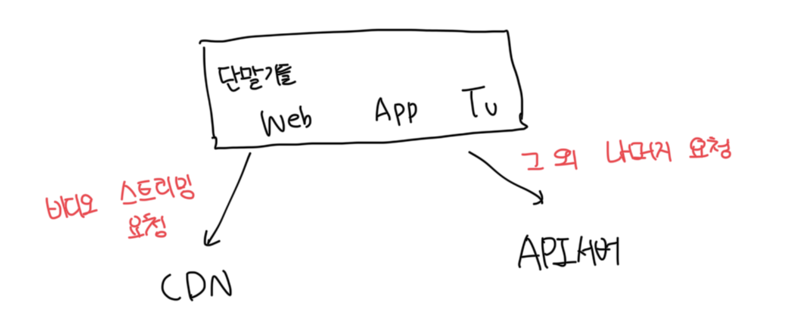
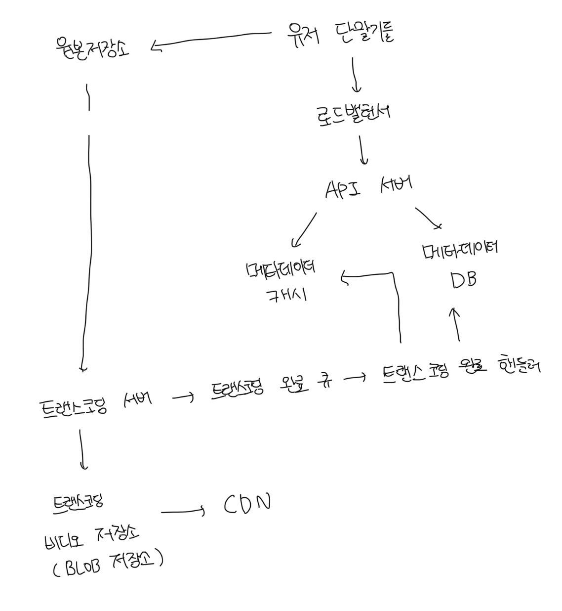
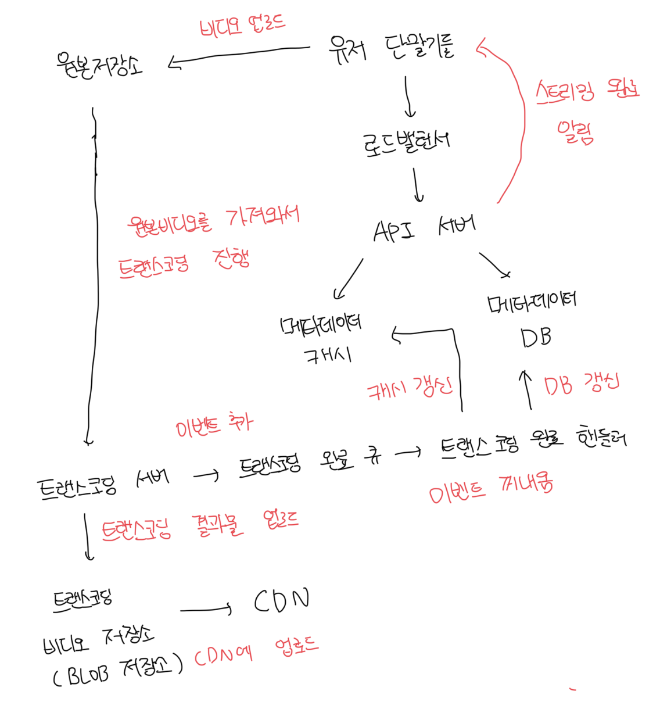
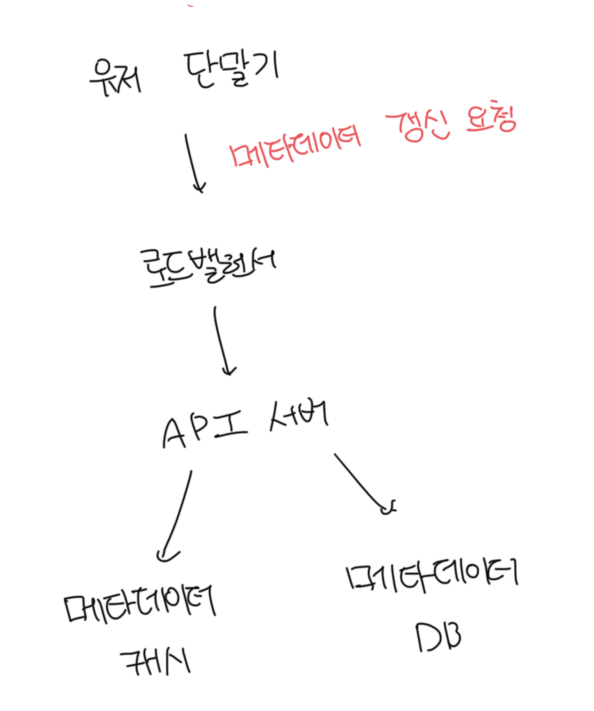

# 저장공간과 CDN

> 직접 바닥부터 모든걸 만드는건 매우 비싼 시간적, 물적 비용이 들어감  
> 이미 만들어진걸 적절하게 사용하자

- 비디오를 저장하기 위해서 BLOB 스토리지 사용
- 빠른 다운로드를 위해서 CDN 사용
  - 넷플릭스는 AWS CloudFront, 페이스븍은 Akamai 등 다양하게 사용함

 

# 비디오 업로드 절차

 

### 트랜스코딩 서버(transcoding server)

- 트랜스코딩은 비디오 인코딩이라 부르기도 하는 절차로, 비디오의 포멧을 변환하는 절차
- 단말이나 대역폭 요구사항에 맞는 최적의 비디오 스트림을 제공하기 위해서 필요함

 

### 트랜스코딩 비디오 저장소(transcoded storage)

- 트랜스 코딩이 완료된 비디오를 저장하는 BLOB 스토리지

 

### CDN

- 트랜스 코딩이 완료된 비디오를 캐시하는 역할을 담당
- 유저가 서비스에서 비디오 재생을 누르면 비디오 스트리밍은 CDN을 통해 이루어짐

 

### 트랜스코딩 완료 큐(completion queue)

- 비디오 트랜스코딩 완료 이벤트들을 보관할 메세지 큐

 

### 트랜스코딩 완료 핸들러(completion handler)

- 트랜스코딩 완료 큐에서 이벤트를 꺼내서 처리함
- 메타데이터 캐시와 메타데이터 디비를 갱신할 작업 서버들임

 

# 프로세스 A : 비디어 업로드

 

# 프로세스 B : 메타데이터 갱신

- 원본 저장소에 파일이 업로드되는 동안 단말은 병렬적으로 비디오 메타데이터 갱신 요청을함
- 메타데이터에는 이름, 크기, 포멧 등 정보가 포함되어있음

 

# 비디오 스트리밍 절차

- 유투브에서 비디오를 재생하면 다운로드 후 재생되는게 아니라 바로 영상이 시작된다
- 스트리밍은 지속적으로 비디오 스트림을 전송받아서 영상을 재생하는걸 뜻함

 

### 스트리밍 프로토콜

- 비디오 스트리밍을 위해서 데이터를 전송할 때 쓰이는 표준화된 통신방법
- MPEG-DASH, HLS, MSS, HDS 등 다양한 프로토콜이 존재함
